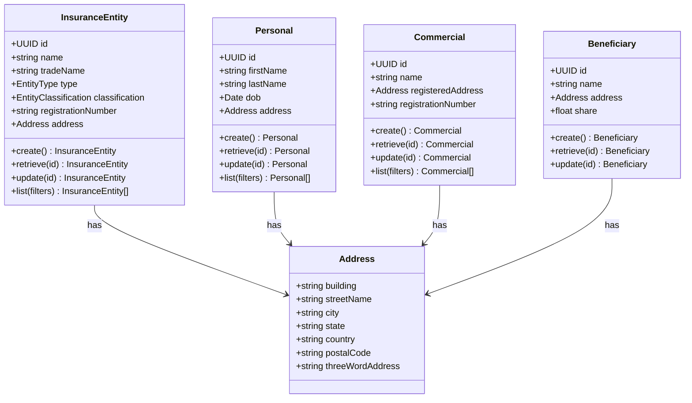
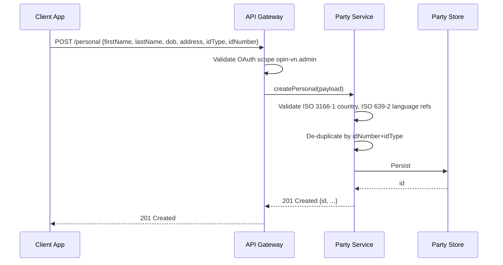
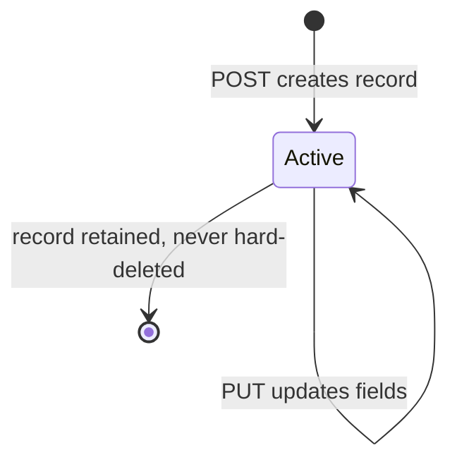
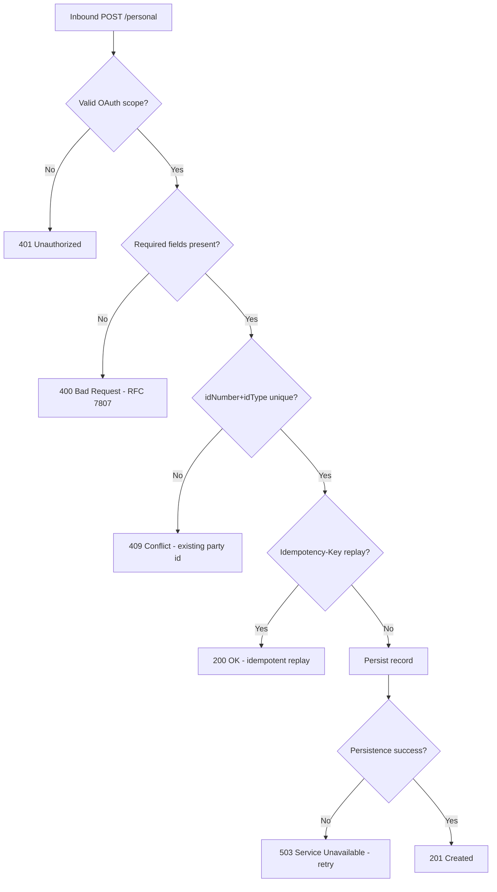

# Module 1: Core Parties and Entities

Resources, endpoints, primary flow, lifecycle and routing. The entities and fields are in [`data-model.md`](data-model.md). Conventions that apply to every module are in [`../conventions.md`](../conventions.md).

### Resource model

`[OPIN concern]`: Address is an embedded value object in the OPIN data standard. It is not a top-level resource and this standard does not expose it as one. Address fields are only ever sent and received inline within their owning entity.

### Endpoints

`[added]`: OPIN publishes the InsuranceEntity, Personal, Commercial, Beneficiary, and address schemas but no endpoints. CRUD endpoints are added here, modelled on the motor `/vehicle`, `/driver` pattern.

- `POST /insuranceEntity` (admin)
- `GET /insuranceEntity` (developer), search by name or registration number
- `GET /insuranceEntity/{id}` (developer)
- `PUT /insuranceEntity/{id}` (admin)
- `POST /personal` (admin)
- `GET /personal` (developer), search
- `GET /personal/{id}` (developer)
- `PUT /personal/{id}` (admin)
- `POST /commercial` (admin)
- `GET /commercial` (developer), search
- `GET /commercial/{id}` (developer)
- `PUT /commercial/{id}` (admin)
- `POST /beneficiary` (admin)
- `GET /beneficiary` (developer)
- `GET /beneficiary/{id}` (developer)
- `PUT /beneficiary/{id}` (admin)

### Primary flow: Onboard a Personal party

### Lifecycle

`[OPIN concern]`: OPIN does not declare a party lifecycle. This standard keeps the lifecycle conservative: a party record exists or it does not. Status flags such as KYC status, suspension, or closure are out of scope at this version and live in implementer-specific extensions.

### Routing and error handling

