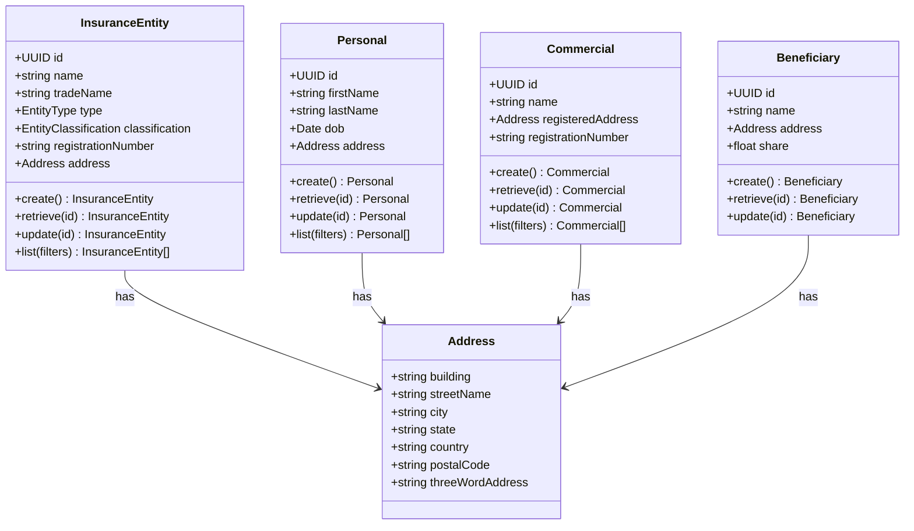
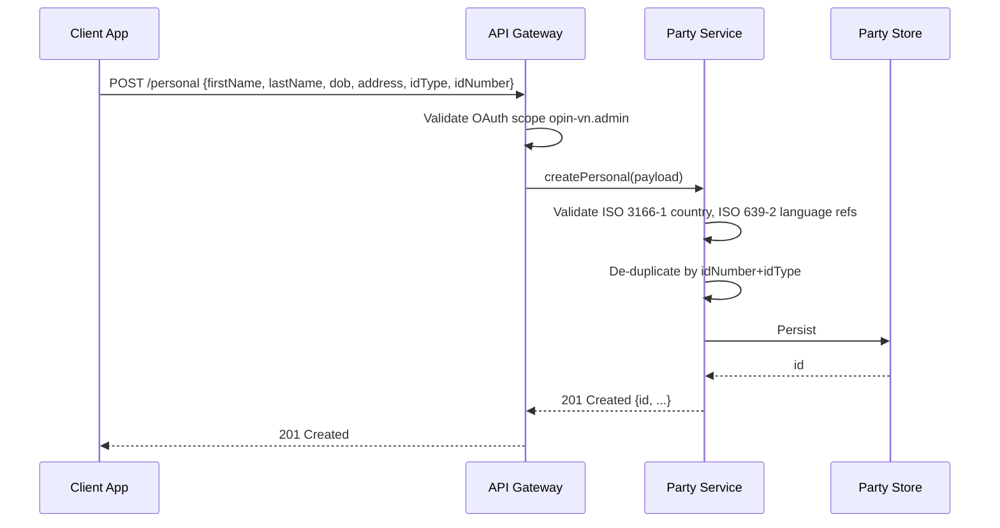
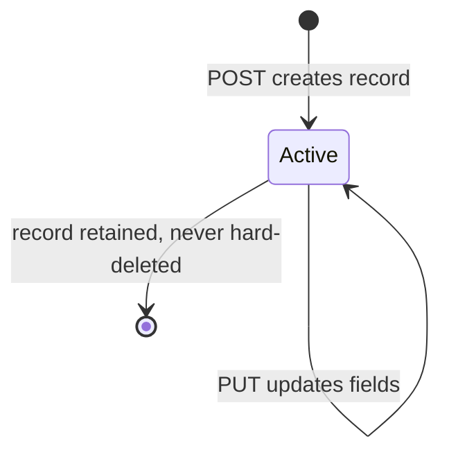
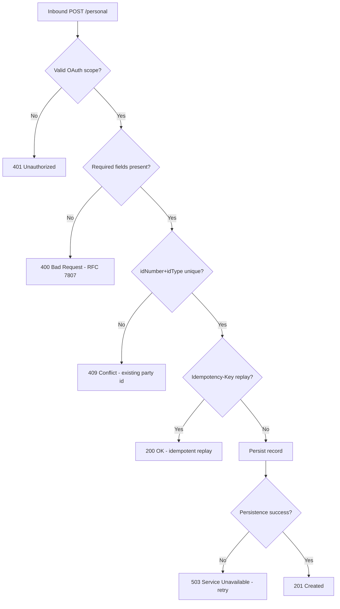

# Module 1: Core Parties and Entities

The endpoints, the flow that onboards a party, the lifecycle and the error paths. The entities and
fields are in [`data-model.md`](data-model.md), and the rules that apply on every call are in
[`../conventions.md`](../conventions.md).

## Resource model

Address has no class of its own here because it is not a resource. It is embedded in whichever
entity owns it, and it travels inline on every request and response that carries one.

## Endpoints

Four resources, all the same shape: create and list on the collection, retrieve and replace on the
item. `opin-vn.admin` is the write scope and `opin-vn.developer` is read-only.

| Endpoint | Scope | What it does |
| :--- | :--- | :--- |
| `POST /insuranceEntity` | admin | Create an insurer, broker or agent |
| `GET /insuranceEntity` | developer | List, searchable by name or registration number |
| `GET /insuranceEntity/{id}` | developer | Retrieve one |
| `PUT /insuranceEntity/{id}` | admin | Replace one |
| `POST /personal` | admin | Create an individual party |
| `GET /personal` | developer | List, searchable |
| `GET /personal/{id}` | developer | Retrieve one |
| `PUT /personal/{id}` | admin | Replace one |
| `POST /commercial` | admin | Create a corporate party |
| `GET /commercial` | developer | List, searchable |
| `GET /commercial/{id}` | developer | Retrieve one |
| `PUT /commercial/{id}` | admin | Replace one |
| `POST /beneficiary` | admin | Create a beneficiary |
| `GET /beneficiary` | developer | List |
| `GET /beneficiary/{id}` | developer | Retrieve one |
| `PUT /beneficiary/{id}` | admin | Replace one |

There is no `/address`. See the note above.

## Primary flow: onboard an individual party

Two things in that flow are worth pulling out. A party is deduplicated on `idType` plus `idNumber`
together, not on name, because names repeat and are spelled inconsistently. And an
`Idempotency-Key` replay returns the original record with a 200 rather than creating a second party,
which is what makes a retried onboarding safe.

## Lifecycle

The lifecycle is deliberately minimal: a party record exists or it does not, and it is never
deleted. There is no suspended state, no closed state and no identity-check status. Those describe
where a party sits in one operator's process rather than what the party is, so they belong in your
own extension fields.

## Errors

