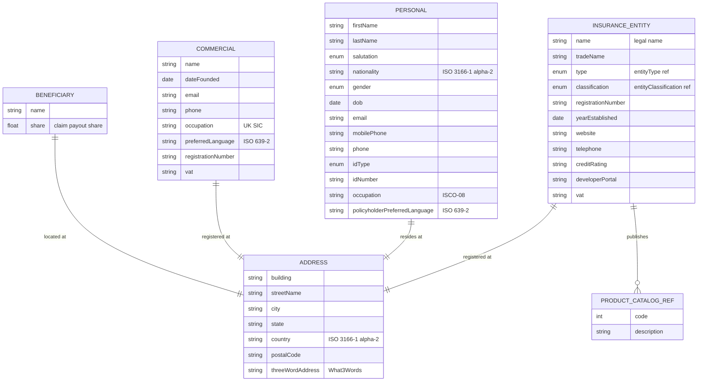

# Module 1: Core Parties and Entities

Entities, fields, enumerated values and relationships. The API surface for this module is in [`api.md`](api.md).

Covers the universal party types across every coverage line: insurer or intermediary entities, retail customers, commercial customers, beneficiaries, and the underlying address structure.

OPIN sources: `InsuranceEntity`, `Personal`, `Commercial`, `Beneficiary`, `address`, `legalEntity`, `entityType`, `entityClassification`, `salutation`, `gender`, `idType`.

### Field annotations (Module 1)

| Entity | Field | Type | OPIN source | Notes |
|---|---|---|---|---|
| InsuranceEntity | name | Text | sheet `InsuranceEntity` | Required for issuer identification |
| InsuranceEntity | tradeName | Text | sheet `InsuranceEntity` | Optional |
| InsuranceEntity | type | enum (entityType) | sheet `entityType` | 17 values: reinsurance, takaful, mutual, P2P, Lloyd's, broker, agent, MGA, etc. |
| InsuranceEntity | classification | enum (entityClassification) | sheet `entityClassification` | P&C / life / composite / other |
| InsuranceEntity | registrationNumber | Text | sheet `InsuranceEntity` | Regulator-issued |
| InsuranceEntity | yearEstablished | Date (ISO 8601) | sheet `InsuranceEntity` |  |
| InsuranceEntity | address | ref (address) | sheet `InsuranceEntity` |  |
| InsuranceEntity | website | Text/URL | sheet `InsuranceEntity` |  |
| InsuranceEntity | telephone | Text | sheet `InsuranceEntity` |  |
| InsuranceEntity | creditRating | Text | sheet `InsuranceEntity` | S&P, AM Best, Fitch |
| InsuranceEntity | developerPortal | Text/URL | sheet `InsuranceEntity` |  |
| InsuranceEntity | productCatalog | ref (productCatalog) | sheet `InsuranceEntity` | Multi-valued |
| InsuranceEntity | vat | Text | sheet `InsuranceEntity` |  |
| Personal | firstName | Text | sheet `Personal` |  |
| Personal | lastName | Text | sheet `Personal` |  |
| Personal | salutation | enum | sheet `salutation` | Mr / Mrs / Ms |
| Personal | nationality | Text (ISO 3166-1 alpha-2) | sheet `Personal` |  |
| Personal | gender | enum | sheet `gender` | m / f / o |
| Personal | dob | Date (ISO 8601) | sheet `Personal` |  |
| Personal | email | Text | sheet `Personal` |  |
| Personal | mobilePhone | Text | sheet `Personal` |  |
| Personal | phone | Text | sheet `Personal` |  |
| Personal | address | ref (address) | sheet `Personal` |  |
| Personal | idType | enum | sheet `idType` | passport / national id / driving licence / NI / other |
| Personal | idNumber | Text | sheet `Personal` |  |
| Personal | occupation | Text (ISCO-08) | sheet `Personal` |  |
| Personal | policyholderPreferredLanguage | Text (ISO 639-2) | sheet `Personal` |  |
| Commercial | name | Text | sheet `Commercial` |  |
| Commercial | registeredAddress | ref (address) | sheet `Commercial` |  |
| Commercial | dateFounded | Date (ISO 8601) | sheet `Commercial` |  |
| Commercial | email | Text | sheet `Commercial` |  |
| Commercial | phone | Text | sheet `Commercial` |  |
| Commercial | occupation | Text (UK SIC) | sheet `Commercial` |  |
| Commercial | preferredLanguage | Text (ISO 639-2) | sheet `Commercial` |  |
| Commercial | registrationNumber | Text | sheet `Commercial` |  |
| Commercial | vat | Text | sheet `Commercial` |  |
| Beneficiary | name | Text | sheet `Beneficiary` | Person or entity |
| Beneficiary | address | ref (address) | sheet `Beneficiary` |  |
| Beneficiary | share | Number/Float | sheet `Beneficiary` | Share in claim payout |
| Address | building | Text | sheet `address` |  |
| Address | streetName | Text | sheet `address` |  |
| Address | city | Text | sheet `address` |  |
| Address | state | Text | sheet `address` |  |
| Address | country | Text (ISO 3166-1 alpha-2) | sheet `address` |  |
| Address | postal_code | Text | sheet `address` | Underscore in OPIN sheet; rendered here as `postalCode` for camelCase consistency |
| Address | 3_word_address | Text (What3Words) | sheet `address` | Underscore-with-leading-digit in OPIN sheet; rendered here as `threeWordAddress` |

`[OPIN concern]`: `Personal.gender` enum is binary plus `other` (m / f / o). OPIN does not address gender-neutral salutations. Some jurisdictions require additional values or a different non-binary representation. This track should review whether VN regulations require additional values before publication.

`[OPIN concern]`: `Commercial` lacks an explicit `legalForm` reference to the `legalEntity` enum that Trade Credit's `Debtor` entity uses. The sheet defines the `legalEntity` enum but does not surface it on `Commercial`, leaving commercial-policyholder legal form unmodelled outside trade credit. Filed as a change proposal.

`[OPIN concern]`: The `address` sheet uses `postal_code` and `3_word_address` (underscore-prefixed digit) as field names, which break camelCase conventions used elsewhere in OPIN. `[normalisation]` applied: rendered as `postalCode` and `threeWordAddress`.
