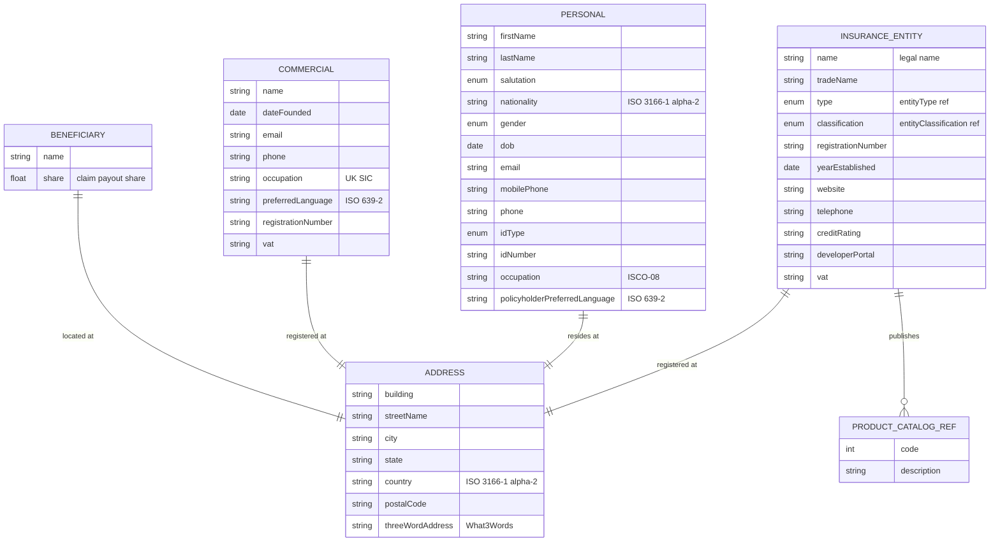

# Module 1: Core Parties and Entities

The entities, fields, enumerated values and relationships. The endpoints over them are in
[`api.md`](api.md), and the terms used throughout are defined in
[Insurance concepts](../concepts.md).

The party types every coverage line uses. **`insuranceEntity`** is the insurer, reinsurer, broker or
agent. **`Personal`** is an individual customer and **`Commercial`** is a corporate one, kept apart
because their fields barely overlap. **`Beneficiary`** is whoever receives a payout, with a `share`
so one payout can be split. **`address`** is embedded inside each of them rather than stored on its
own.

## Selected fields

The fields most likely to need explanation. Everything else is in the diagram above.

| Entity | Field | Type | What it means |
|---|---|---|---|
| InsuranceEntity | name | Text | The legal name. This is the entity a contract is written against |
| InsuranceEntity | tradeName | Text | The name it trades under, where that differs from the legal one |
| InsuranceEntity | type | enum (entityType) | What kind of organisation it is. Seventeen values covering insurer, reinsurer, takaful, mutual, peer-to-peer, Lloyd's, broker, agent and managing general agent |
| InsuranceEntity | classification | enum (entityClassification) | The business it writes: property and casualty, life, composite, or other |
| InsuranceEntity | registrationNumber | Text | Issued by the regulator that licensed it |
| InsuranceEntity | creditRating | Text | The rating from S&P, AM Best or Fitch. It matters because it is a measure of whether the insurer can pay its claims |
| InsuranceEntity | developerPortal | Text/URL | Where an integrator finds that entity's own API documentation |
| InsuranceEntity | productCatalog | ref (productCatalog) | The products it publishes. Multi-valued |
| Personal | salutation | enum | Mr, Mrs or Ms |
| Personal | nationality | Text (ISO 3166-1 alpha-2) | Two-letter country code |
| Personal | gender | enum | Three values: `m`, `f`, `o` |
| Personal | dob | Date (ISO 8601) | Date of birth, and a pricing input in most lines |
| Personal | idType | enum | The kind of identity document: passport, national ID, driving licence, national insurance number, or other |
| Personal | idNumber | Text | The number on that document. With `idType`, this is what deduplicates a party |
| Personal | occupation | Text (ISCO-08) | Occupation as an ISCO-08 code rather than free text, so two systems agree on what a job title means |
| Personal | policyholderPreferredLanguage | Text (ISO 639-2) | Three-letter language code, for correspondence |
| Commercial | dateFounded | Date (ISO 8601) | When the organisation was established. Trading history is a risk signal |
| Commercial | occupation | Text (UK SIC) | Industry, as a UK Standard Industrial Classification code |
| Commercial | registrationNumber | Text | Company registration number |
| Beneficiary | name | Text | Either a person or an organisation |
| Beneficiary | share | Number/Float | This beneficiary's share of the payout. Shares across all beneficiaries on a policy are expected to total 100 |
| Address | country | Text (ISO 3166-1 alpha-2) | Two-letter country code |
| Address | postalCode | Text | Postal or ZIP code |
| Address | threeWordAddress | Text (What3Words) | A What3Words reference, useful where street addressing is sparse |

## What to watch

**`Personal.gender` carries three values: `m`, `f` and `o`.** Several jurisdictions require more
values, a different representation, or that the field be optional. Decide what your market needs
before you make it mandatory, and note that the standard also offers no gender-neutral salutation.

**`Commercial` has no legal-form field.** Nothing records whether an organisation is a limited
company, a partnership or a sole trader, even though the standard defines a `legalEntity` enum and
[trade credit](../09-trade-credit/) surfaces it on `Debtor`. Carry it as an extension field if you
need it.

**Address field names are camelCase here.** Use `postalCode` and `threeWordAddress`. The underlying
data standard spells them `postal_code` and `3_word_address`, and the second is not a legal
identifier in most languages, so both are normalised. No address endpoint ever carried the original
spellings, so nothing on the wire depends on them.

**Address is a value object, not a resource.** It is sent and received inline inside its owning
entity, and there is no way to create, fetch or update one on its own.
