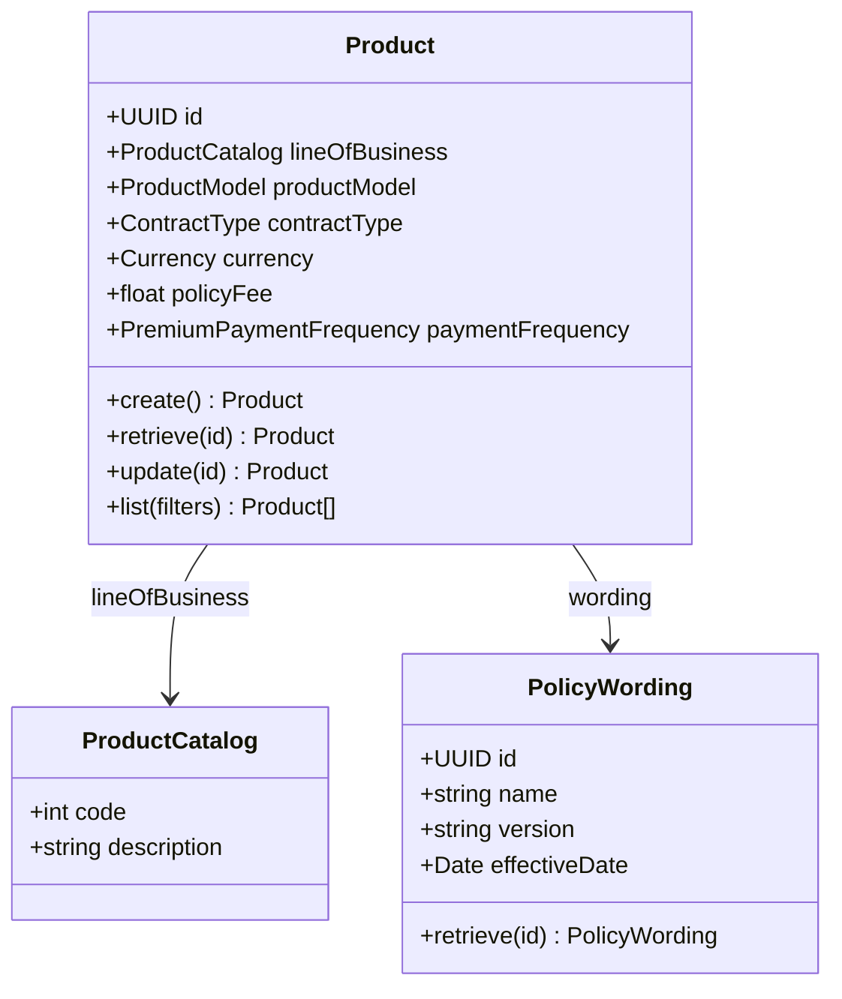
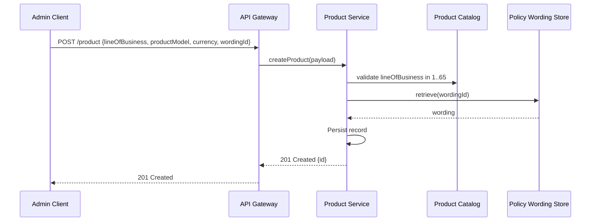
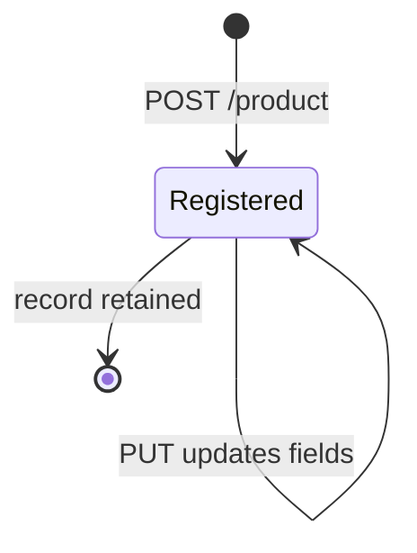
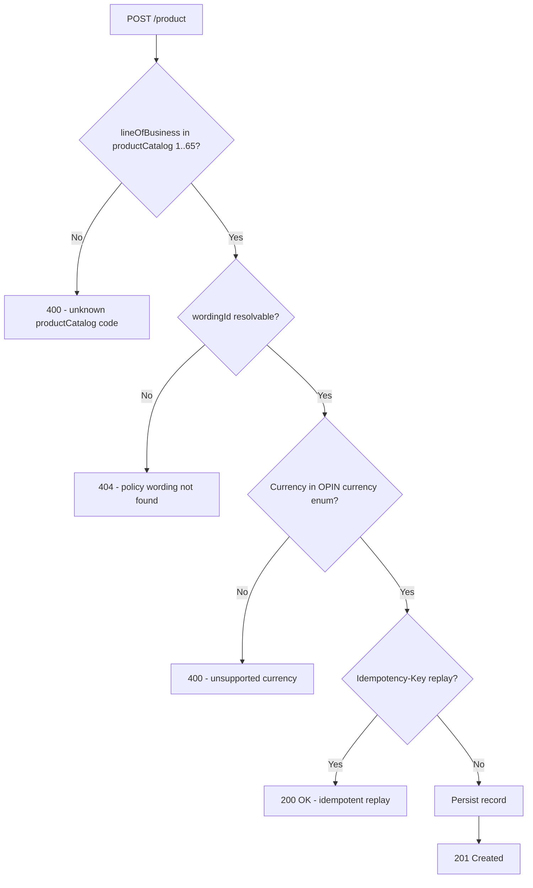

# Module 2: Products and Catalog

The endpoints, the flow that registers a product, the lifecycle and the error paths. The entities
and fields are in [`data-model.md`](data-model.md), and the rules that apply on every call are in
[`../conventions.md`](../conventions.md).

## Resource model

`policyWording` carries `version` and `effectiveDate` as well as a name. Together they are what let
you evidence which wording governed a policy sold on a given date, which is a routine compliance
ask and the reason the entity is more than a label.

## Endpoints

`productCatalog` is read-only. It is the standard's fixed list of 65 lines of business, not
something an implementation adds to.

| Endpoint | Scope | What it does |
| :--- | :--- | :--- |
| `POST /product` | admin | Register a product |
| `GET /product` | developer | List, filterable by `lineOfBusiness`, `productModel` and `currency` |
| `GET /product/{id}` | developer | Retrieve one product |
| `PUT /product/{id}` | admin | Replace a product |
| `GET /productCatalog` | developer | List the 65 lines of business |
| `POST /policyWording` | admin | Register a wording |
| `GET /policyWording` | developer | List wordings |
| `GET /policyWording/{id}` | developer | Retrieve one wording |
| `PUT /policyWording/{id}` | admin | Replace a wording |

## Primary flow: register a product

## Lifecycle

A product exists or it does not. There is no draft state and no deprecated state, so nothing in the
standard says whether a product is open for new business today. That is an operational question
about one insurer's catalogue rather than a fact about the product, so carry it as an extension
field.

## Errors

