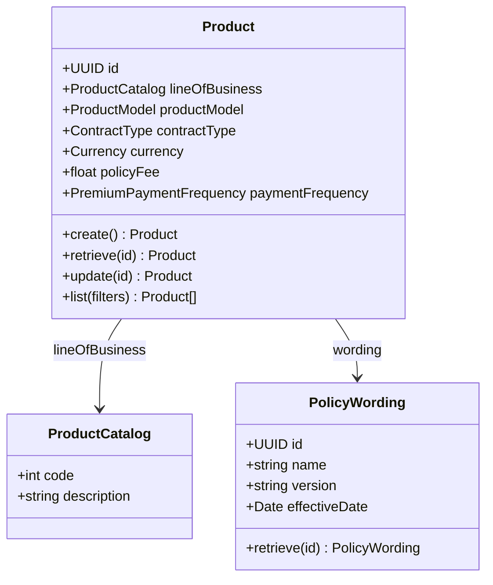
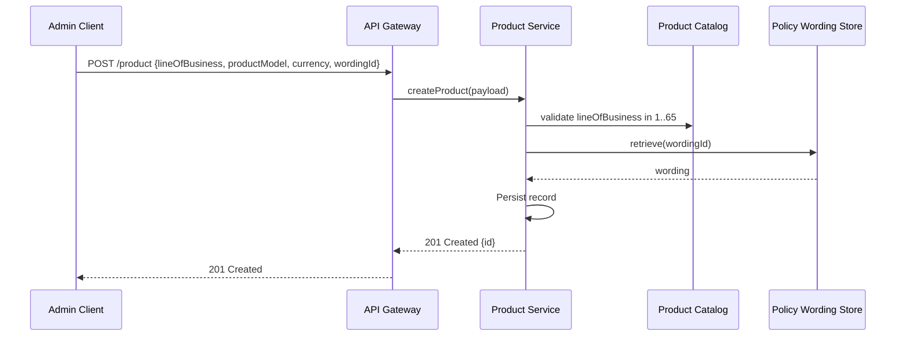
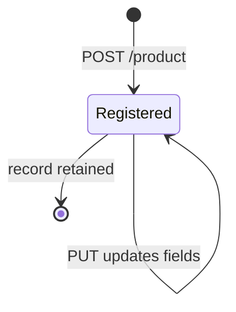
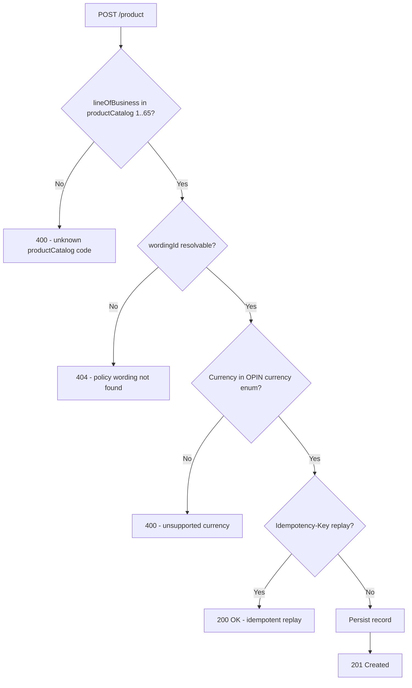

# Module 2: Products and Catalog

Resources, endpoints, primary flow, lifecycle and routing. The entities and fields are in [`data-model.md`](data-model.md). Conventions that apply to every module are in [`../conventions.md`](../conventions.md).

### Resource model

### Endpoints

`[added]`: OPIN publishes the Product and policyWording schemas but no endpoints. CRUD on Product and a read endpoint are added here for the productCatalog enum lookup.

- `POST /product` (admin)
- `GET /product` (developer), filter by lineOfBusiness, productModel, currency
- `GET /product/{id}` (developer)
- `PUT /product/{id}` (admin)
- `GET /productCatalog` (developer), list 65 OPIN productCatalog entries
- `GET /policyWording` (developer)
- `GET /policyWording/{id}` (developer)
- `POST /policyWording` (admin)
- `PUT /policyWording/{id}` (admin)

### Primary flow: Register a new product

### Lifecycle

`[OPIN concern]`: OPIN does not declare a Product lifecycle (no draft, active, deprecated states). This standard keeps the lifecycle conservative. Product activation and deprecation are operational concerns to be encoded in implementer-specific extensions.

### Routing and error handling

