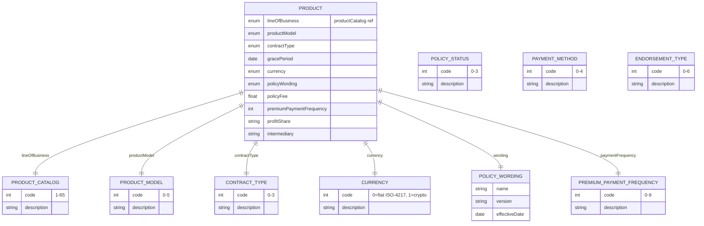

# Module 2: Products and Catalog

The entities, fields, enumerated values and relationships. The endpoints over them are in
[`api.md`](api.md), and the terms used throughout are defined in
[Insurance concepts](../concepts.md).

**`Product`** is the thing an insurer sells, before any particular customer buys it. It names its
line of business from **`productCatalog`**, how it is priced through **`productModel`**, how it is
automated through **`contractType`**, and which **`policyWording`** governs it.

The smaller enumerations here are shared rather than local. `policyStatus`, `endorsementType`,
`paymentMethod`, `premiumPaymentFrequency` and `currency` are all defined once in this module and
referenced from the coverage modules.

## Selected fields

| Entity | Field | Type | What it means |
|---|---|---|---|
| Product | lineOfBusiness | enum (productCatalog) | What kind of insurance this is, as one of 65 catalogue codes |
| Product | productModel | enum | How the product is priced and charged. Conventional annual, pay-as-you-drive, pay-how-you-drive, subscription, government tariff, or other |
| Product | contractType | enum | How automated the contract is. Not automated, smart contract, parametric, or other. A parametric product pays on a measured trigger rather than on an assessed loss |
| Product | gracePeriod | Date | How long a customer has to pay a late premium before the policy lapses |
| Product | currency | enum | Fiat under ISO 4217, or cryptocurrency |
| Product | policyWording | ref (policyWording) | The legal document that governs what is covered |
| PolicyWording | name | Text | The wording's name, which is market-specific |
| PolicyWording | version | Text | Which revision of the wording this is |
| PolicyWording | effectiveDate | Date | The date this version came into force. With `version`, this is what lets you evidence which wording governed a policy sold on a given day |
| Product | policyFee | Number/Float | Administration fee charged on top of the premium |
| Product | premiumPaymentFrequency | enum | How often the customer pays. Ten values: annual, bi-annual, quarterly, monthly, bi-monthly, weekly, daily, usage-based, subscription, other |
| Product | profitShare | Text | The formula splitting underwriting profit with an intermediary or a partner |
| Product | intermediary | Text | The broker or agent through whom the product is distributed |
| ProductCatalog | code | int | 1 to 65, covering motor, property, marine, medical, engineering, life, cyber, business interruption, trade credit, pet and travel among others |
| PolicyStatus | code | int | In force, cancelled, lapsed or extended. Used by every coverage module |
| EndorsementType | code | int | The kind of mid-term change: addition, deletion, cancellation, extension, declaration, transfer or renewal |
| PaymentMethod | code | int | Cash, credit card, cheque, electronic transfer or crypto |

## What to watch

**`premiumPaymentFrequency` is declared two incompatible ways.** On `Product` it is typed as an
integer, and it also references an enumeration of the same name. The enumeration is authoritative.
Send a code from it, and do not accept arbitrary integers on the strength of the typing.

**`policyWording` carries no document URL.** It has a name, a version and an effective date, and
nothing pointing at the text itself. Hold the document wherever you hold your other binaries and
reference it from your own side.

**The catalogue has no parametric or index-linked codes.** Parametric weather cover and index-linked
microinsurance map only loosely onto existing entries such as 36 (purchase protection) or 30
(personal accident). Choose deliberately and record the choice.
