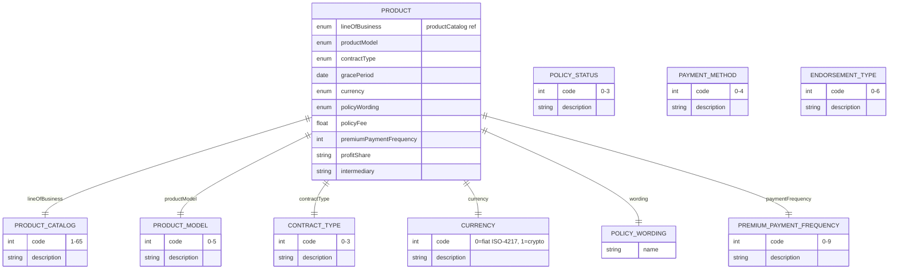

# Module 2: Products and Catalog

Entities, fields, enumerated values and relationships. The API surface for this module is in [`api.md`](api.md).

Covers the policy-level Product entity that every coverage shares: lineOfBusiness reference, product model (conventional, PAYD, PHYD, subscription, government tariff, other), contract type (not automated, smart contract, parametric, other), and currency.

OPIN sources: `Product`, `productCatalog`, `productModel`, `contractType`, `policyWording`, `currency`, `paymentMethod`, `premiumPaymentFrequency`, `endorsementType`, `policyStatus`.

### Field annotations (Module 2)

| Entity | Field | Type | OPIN source | Notes |
|---|---|---|---|---|
| Product | lineOfBusiness | enum (productCatalog) | sheet `Product` | 65 distinct insurance product types |
| Product | productModel | enum | sheet `productModel` | conventional annual / PAYD / PHYD / subscription / government tariff / other |
| Product | contractType | enum | sheet `contractType` | not automated / smart contract / parametric / other |
| Product | gracePeriod | Date | sheet `Product` | Policy lapse date |
| Product | currency | enum | sheet `currency` | fiat (ISO-4217) or cryptocurrency |
| Product | policyWording | ref (policyWording) | sheet `policyWording` | Market-specific name |
| Product | policyFee | Number/Float | sheet `Product` | Admin fees |
| Product | premiumPaymentFrequency | enum (premiumPaymentFrequency) | sheet `premiumPaymentFrequency` |  |
| Product | profitShare | Text | sheet `Product` | Formula |
| Product | intermediary | Text | sheet `Product` | Broker/agent name |
| ProductCatalog | code | int | sheet `productCatalog` | 1-65 enumeration covering motor, property, marine, medical, engineering, life, cyber, BI, trade credit, pet, travel, etc. |
| ProductModel | code | int | sheet `productModel` | 0-5 |
| ContractType | code | int | sheet `contractType` | 0-3 |
| PolicyStatus | code | int | sheet `policyStatus` | in force / cancelled / lapsed / extended |
| EndorsementType | code | int | sheet `endorsementType` | addition / deletion / cancellation / extension / declaration / transfer / renewal |
| PaymentMethod | code | int | sheet `paymentMethod` | cash / credit card / cheque / electronic transfer / crypto |
| PremiumPaymentFrequency | code | int | sheet `premiumPaymentFrequency` | 0-9: annual, bi-annual, quarterly, monthly, bi-monthly, weekly, daily, usage-based, subscription, other |

`[OPIN concern]`: `policyWording` is defined as a single-property entity with just `name`. OPIN does not specify version control, effective date, or wording document URL for the underlying policy text. Compliance traceability and reissuance handling are not supported. On the work list.

`[OPIN concern]`: `productCatalog` (65 entries) does not include parametric weather, index-linked microinsurance, or microinsurance-specific products explicitly. Parametric and index-linked products map only loosely to existing codes (e.g., 36 purchase protection or 30 personal accident). On the work list: whether parametric variants merit dedicated codes.

`[OPIN concern]`: `Product.premiumPaymentFrequency` is typed `Number/integer` on the `Product` sheet but references the `premiumPaymentFrequency` enum. Type vs reference inconsistency. The enum is authoritative; type should be `enum`.
