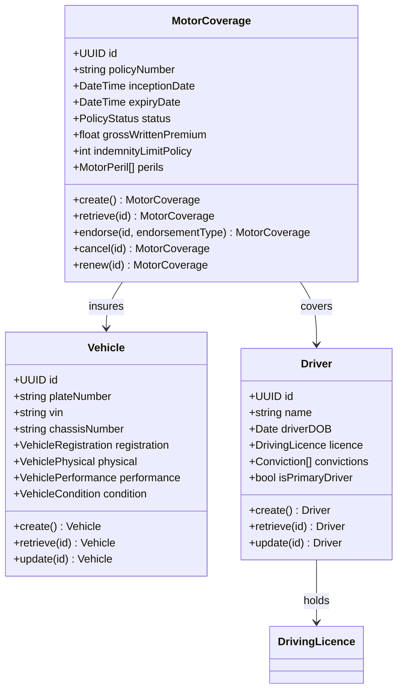
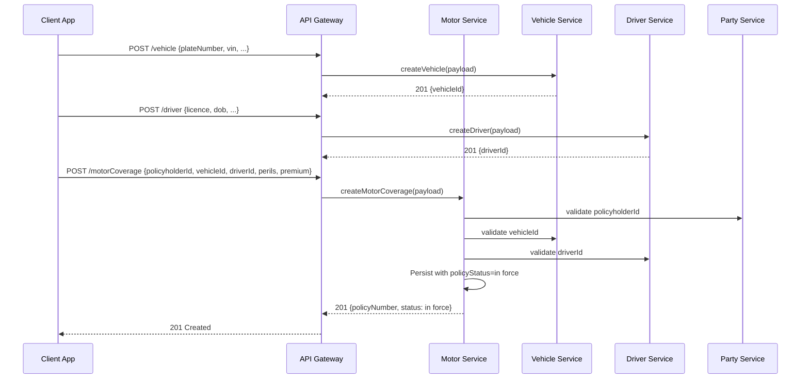
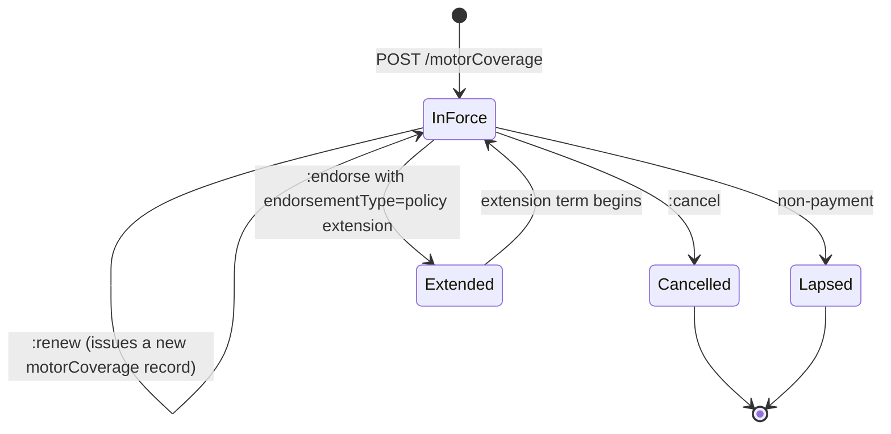
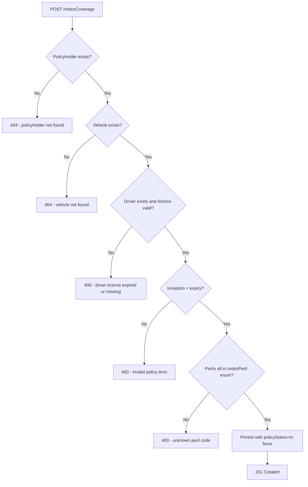

# Module 3: Motor

Resources, endpoints, primary flow, lifecycle and routing. The entities and fields are in [`data-model.md`](data-model.md). Conventions that apply to every module are in [`../conventions.md`](../conventions.md).

### Resource model

### Endpoints

OPIN spec endpoints (kept verbatim, motor only, attributed to OPIN):

- `POST /vehicle` (admin) `[OPIN]`
- `GET /vehicle` (developer) `[OPIN]`
- `POST /claim` (admin) `[OPIN]`: polymorphic across coverages, see Module 11
- `GET /claim` (developer) `[OPIN]`
- `POST /driver` (admin) `[OPIN]`
- `GET /driver` (developer) `[OPIN]`
- `POST /motorCoverage` (admin) `[OPIN]`
- `GET /motorCoverage` (developer) `[OPIN]`

OPIN-VN extensions on the same OPIN schemas:

- `GET /vehicle/{id}` (developer) `[OPIN-VN extension to API; OPIN schema reused]`
- `PUT /vehicle/{id}` (admin) `[OPIN-VN extension to API; OPIN schema reused]`
- `GET /driver/{id}` (developer) `[OPIN-VN extension to API; OPIN schema reused]`
- `PUT /driver/{id}` (admin) `[OPIN-VN extension to API; OPIN schema reused]`
- `GET /motorCoverage/{id}` (developer) `[OPIN-VN extension to API; OPIN schema reused]`
- `PUT /motorCoverage/{id}` (admin) `[OPIN-VN extension to API; OPIN schema reused]`
- `POST /motorCoverage/{id}:endorse` (admin) `[OPIN-VN extension to API; OPIN schema reused]`: body carries OPIN `endorsementType`
- `POST /motorCoverage/{id}:cancel` (admin) `[OPIN-VN extension to API; OPIN schema reused]`
- `POST /motorCoverage/{id}:renew` (admin) `[OPIN-VN extension to API; OPIN schema reused]`

### Primary flow: Bind a motor policy

### Lifecycle

States are exactly OPIN `policyStatus` (in force, cancelled, lapsed, extended). Endorsement is an operation on an in-force policy that mutates fields under an OPIN `endorsementType` value but does not introduce a new lifecycle state. Renewal issues a new record rather than transitioning the existing one.

### Routing and error handling

