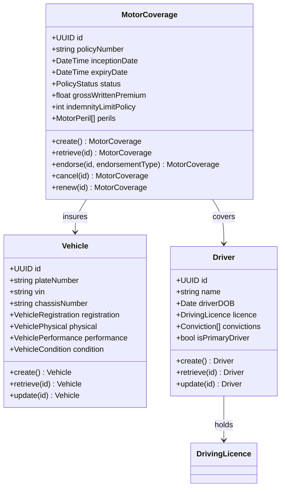
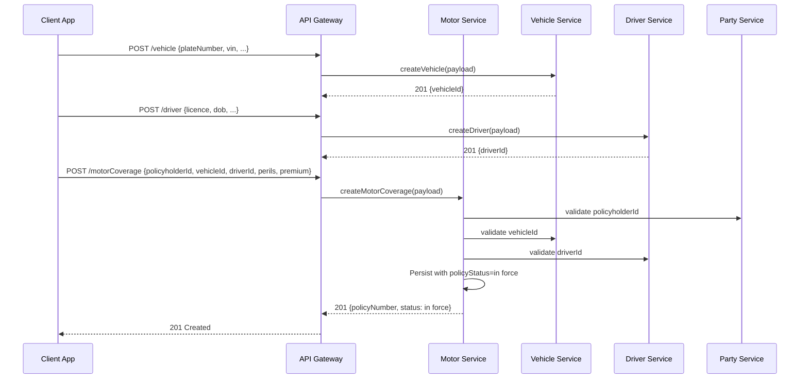
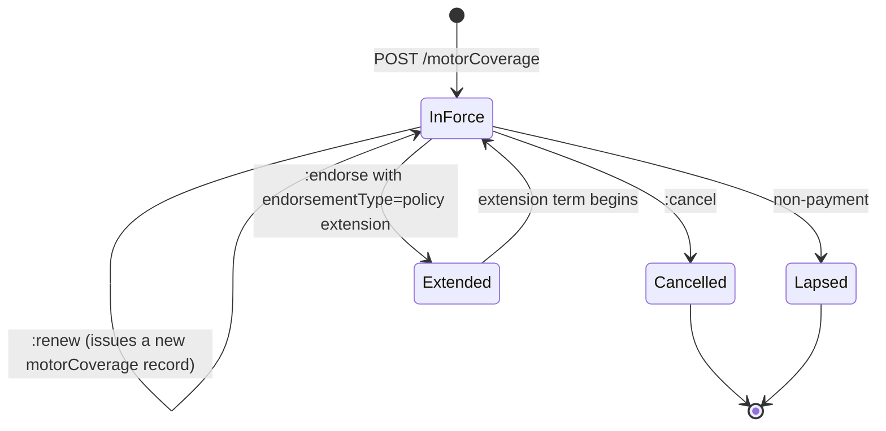
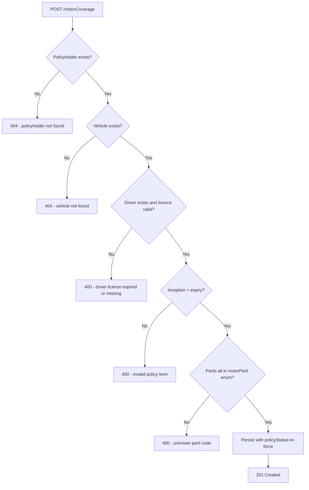

# Module 3: Motor

The endpoints, the flow that binds a policy, the lifecycle and the error paths. The entities and
fields are in [`data-model.md`](data-model.md), and the rules that apply on every call are in
[`../conventions.md`](../conventions.md).

## Resource model

## Endpoints

Three resources, each with the same shape: create and list on the collection, retrieve and replace
on the item. `motorCoverage` adds three lifecycle actions that CRUD cannot express.

Each endpoint names the scope it requires. `opin-vn.admin` is the write scope and
`opin-vn.developer` is read-only. See [`../conventions.md`](../conventions.md).

| Endpoint | Scope | What it does |
| :--- | :--- | :--- |
| `POST /vehicle` | admin | Create a vehicle |
| `GET /vehicle` | developer | List vehicles |
| `GET /vehicle/{id}` | developer | Retrieve one vehicle |
| `PUT /vehicle/{id}` | admin | Replace a vehicle |
| `POST /driver` | admin | Create a driver |
| `GET /driver` | developer | List drivers |
| `GET /driver/{id}` | developer | Retrieve one driver |
| `PUT /driver/{id}` | admin | Replace a driver |
| `POST /motorCoverage` | admin | Bind a policy against an existing vehicle and driver |
| `GET /motorCoverage` | developer | List coverage, filterable by `policyNumber` |
| `GET /motorCoverage/{id}` | developer | Retrieve one coverage record |
| `PUT /motorCoverage/{id}` | admin | Replace a coverage record |
| `POST /motorCoverage/{id}:endorse` | admin | Amend a policy in force. Body carries an `endorsementType` |
| `POST /motorCoverage/{id}:cancel` | admin | End a policy before expiry |
| `POST /motorCoverage/{id}:renew` | admin | Issue a new coverage record for a new term |

Claims against a motor policy go to `POST /claim`, which serves every coverage type from one
endpoint. See [Claims](../11-claims/).

## Primary flow: bind a motor policy

The vehicle and the driver are created first, and the coverage refers to both. Three writes rather
than one, because a vehicle and a driver outlive the policy that binds them.

## Lifecycle

**This diagram is normative.** A transition it does not draw is not one an implementation may make.

Four states, and they are the `policyStatus` value set: in force, cancelled, lapsed, extended. Two
of the operations behave in ways worth stating plainly.

**Endorsing does not change the state.** An endorsement amends a policy that stays in force
throughout. It applies an `endorsementType` and mutates fields, and the policy is in force before
and after.

**Renewing does not transition the record.** It writes a second `motorCoverage` with its own policy
number, and the original runs to its own expiry. Two records, not one moved forward.

## Errors

Every error body is an RFC 7807 problem document, described in
[`../conventions.md`](../conventions.md). The distinction to note is between 404 and 400 here: a
missing referenced record is a 404 because the caller named something that does not exist, and an
expired licence or an inverted policy term is a 400 because the caller named something real and
described it wrongly.
