# Module 3: Motor

Entities, fields, enumerated values and relationships. The API surface for this module is in [`api.md`](api.md).

Covers motor insurance: Vehicle (the most data-rich entity in OPIN, with 100+ properties spanning registration, OEM, telematics, ADAS, and condition signals), Driver, motorCoverage, and motor-specific perils.

OPIN sources: `motorCoverage`, `Vehicle`, `Driver`, `motorPeril`, `bodyType`, `fuelType`, `aiClassification`, `vehicleUse`, `drivingLicence`, `conviction`, `offenceCode`, `medicalCondition`, `workStatus`, `notifiableCondition`, `distanceUnit`.

```mermaid
erDiagram
    MOTOR_COVERAGE {
        string policyNumber
        datetime inceptionDate "ISO 8601"
        datetime expiryDate "ISO 8601"
        enum status "policyStatus ref"
        float discountAmount
        float premiumRate
        float grossWrittenPremium
        float salesTax
        float brokeragePercentage
        float brokerageAmount
        int premiumPaymentFrequency
        int indemnityLimitPolicy
        int indemnityLimitAccident
        bool isAgreedValue
        string endorsementID
        datetime endorsementDate
        enum endorsementType
        enum peril "motorPeril ref"
        float voluntaryDeductiblePercentage
        int voluntaryDeductibleAmount
        float compulsoryDeductiblePercentage
        int compulsoryDeductibleAmount
        float windscreenDeductiblePercentage
        int windscreenDeductibleAmount
        enum distanceUnit
        float pleasureDistance
        float businessDistance
        int numberOfVehicles
    }
    DRIVER {
        string name
        enum gender
        date driverDOB
        bool isPrimaryDriver
        int noClaimsDiscount
        float loading "young driver loading"
        bool isBlueBadge
        string nonMotorConviction
        enum workStatus
        string occupation "ISCO-08"
    }
    DRIVING_LICENCE {
        string licenceNumber
        date issueDate
        date expiryDate
        string country "ISO 3166-1 alpha-2"
        string licenceCategory
        string licenceCodes
    }
    CONVICTION {
        date offenceDate
        enum offenceCode "offenceCode ref - DVLA UK"
        date date
        int points
        float fine
        enum fineCurrency "currency ref"
        bool suspension
        int suspensionLength
    }
    MEDICAL_CONDITION {
        enum notifiableCondition
        string status
        string medicalDvlaRestriction
        string medicalTreatment
        bool bypassOperation
        bool insulinInjected
        int dailyInsulinUnits
    }
    VEHICLE {
        string plateNumber
        date registrationDate
        string countryOfRegistration "ISO 3166-1 alpha-2"
        string chassisNumber
        string vin
        string engineNumber
        string vehicleWeight
        bool agencyRepair
        bool vehicleGarage
        enum bodyType
        enum fuelType
        enum aiClassification "SAE International"
        enum vehicleUse
        int yearlyMilage
        string vehicleBrand "KBA HSN/TSN"
        string vehicleModel
        date modelYear
        string seats
        string colour "ISO 14726"
        bool trailerIncluded
        int sumInsured
        string accessories
        int accessoryValue
        float engineCapacity "cc"
        bool co2Emissions
        bool automaticTransmission
        bool lefthandDrive
        bool blueBadgeAdapted
        int doors
        string securityDevice
        string modification
        bool digitalKeyUsed
        int power
        int torque
        int evPower "kilowatts"
        int evTorque
        string acceleration "0-60mph seconds"
        string vehicleTopSpeed
        bool hasTractionEnabled
        bool hasImmobilizer
        bool hasTheftDetection
        float currentMileage
        float currentMileageDynamic
        float yearlyMilageDynamic
        float highwayYearlyMilageDynamic
        float dailyMilageDynamic
        string serviceHistory
        bool serviceDue
        int timeToService
        string recallHistory
        bool tractionControlEngaged
        float accelerationLongitudinal
        float accelerationLateral
        float accelerationVertical
        float brakingFrequency
        float brakePedalForce
        float brakePedalSpeed
        bool performanceMode
        bool emergencyBraking
        bool engnitionOn
        bool engnitionOff
        float ignitionOnTime
        float ignitionOffTime
        float longitude
        float latitude
        float altitude
        float heading
        bool isMoving
        bool hornIsActive
        float drivingSpeed
        bool wheelSpin
        float decelrationRate
        float steeringSpeedTurn
        bool laneDepartureWarning
        bool adasAbsIsActive
        bool obstacleDetectionIsActive
        bool driverIntervention
        bool obstacleDetectionWarning
        float speedSet
        float yaw
        float pitch
        float roll
        float gForce
        bool row1Pos1Isbelted
        bool row1Pos2Isbelted
        bool row2Pos1Isbelted
        bool row2Pos2Isbelted
        float cabinTemp
        float cabinHumidity
        string tireConditionRow1Left
        string tireConditionRow1Right
        string tireConditionRow2Left
        string tireConditionRow2Right
        float tirePressureRow1Left
        bool tirePressureRow1LeftLow
        float brakePadWearRow1Left
        bool brakesWornRow1Right
        float clutchWear
        bool hasAirbagDeployed
        bool hasAbsError
        bool engineWarning
        string knownVehicleDamage
        string damagedParts
        float damagedPartsCost
        int occupiedSeats
        bool childSeatOccupiesSeat
        bool consentGranted
    }
    MOTOR_PERIL {
        int code "0-16, seventeen values"
        string description
    }

    MOTOR_COVERAGE ||--|{ DRIVER : "covers"
    MOTOR_COVERAGE ||--|{ VEHICLE : "insures"
    DRIVER ||--|| DRIVING_LICENCE : "holds"
    DRIVER ||--o{ CONVICTION : "has"
    DRIVER ||--o{ MEDICAL_CONDITION : "has"
    MOTOR_COVERAGE ||--|{ MOTOR_PERIL : "covers"
```

### Field annotations (Module 3)

| Entity | Field | Type | OPIN source | Notes |
|---|---|---|---|---|
| MotorCoverage | policyNumber | Text | sheet `motorCoverage` |  |
| MotorCoverage | inceptionDate | DateTime (ISO 8601) | sheet `motorCoverage` |  |
| MotorCoverage | expiryDate | DateTime (ISO 8601) | sheet `motorCoverage` |  |
| MotorCoverage | status | enum (policyStatus) | sheet `motorCoverage` |  |
| MotorCoverage | premiumRate | Number/Float | sheet `motorCoverage` | Percentage |
| MotorCoverage | grossWrittenPremium | Number/Float | sheet `motorCoverage` | Pre-tax premium and acquisition costs |
| MotorCoverage | indemnityLimitPolicy | Number/integer | sheet `motorCoverage` | Annual policy limit |
| MotorCoverage | indemnityLimitAccident | Number/integer | sheet `motorCoverage` | Per-accident limit |
| MotorCoverage | peril | enum (motorPeril) | sheet `motorPeril`, API enum `motorPeril` | 17 values: TPL, fire, theft, accidental damage, windshield damage, malicious damage, terrorism and sabotage, flood, earthquake, volcanic eruption, tsunami, hail, unknown or hit-and-run, riots, strikes, civil commotion, war |
| MotorCoverage | voluntaryDeductibleAmount | Number/integer | sheet `motorCoverage` |  |
| MotorCoverage | compulsoryDeductibleAmount | Number/integer | sheet `motorCoverage` |  |
| MotorCoverage | windscreenDeductibleAmount | Number/integer | sheet `motorCoverage` |  |
| MotorCoverage | distanceUnit | enum (distanceUnit) | sheet `motorCoverage` | km / miles |
| MotorCoverage | pleasureDistance | Number/Float | sheet `motorCoverage` | PAYD support |
| MotorCoverage | businessDistance | Number/Float | sheet `motorCoverage` | PAYD support |
| Driver | name | Text | sheet `Driver` |  |
| Driver | driverDOB | Date | sheet `Driver` |  |
| Driver | isPrimaryDriver | Boolean | sheet `Driver` |  |
| Driver | licence | ref (drivingLicence) | sheet `Driver` |  |
| Driver | noClaimsDiscount | Number/integer | sheet `Driver` | Years of NCB |
| Driver | conviction | ref (conviction) | sheet `Driver` | Multi-valued |
| Driver | medicalCondition | ref (medicalCondition) | sheet `Driver` | OPIN spelling `medicalConditon` on Driver sheet; `[normalisation]` applied |
| Driver | loading | Number/Float | sheet `Driver` | Young driver % loading |
| Driver | isBlueBadge | Boolean | sheet `Driver` | UK accessibility scheme |
| Driver | workStatus | enum (workStatus) | sheet `workStatus` | self-employed / retired / employed / redundant |
| Vehicle | plateNumber | Text | sheet `Vehicle` |  |
| Vehicle | countryOfRegistration | Text (ISO 3166-1 alpha-2) | sheet `Vehicle` | OPIN spelling `countryOfRegisteration`; `[normalisation]` applied |
| Vehicle | vin | Text | sheet `Vehicle` | Standard VIN |
| Vehicle | bodyType | enum | sheet `bodyType` | 12 values from motor car to construction equipment |
| Vehicle | fuelType | enum | sheet `fuelType` | petrol / diesel / electric / hybrid / gas / hydrogen |
| Vehicle | aiClassification | enum (SAE International levels 0-5) | sheet `aiClassification` | Level 0-5 autonomy |
| Vehicle | vehicleUse | enum | sheet `vehicleUse` | business / business and leisure / commercial / sharing / subscription |
| Vehicle | currentMileageDynamic | Number/Float | sheet `Vehicle` | From vehicle telematics |
| Vehicle | hasAirbagDeployed | Boolean | sheet `Vehicle` | Crash signal |
| Vehicle | consentGranted | Boolean | sheet `Vehicle` | Telematics data sharing consent |

`[OPIN concern]`: The `Vehicle` entity in OPIN bundles 100+ fields spanning registration, OEM specs, real-time telematics, ADAS state, seat occupancy, tire pressure, brake pad wear, and consent flags into one sheet. This is operationally large for a single record and conflates static vehicle attributes with high-frequency telematics state. OPIN does not factor these into separate sub-entities. This document renders Vehicle as a single entity to match OPIN exactly. On the work list: split Vehicle into static (registration, OEM specs) and dynamic (telematics, condition) sub-entities.

`[OPIN concern]`: The `Vehicle` sheet contains several typos: `countryOfRegisteration` (should be `countryOfRegistration`), `engnitionOn` and `engnitionOff` (should be `ignitionOn`/`ignitionOff`), `logitude` (should be `longitude`), `laneDepartureWarnning` (should be `laneDepartureWarning`), `decelrationRate` (should be `decelerationRate`), `yearlyMilage` (should be `yearlyMileage`). `[normalisation]` applied to the field names rendered in the Mermaid block; original OPIN spellings recorded here against the defect.

`[OPIN concern]`: The `Driver` sheet field `medicalConditon` is misspelled (should be `medicalCondition`); the enum sheet itself is correctly named `medicalCondition`. `[normalisation]` applied.

`[OPIN concern]`: The `motorPeril` enum carries 17 values in both the XLSX and the API JSON (codes 0-16) with internal typos in descriptions (`unkown or hit and run`, `volcanic erruption`). `[normalisation]` may correct enum description spellings without changing codes; codes are stable.

Out-of-scope for OPIN: real-time telematics ingestion, event streaming, PAYD/PHYD billing computations, and ADAS event correlation. These are operational concerns that consume Vehicle telematics fields but are not modelled by OPIN as event entities. Domain extensions, if needed, are out-of-scope for this document.
