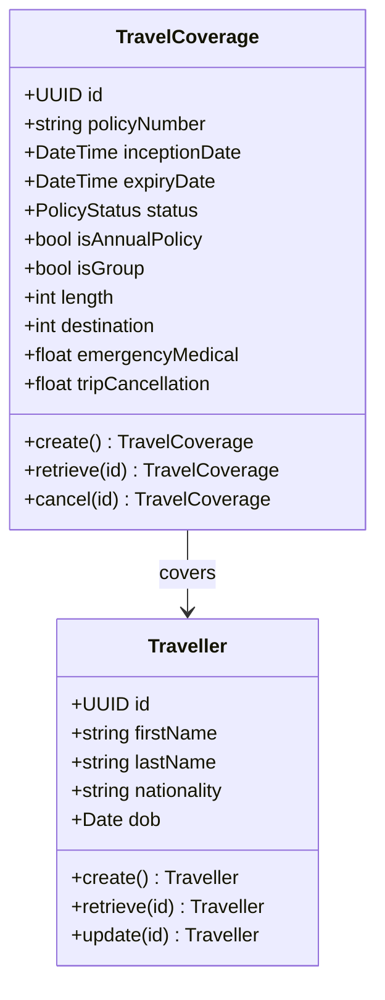
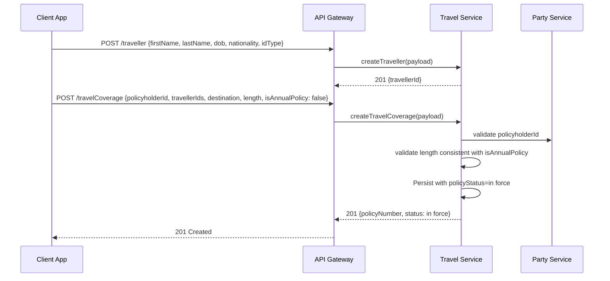
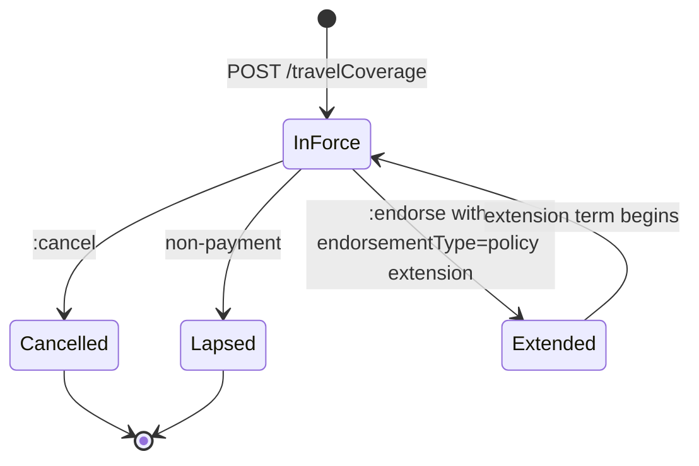
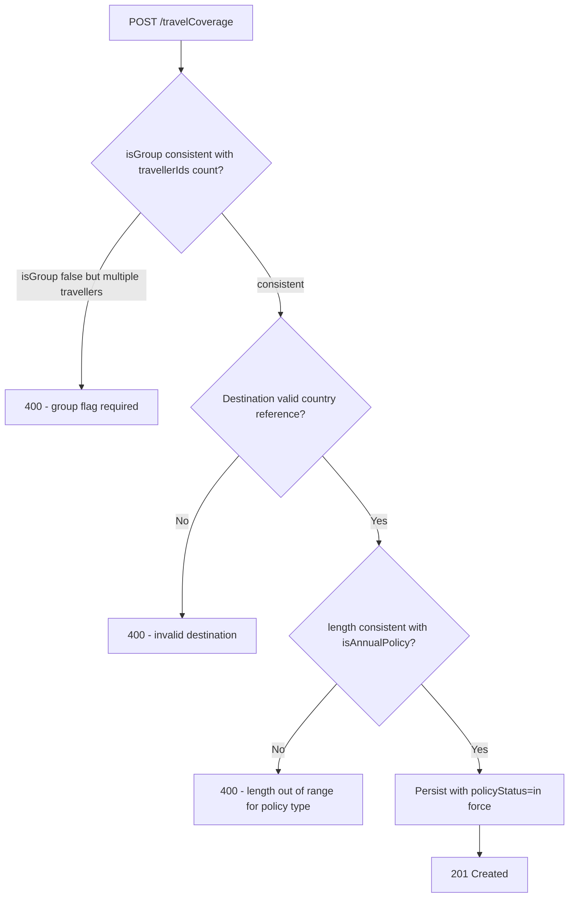

# Module 4: Travel

Resources, endpoints, primary flow, lifecycle and routing. The entities and fields are in [`data-model.md`](data-model.md). Conventions that apply to every module are in [`../conventions.md`](../conventions.md).

### Resource model

### Endpoints

`[added]`: OPIN publishes the travelCoverage and traveller schemas but no endpoints. CRUD is added here, modelled on the motor pattern.

- `POST /travelCoverage` (admin)
- `GET /travelCoverage` (developer)
- `GET /travelCoverage/{id}` (developer)
- `PUT /travelCoverage/{id}` (admin)
- `POST /travelCoverage/{id}:cancel` (admin)
- `POST /traveller` (admin)
- `GET /traveller` (developer)
- `GET /traveller/{id}` (developer)
- `PUT /traveller/{id}` (admin)

### Primary flow: Bind a single-trip travel policy

### Lifecycle

States are exactly OPIN `policyStatus`. Trip expiry is a derived property from `expiryDate` and is not a separate lifecycle state.

### Routing and error handling

