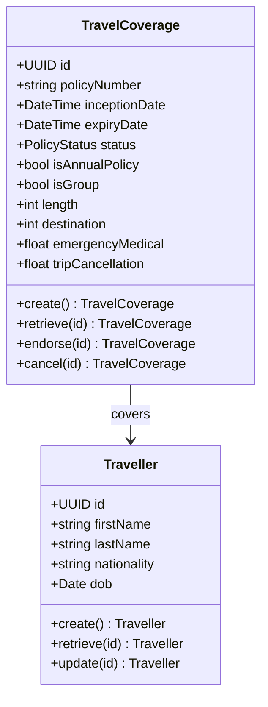
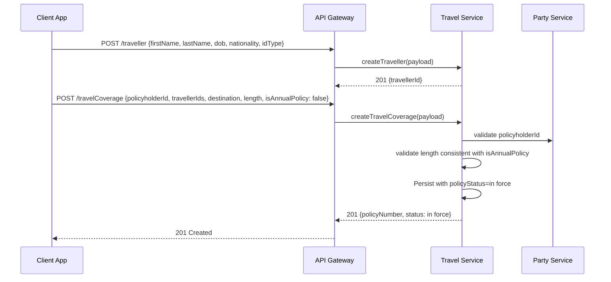
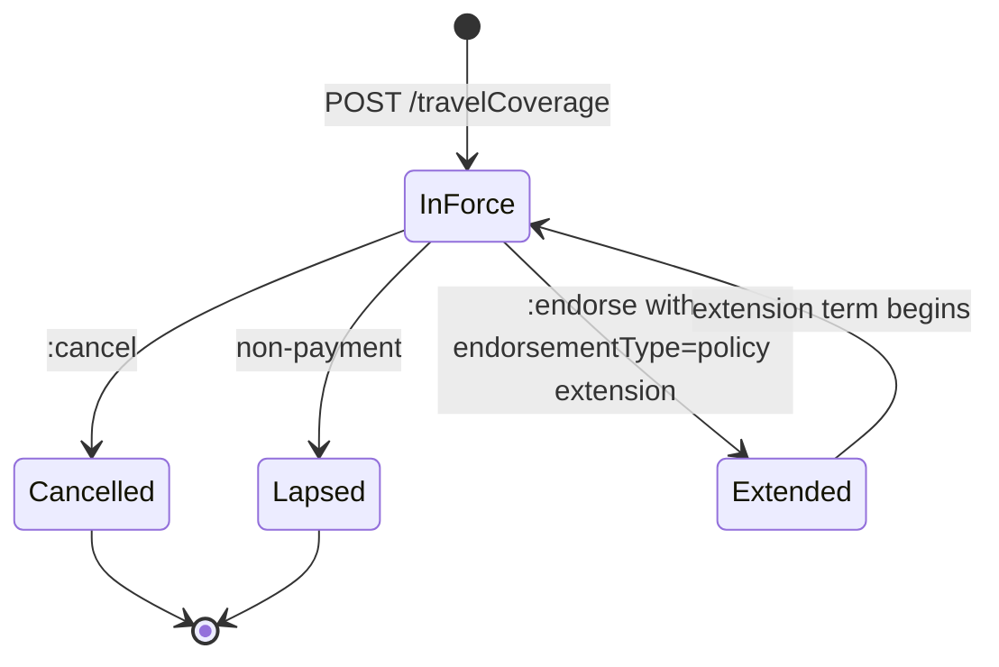
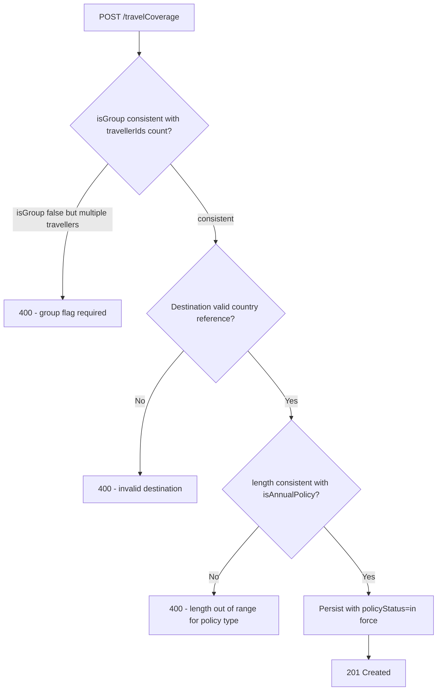

# Module 4: Travel

The endpoints, the flow that binds a policy, the lifecycle and the error paths. The entities and
fields are in [`data-model.md`](data-model.md), and the rules that apply on every call are in
[`../conventions.md`](../conventions.md).

## Resource model

## Endpoints

| Endpoint | Scope | What it does |
| :--- | :--- | :--- |
| `POST /travelCoverage` | admin | Bind a policy against one or more existing travellers |
| `GET /travelCoverage` | developer | List, filterable by `policyNumber` |
| `GET /travelCoverage/{id}` | developer | Retrieve one policy |
| `PUT /travelCoverage/{id}` | admin | Replace a policy |
| `POST /travelCoverage/{id}:endorse` | admin | Amend a policy in force, including extending the term |
| `POST /travelCoverage/{id}:cancel` | admin | End a policy before expiry |
| `POST /traveller` | admin | Create a traveller |
| `GET /traveller` | developer | List travellers |
| `GET /traveller/{id}` | developer | Retrieve one traveller |
| `PUT /traveller/{id}` | admin | Replace a traveller |

Extending a trip is an endorsement rather than a new policy, which matters on an annual multi-trip
policy where the customer is still mid-journey.

## Primary flow: bind a single-trip policy

## Lifecycle

**This diagram is normative.** A transition it does not draw is not one an implementation may make.

The four states are the shared `policyStatus` set. A trip simply ending is not one of them: expiry
is derived from `expiryDate`, so a policy past its expiry date is still recorded as in force rather
than moving to a state of its own.

## Errors

