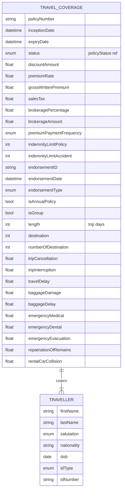

# Module 4: Travel

Entities, fields, enumerated values and relationships. The API surface for this module is in [`api.md`](api.md).

Covers travel insurance: travelCoverage policy with destination/length/group flags and benefit limits (trip cancellation, interruption, baggage, emergency medical, evacuation, repatriation, rental car collision); traveller party.

OPIN sources: `travelCoverage`, `traveller`.

### Field annotations (Module 4)

| Entity | Field | Type | OPIN source | Notes |
|---|---|---|---|---|
| TravelCoverage | isAnnualPolicy | Boolean | sheet `travelCoverage` | False = single trip |
| TravelCoverage | isGroup | Boolean | sheet `travelCoverage` |  |
| TravelCoverage | length | Number/integer | sheet `travelCoverage` | Trip days |
| TravelCoverage | destination | Number/integer | sheet `travelCoverage` | OPIN types as integer; assumed to be a destination code |
| TravelCoverage | numberOfDestination | Number/integer | sheet `travelCoverage` | For multi-leg trips |
| TravelCoverage | tripCancellation | Number/Float | sheet `travelCoverage` | OPIN does not declare a type; normalised to Number/Float |
| TravelCoverage | tripInterruption | Number/Float | sheet `travelCoverage` | OPIN does not declare a type |
| TravelCoverage | travelDelay | Number/Float | sheet `travelCoverage` | OPIN does not declare a type |
| TravelCoverage | baggageDamage | Number/Float | sheet `travelCoverage` | OPIN does not declare a type |
| TravelCoverage | baggageDelay | Number/Float | sheet `travelCoverage` | OPIN does not declare a type |
| TravelCoverage | emergencyMedical | Number/Float | sheet `travelCoverage` | OPIN does not declare a type |
| TravelCoverage | emergencyDental | Number/Float | sheet `travelCoverage` | OPIN does not declare a type |
| TravelCoverage | emergencyEvacuation | Number/Float | sheet `travelCoverage` | OPIN does not declare a type |
| TravelCoverage | repatriationOfRemains | Number/Float | sheet `travelCoverage` | OPIN does not declare a type |
| TravelCoverage | rentalCarCollision | Number/Float | sheet `travelCoverage` | OPIN does not declare a type |
| Traveller | firstName | Text | sheet `traveller` |  |
| Traveller | lastName | Text | sheet `traveller` |  |
| Traveller | salutation | enum (salutation) | sheet `traveller` |  |
| Traveller | nationality | Text (ISO 3166-1 alpha-2) | sheet `traveller` |  |
| Traveller | dob | Date | sheet `traveller` |  |
| Traveller | idType | enum (idType) | sheet `traveller` |  |
| Traveller | idNumber | Text | sheet `traveller` |  |

`[OPIN concern]`: The benefit-limit fields on `travelCoverage` (`tripCancellation`, `tripInterruption`, `travelDelay`, `baggageDamage`, `baggageDelay`, `emergencyMedical`, `emergencyDental`, `emergencyEvacuation`, `repatriationOfRemains`, `rentalCarCollision`) are declared without explicit data types in the OPIN XLSX. `[normalisation]` types all to `Number/Float` for consistency with other coverage modules. Filed as a change proposal.

`[OPIN concern]`: `Traveller` does not include address or contact fields. Travel coverage commonly requires emergency contact details and a delivery address for documents; OPIN is silent here. Filed as a change proposal.
