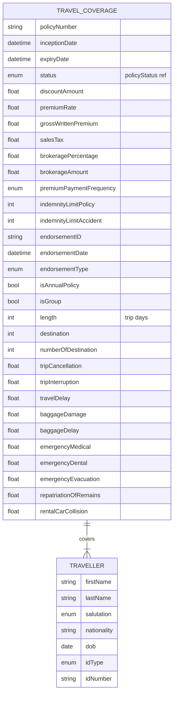

# Module 4: Travel

The entities, fields, enumerated values and relationships. The endpoints over them are in
[`api.md`](api.md), and the terms used throughout are defined in
[Insurance concepts](../concepts.md).

Two entities. **`travelCoverage`** is the policy, carrying the trip shape and a separate monetary
limit for each benefit it offers. **`traveller`** is a person covered by it, and one policy covers
many.

## Selected fields

| Entity | Field | Type | What it means |
|---|---|---|---|
| TravelCoverage | isAnnualPolicy | Boolean | True for annual multi-trip, false for a single trip |
| TravelCoverage | isGroup | Boolean | Whether more than one traveller is covered |
| TravelCoverage | length | Number/integer | Trip days. On a single-trip policy this is the trip. On an annual policy it is the cap on any one trip |
| TravelCoverage | destination | Number/integer | Where the trip goes, as an integer code. What the code means is not declared. See below |
| TravelCoverage | numberOfDestination | Number/integer | How many destinations, for a multi-leg trip |
| TravelCoverage | tripCancellation | Number/Float | Paid when the trip is cancelled before departure |
| TravelCoverage | tripInterruption | Number/Float | Paid when a trip already under way is cut short |
| TravelCoverage | travelDelay | Number/Float | Paid when departure is delayed beyond a threshold |
| TravelCoverage | baggageDamage | Number/Float | Cap on lost or damaged baggage |
| TravelCoverage | baggageDelay | Number/Float | Paid for essentials bought while baggage is delayed. Separate from the damage limit |
| TravelCoverage | emergencyMedical | Number/Float | Cap on medical treatment abroad. Usually the largest limit on the policy |
| TravelCoverage | emergencyDental | Number/Float | Dental treatment, capped separately and far lower |
| TravelCoverage | emergencyEvacuation | Number/Float | Cap on moving the traveller to adequate treatment, which can mean an air ambulance |
| TravelCoverage | repatriationOfRemains | Number/Float | Cap on returning a body home |
| TravelCoverage | rentalCarCollision | Number/Float | Cap on damage to a hired vehicle, which overlaps with what a rental firm sells at the desk |
| Traveller | nationality | Text (ISO 3166-1 alpha-2) | Two-letter country code. Affects both visa exposure and medical cost |
| Traveller | dob | Date | Date of birth. Age drives medical exposure and is often what caps eligibility |
| Traveller | idType, idNumber | enum, Text | Identity document, usually the passport the trip is taken on |

Every limit above applies independently. Exhausting baggage cover does not reduce medical cover.

## What to watch

**`destination` is an integer with nothing behind it.** No enumeration is declared and nothing says
what the number means. It is probably a country or region code. Agree the meaning with your
counterparty rather than assuming, and do not assume ISO 3166 numeric.

**The ten benefit-limit fields carry no declared type.** They are typed here as `Number/Float` to
match the other coverage modules. Treat them as monetary amounts in the policy currency.

**`traveller` carries no address and no contact details.** Travel cover normally needs an emergency
contact and a document delivery address. Neither has a home here, so carry them as extension
fields.
