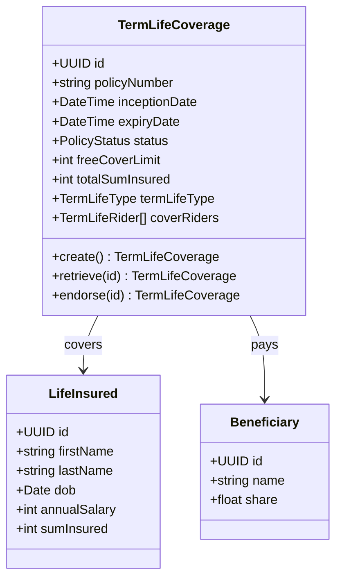
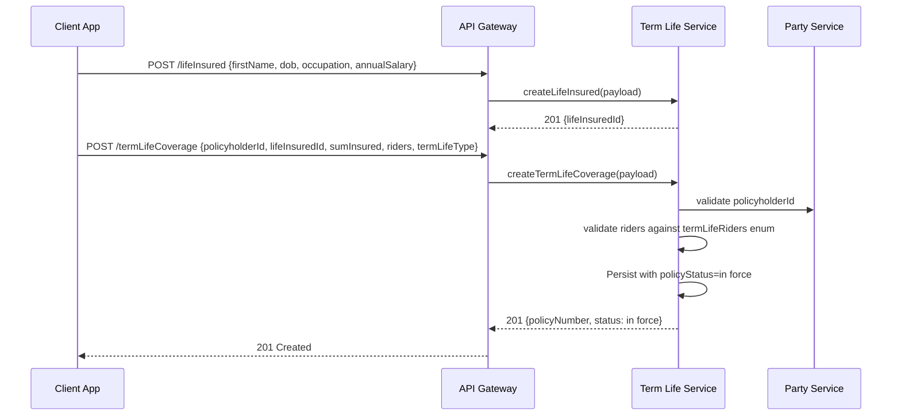
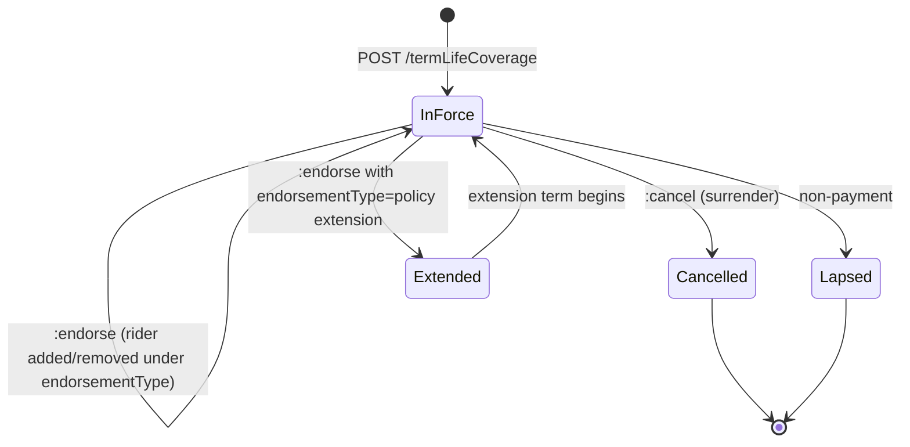
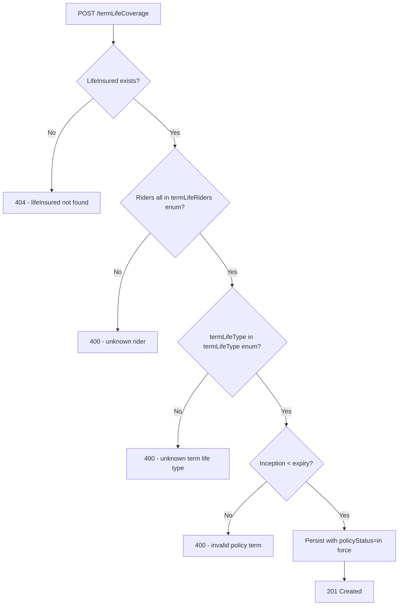

# Module 5: Term Life

The endpoints, the flow that binds a policy, the lifecycle and the error paths. The entities and
fields are in [`data-model.md`](data-model.md), and the rules that apply on every call are in
[`../conventions.md`](../conventions.md).

## Resource model

`termLifeCoverage` carries a multi-valued `beneficiary` reference. The beneficiary records
themselves are created and maintained through [core parties](../01-core-parties/), because a
beneficiary is a party like any other and can be named on more than one policy.

## Endpoints

Beneficiaries are created and maintained through [core parties](../01-core-parties/), not here.

| Endpoint | Scope | What it does |
| :--- | :--- | :--- |
| `POST /termLifeCoverage` | admin | Bind a policy against an existing life insured |
| `GET /termLifeCoverage` | developer | List, filterable by `policyNumber` |
| `GET /termLifeCoverage/{id}` | developer | Retrieve one policy |
| `PUT /termLifeCoverage/{id}` | admin | Replace a policy |
| `POST /termLifeCoverage/{id}:endorse` | admin | Amend a policy in force, including adding or removing a rider |
| `POST /termLifeCoverage/{id}:cancel` | admin | Surrender the policy |
| `POST /termLifeCoverage/{id}:renew` | admin | Issue a new coverage record for a new term |
| `POST /lifeInsured` | admin | Create a life insured |
| `GET /lifeInsured` | developer | List |
| `GET /lifeInsured/{id}` | developer | Retrieve one |
| `PUT /lifeInsured/{id}` | admin | Replace one |

A death claim goes to `POST /claim` like any other claim. See [Claims](../11-claims/).

## Primary flow: bind a policy with riders

## Lifecycle

**This diagram is normative.** A transition it does not draw is not one an implementation may make.

Two things this lifecycle does not contain, and both surprise people.

**There is no underwriting.** No quote, no decision, no declined state, no awaiting-medicals state.
The record begins at in force, so everything between an application and a bound policy happens
before the standard sees it. This is a genuine gap rather than a scope decision, and nothing in the
standard closes it today.

**There is no settled state.** A death claim does not move the policy. It runs through
[Claims](../11-claims/) on the shared claim lifecycle, exactly as a motor or travel claim does.

## Errors

