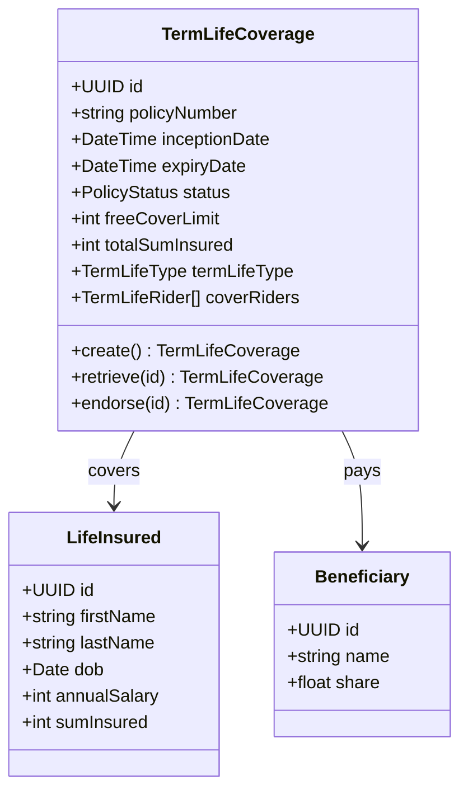
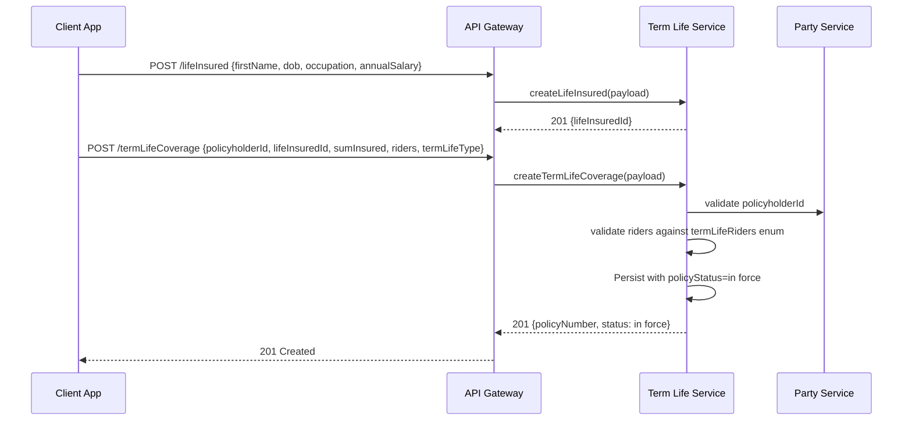
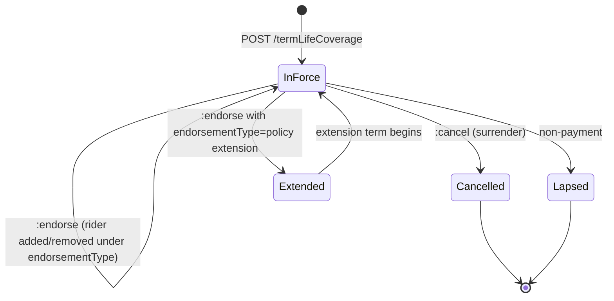
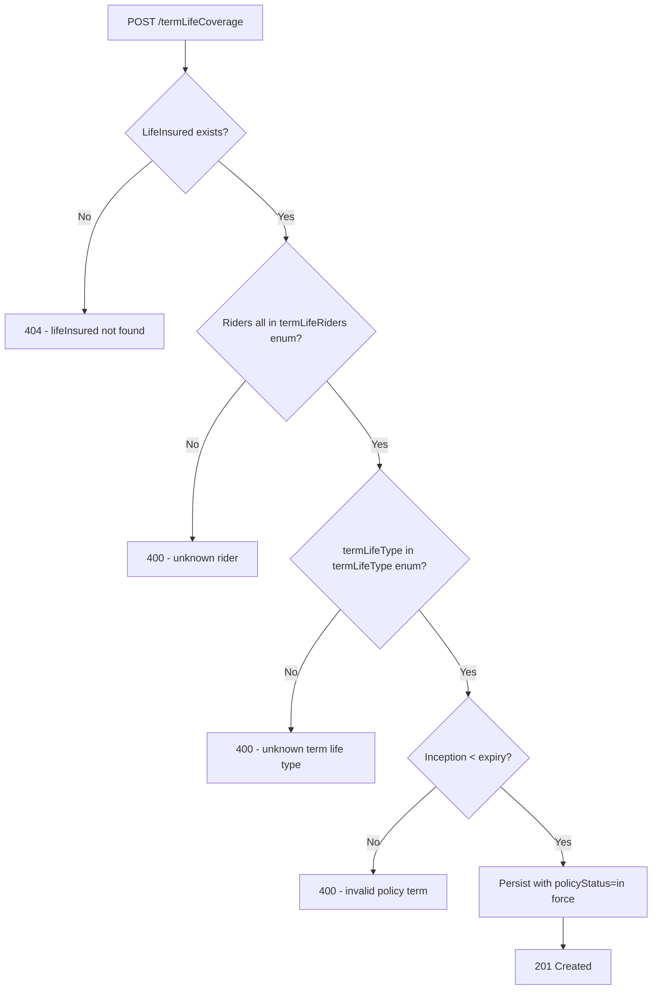

# Module 5: Term Life

Resources, endpoints, primary flow, lifecycle and routing. The entities and fields are in [`data-model.md`](data-model.md). Conventions that apply to every module are in [`../conventions.md`](../conventions.md).

### Resource model

### Endpoints

`[added]`: OPIN publishes the termLifeCoverage and lifeInsured schemas but no endpoints. Beneficiary CRUD lives in Module 1.

- `POST /termLifeCoverage` (admin)
- `GET /termLifeCoverage` (developer)
- `GET /termLifeCoverage/{id}` (developer)
- `PUT /termLifeCoverage/{id}` (admin)
- `POST /termLifeCoverage/{id}:endorse` (admin)
- `POST /termLifeCoverage/{id}:cancel` (admin)
- `POST /termLifeCoverage/{id}:renew` (admin)
- `POST /lifeInsured` (admin)
- `GET /lifeInsured` (developer)
- `GET /lifeInsured/{id}` (developer)
- `PUT /lifeInsured/{id}` (admin)

### Primary flow: Bind a term life policy with riders

### Lifecycle

States are exactly OPIN `policyStatus`. Underwriting outcomes (declined, awaiting medicals) and claim settlement are out of scope here. Underwriting belongs to a future OPIN module not in v1.0; settlement of a death claim is the same flow as any other claim and lives in Module 11.

`[OPIN concern]`: OPIN does not model underwriting (quote, decision, decline). An OPIN v1.1 underwriting module would close this gap.

### Routing and error handling

