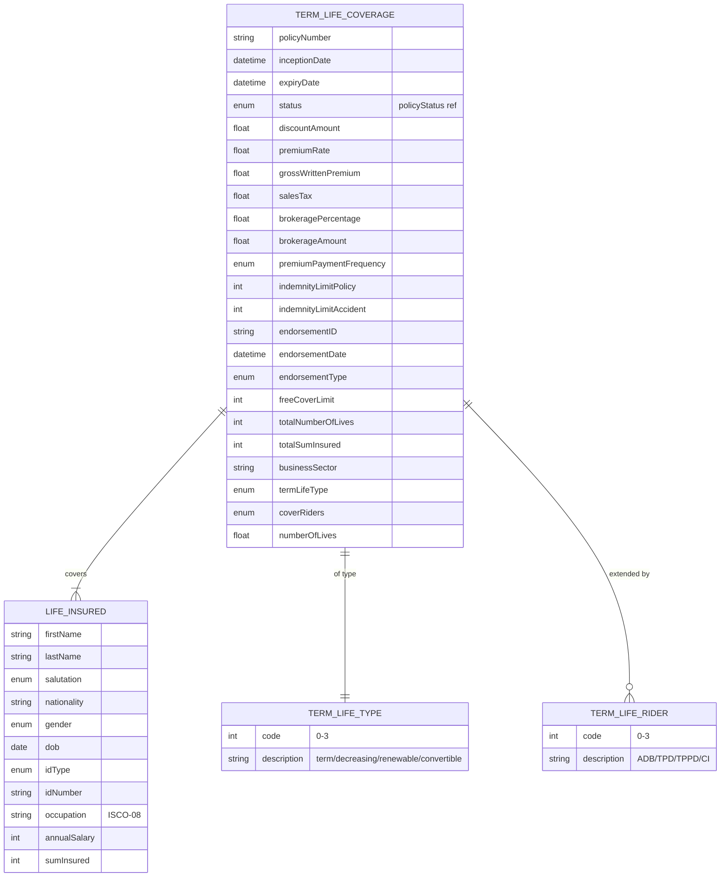

# Module 5: Term Life

Entities, fields, enumerated values and relationships. The API surface for this module is in [`api.md`](api.md).

Covers term life insurance: termLifeCoverage with sum insured, free cover limit, term type, and riders; lifeInsured party including occupation and annual salary.

OPIN sources: `termLifeCoverage`, `lifeInsured`, `termLifeType`, `termLifeRiders`.

### Field annotations (Module 5)

| Entity | Field | Type | OPIN source | Notes |
|---|---|---|---|---|
| TermLifeCoverage | freeCoverLimit | Number/integer | sheet `termLifeCoverage` | Non-medical limit |
| TermLifeCoverage | totalNumberOfLives | Number/integer | sheet `termLifeCoverage` | Group policies; OPIN spelling `totalNumberiOfLives`; `[normalisation]` applied |
| TermLifeCoverage | totalSumInsured | Number/integer | sheet `termLifeCoverage` |  |
| TermLifeCoverage | businessSector | Text (UK SIC) | sheet `termLifeCoverage` | OPIN does not declare type or reference; normalised to Text/UK SIC for consistency with Commercial.occupation |
| TermLifeCoverage | termLifeType | enum (termLifeType) | sheet `termLifeType` | XLSX: 4 values (Term life, Decreasing term, Renewable term, Convertible term) |
| TermLifeCoverage | coverRiders | enum multi (termLifeRiders) | sheet `termLifeRiders` | XLSX: 4 values (ADB, TPD, TPPD, Critical illness) |
| TermLifeCoverage | numberOfLives | Number/Float | sheet `termLifeCoverage` |  |
| LifeInsured | annualSalary | Number/integer | sheet `lifeInsured` | Underwriting input |
| LifeInsured | sumInsured | Number/integer | sheet `lifeInsured` | Death benefit |
| LifeInsured | address | ref (address) | sheet `lifeInsured` | Place of residence |
| LifeInsured | occupation | Text (ISCO-08) | sheet `lifeInsured` |  |

`[OPIN concern]`: `businessSector` on `termLifeCoverage` is listed without a type or a reference column in the XLSX. The likely intent is UK SIC (matching `Commercial.occupation` and `business.businessSector`). `[normalisation]` types as `Text` with UK SIC reference. Declaring it explicitly is filed as a change proposal.

`[OPIN concern]`: `termLifeType` and `termLifeRiders` enum values diverge between the OPIN data standard XLSX and the OPIN API JSON.
  - XLSX `termLifeType` has 4 values: `Term life`, `Decreasing term`, `Renewable term`, `Convertible term`.
  - API JSON `termLifeType` has 3 values: `Term life`, `Decreasing term`, `Renewable term` (Convertible missing).
  - XLSX `termLifeRiders` has 4 values: `Accidental death benefit`, `Total permanent disability`, `Total and partial permanent disability`, `Critical illness`.
  - API JSON `termLifeRiders` has 5 values: the XLSX 4 plus `Convertible term` (which conceptually belongs in `termLifeType`, not in riders).
  
  This document treats the XLSX as authoritative: `termLifeType` is the 4-value set including `Convertible term`; `termLifeRiders` is the 4-value set without `Convertible term`. Resolving the divergence is inherited defect 1 and is filed as a change proposal against the standard.

`[OPIN concern]`: `Beneficiary` is not explicitly linked from `termLifeCoverage` in the OPIN sheet, although the universal `Beneficiary` entity exists in Module 1. Term life is the canonical case for beneficiary designation. Formalising the link is filed as a change proposal.
