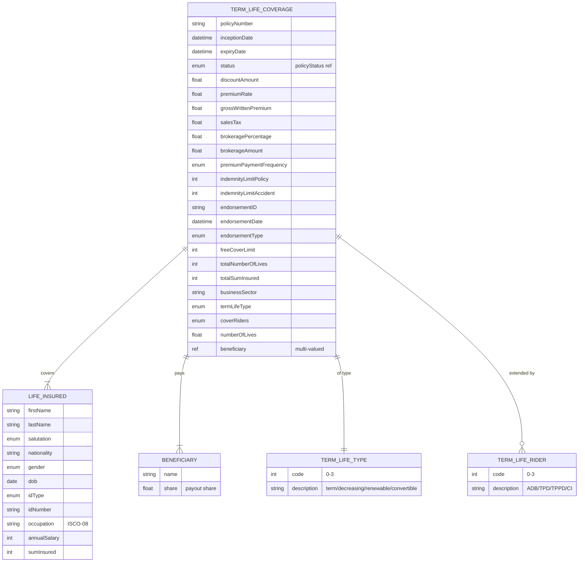

# Module 5: Term Life

The entities, fields, enumerated values and relationships. The endpoints over them are in
[`api.md`](api.md), and the terms used throughout are defined in
[Insurance concepts](../concepts.md).

**`termLifeCoverage`** is the policy: term, sum insured, free cover limit, which variant of term
life it is, and which riders are attached. **`lifeInsured`** is the person whose death triggers the
payout, carrying occupation and salary because both price the risk. **`termLifeType`** and
**`termLifeRiders`** are the two enumerations that shape the product.

## Selected fields

| Entity | Field | Type | What it means |
|---|---|---|---|
| TermLifeCoverage | freeCoverLimit | Number/integer | The most cover available without medical underwriting. Below this figure nobody has to be examined, which is what makes group schemes workable |
| TermLifeCoverage | totalNumberOfLives | Number/integer | How many people a group policy covers |
| TermLifeCoverage | totalSumInsured | Number/integer | The combined death benefit across every life on the policy |
| TermLifeCoverage | businessSector | Text (UK SIC) | The employer's industry, for a group scheme. Type is not declared in the standard; treated here as UK SIC to match `Commercial.occupation` |
| TermLifeCoverage | termLifeType | enum (termLifeType) | Level term, decreasing term, renewable term or convertible term. Decreasing term is how cover is matched to a shrinking mortgage; convertible term can be swapped for whole-of-life later |
| TermLifeCoverage | coverRiders | enum multi (termLifeRiders) | Optional add-ons: accidental death benefit, total permanent disability, total and partial permanent disability, critical illness |
| TermLifeCoverage | numberOfLives | Number/Float | Lives covered. Overlaps with `totalNumberOfLives` and the standard does not distinguish them |
| LifeInsured | annualSalary | Number/integer | Earnings. Cover is usually capped at a multiple of it |
| LifeInsured | occupation | Text (ISCO-08) | Occupation as an ISCO-08 code. A structural risk factor in life underwriting |
| LifeInsured | sumInsured | Number/integer | This person's death benefit |
| LifeInsured | address | ref (address) | Place of residence |
| TermLifeCoverage | beneficiary | ref (Beneficiary) | Who receives the payout. Multi-valued, and each carries a `share`. The life insured cannot collect their own death benefit, which is why this is a separate party. Defined in [core parties](../01-core-parties/) |

## What to watch

**The two enumerations in this module disagree between the standard's own source documents**, and
this is the sharpest such disagreement anywhere in it.

| Enumeration | Data standard | API specification |
| :--- | :--- | :--- |
| `termLifeType` | 4 values: term life, decreasing term, renewable term, convertible term | 3 values, without convertible term |
| `termLifeRiders` | 4 values: accidental death benefit, total permanent disability, total and partial permanent disability, critical illness | 5 values, the same 4 plus convertible term |

**Treat the data standard as authoritative.** `termLifeType` is the four-value set including
convertible term, and `termLifeRiders` is the four-value set without it. Convertible term is a kind
of policy, not a rider, so its appearance in the rider list is the error rather than the omission.
Validate against the four-value sets, and expect a mismatch if you integrate with anything built
from the API specification.

**Beneficiary shares are expected to total 100.** Nothing in the schema enforces it, and a policy
whose shares do not add up cannot be settled without someone deciding what the remainder does.
Validate it on the way in.

**`totalNumberOfLives` is spelled correctly here.** The underlying standard spells it
`totalNumberiOfLives`. Nothing on the wire depends on the original, so this page uses the corrected
form.
