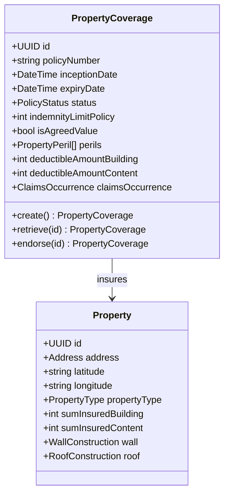
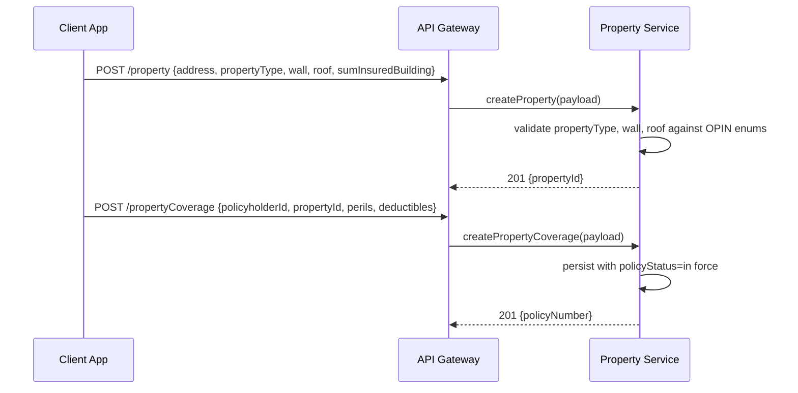
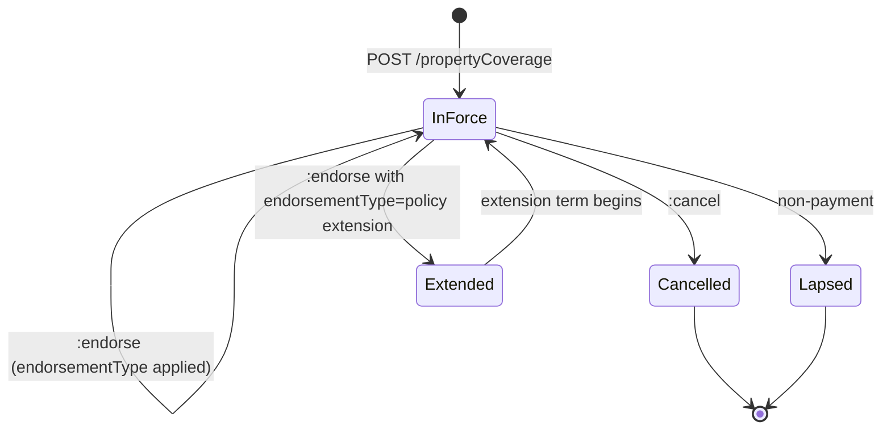
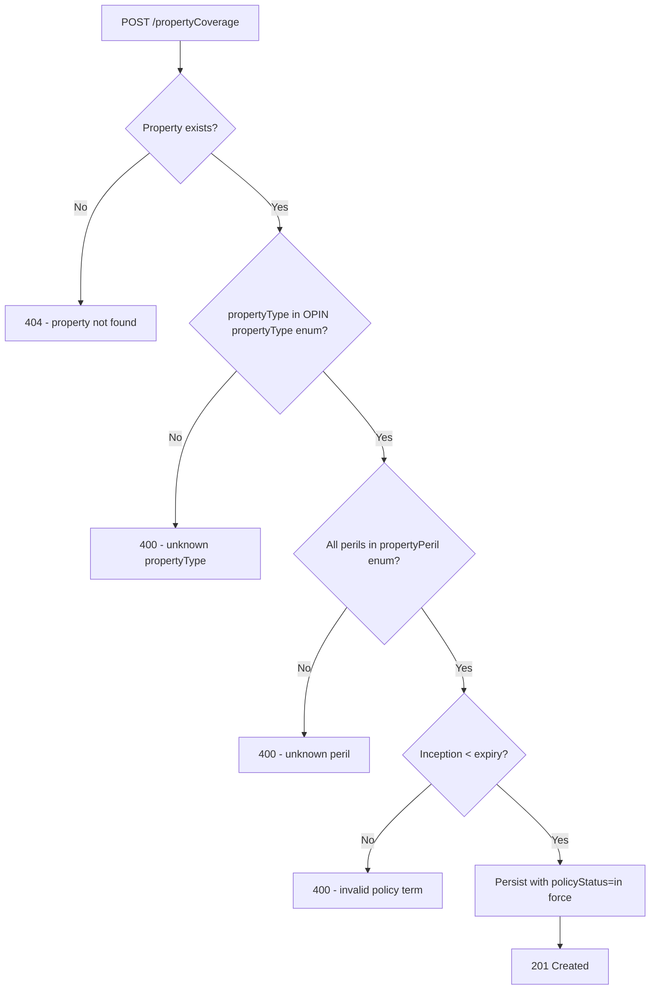

# Module 6: Property

The endpoints, the flow that binds a policy, the lifecycle and the error paths. The entities and
fields are in [`data-model.md`](data-model.md), and the rules that apply on every call are in
[`../conventions.md`](../conventions.md).

## Resource model

## Endpoints

| Endpoint | Scope | What it does |
| :--- | :--- | :--- |
| `POST /propertyCoverage` | admin | Bind a policy against one or more existing properties |
| `GET /propertyCoverage` | developer | List, filterable by `policyNumber` |
| `GET /propertyCoverage/{id}` | developer | Retrieve one policy |
| `PUT /propertyCoverage/{id}` | admin | Replace a policy |
| `POST /propertyCoverage/{id}:endorse` | admin | Amend a policy in force |
| `POST /propertyCoverage/{id}:cancel` | admin | End a policy before expiry |
| `POST /propertyCoverage/{id}:renew` | admin | Issue a new coverage record for a new term |
| `POST /property` | admin | Create a property |
| `GET /property` | developer | List properties |
| `GET /property/{id}` | developer | Retrieve one property |
| `PUT /property/{id}` | admin | Replace a property |

[Business interruption](../08-business-interruption/) is normally written alongside this cover on
the same premises, and it is a separate policy record.

## Primary flow: bind a buildings and contents policy

## Lifecycle

**This diagram is normative.** A transition it does not draw is not one an implementation may make.

Endorsing keeps the policy in force. Renewing writes a second record rather than moving this one
forward.

## Errors

