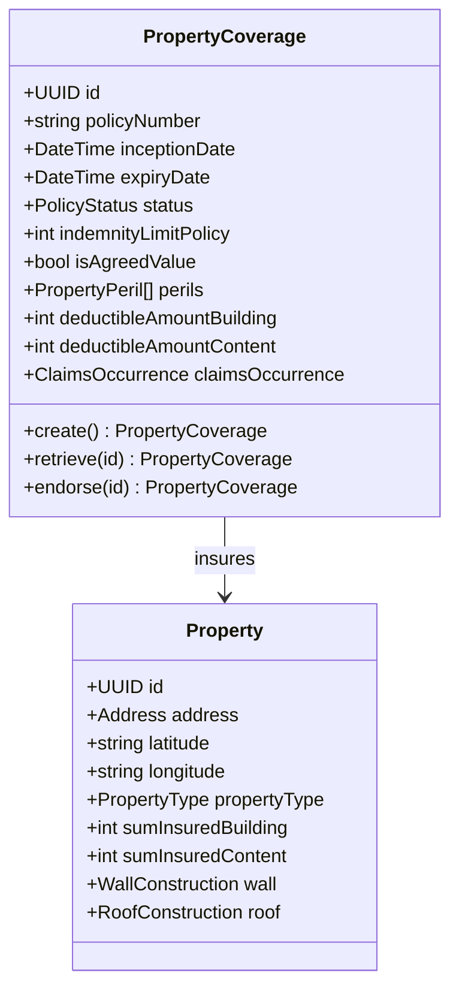
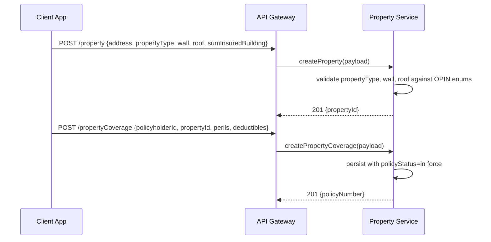
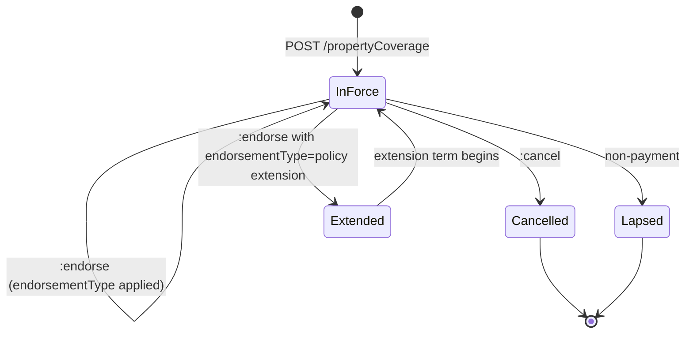
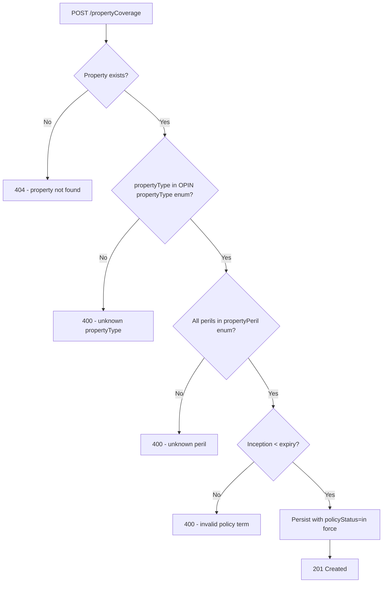

# Module 6: Property

Resources, endpoints, primary flow, lifecycle and routing. The entities and fields are in [`data-model.md`](data-model.md). Conventions that apply to every module are in [`../conventions.md`](../conventions.md).

### Resource model

### Endpoints

`[added]`: OPIN publishes the propertyCoverage and property schemas but no endpoints.

- `POST /propertyCoverage` (admin)
- `GET /propertyCoverage` (developer)
- `GET /propertyCoverage/{id}` (developer)
- `PUT /propertyCoverage/{id}` (admin)
- `POST /propertyCoverage/{id}:endorse` (admin)
- `POST /propertyCoverage/{id}:cancel` (admin)
- `POST /propertyCoverage/{id}:renew` (admin)
- `POST /property` (admin)
- `GET /property` (developer)
- `GET /property/{id}` (developer)
- `PUT /property/{id}` (admin)

### Primary flow: Bind a home and contents policy

### Lifecycle

### Routing and error handling

