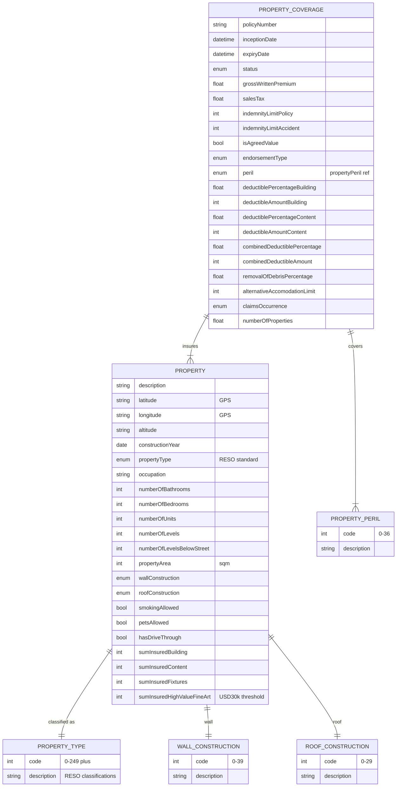

# Module 6: Property

The entities, fields, enumerated values and relationships. The endpoints over them are in
[`api.md`](api.md), and the terms used throughout are defined in
[Insurance concepts](../concepts.md).

**`propertyCoverage`** is the policy and **`property`** is the building it insures. One policy can
cover several properties.

Building, contents and fixtures are insured separately, each with its own sum insured and its own
deductible, so a single fire produces a settlement calculated three times. Four enumerations carry
the description: **`propertyType`** (about 250 RESO values), **`propertyPeril`** (37),
**`wallConstruction`** (about 40) and **`roofConstruction`** (about 30). Construction material is
enumerated that finely because it is most of what decides whether a building burns.

## Selected fields

| Entity | Field | Type | What it means |
|---|---|---|---|
| PropertyCoverage | isAgreedValue | Boolean | How a total loss is paid. True pays the sum insured outright. False pays what the property was worth when it was destroyed, which can be less |
| PropertyCoverage | claimsOccurrence | enum (claimsOccurrence) | Which policy year owns a claim. `Claims occurring` covers losses that happened in the term, whenever reported. `Claims made` covers claims reported in the term, whenever the loss happened |
| PropertyCoverage | indemnityLimitPolicy | Number/integer | The most the policy pays across the year |
| PropertyCoverage | deductibleAmountBuilding | Number/integer | Excess on a claim against the structure |
| PropertyCoverage | deductibleAmountContent | Number/integer | Excess on a claim against the contents. Separate from the building excess |
| PropertyCoverage | combinedDeductibleAmount | Number/integer | A single excess applied where one event damages both, instead of charging two |
| PropertyCoverage | removalOfDebrisPercentage | Number/Float | Cap on clearing the site after a loss, as a percentage. Demolition and disposal are a real cost and are not part of rebuilding |
| PropertyCoverage | alternativeAccomodationLimit | Number/integer | Cap on housing the occupants while the property is uninhabitable. Spelled with one `m` on the wire |
| Property | propertyType | enum (propertyType) | What kind of property it is, from the RESO classification. About 250 values |
| Property | wallConstruction | enum (wallConstruction) | What the walls are made of. About 40 values |
| Property | roofConstruction | enum (roofConstruction) | What the roof is made of. About 30 values |
| Property | constructionYear | Date | When it was built. Older construction carries different fire and escape-of-water exposure |
| Property | numberOfLevelsBelowStreet | Number/integer | Basement levels, which is a flood exposure question rather than a size one |
| Property | propertyArea | Number/integer | Floor area in square metres |
| Property | sumInsuredBuilding | Number/integer | Cover on the structure |
| Property | sumInsuredContent | Number/integer | Cover on everything movable inside it |
| Property | sumInsuredFixtures | Number/integer | Cover on fixtures, which are attached to the building but are not the structure |
| Property | sumInsuredHighValueFineArt | Number/integer | Cover on individual items worth more than USD 30,000, which ordinary contents cover excludes |
| Property | latitude, longitude, altitude | string | Position. Used for flood, storm and wildfire exposure rather than for finding the place |

## What to watch

**`claimsOccurrence` is declared two incompatible ways.** It is a Boolean on the coverage entity,
and a two-value enumeration (`Claims occurring`, `Claims made`) on its own. Use the enumeration. A
Boolean cannot carry which basis applies without a convention agreed out of band, and reading it
wrongly assigns claims to the wrong policy year.

**`numberOfBedrooms` appears twice on `property`.** The first of the two describes itself as the
number of bathrooms, so this page reads it as `numberOfBathrooms`. Other implementations may have
resolved the duplicate differently, so do not assume a counterpart agrees.

**The roof construction enumeration is spelled two ways.** The data standard has
`roofConstruction`; the API specification has `rootConstruction`. The data standard is authoritative
here.

**Two names stay misspelled because they are on the wire.** `alternativeAccomodation` carries one
`m`, and `occcupation` on the property entity carries three `c`s. This page shows the corrected
forms for readability, and what you send is the original.
