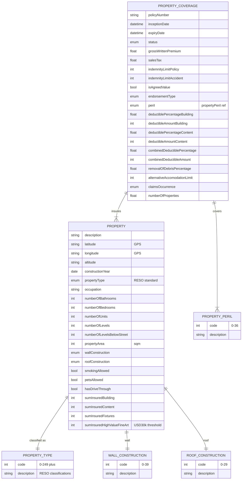

# Module 6: Property

Entities, fields, enumerated values and relationships. The API surface for this module is in [`api.md`](api.md).

Covers property insurance: propertyCoverage with sum insured for building/content/fixtures, deductibles, and perils; property entity with address, GPS, construction, type, and unit-level details.

OPIN sources: `propertyCoverage`, `property`, `propertyType` (~250 values), `propertyPeril` (~37 values), `wallConstruction` (~40 values), `roofConstruction` (~30 values).

### Field annotations (Module 6)

| Entity | Field | Type | OPIN source | Notes |
|---|---|---|---|---|
| PropertyCoverage | indemnityLimitPolicy | Number/integer | sheet `propertyCoverage` | Annual policy limit |
| PropertyCoverage | isAgreedValue | Boolean | sheet `propertyCoverage` | True = agreed, false = market |
| PropertyCoverage | deductibleAmountBuilding | Number/integer | sheet `propertyCoverage` |  |
| PropertyCoverage | deductibleAmountContent | Number/integer | sheet `propertyCoverage` |  |
| PropertyCoverage | combinedDeductibleAmount | Number/integer | sheet `propertyCoverage` |  |
| PropertyCoverage | removalOfDebrisPercentage | Number/Float | sheet `propertyCoverage` | Limit any one claim |
| PropertyCoverage | alternativeAccomodationLimit | Number/integer | sheet `propertyCoverage` | OPIN spelling `alternativeAccomodation` (single 'm'); preserved here |
| PropertyCoverage | claimsOccurrence | enum (claimsOccurrence) | sheet `claimsOccurrence` | OPIN sheet types as Boolean on `propertyCoverage`; `[normalisation]` uses the two-value enum sheet |
| Property | propertyType | enum (propertyType) | sheet `propertyType` | RESO standard, ~250 enumerated property types |
| Property | wallConstruction | enum (wallConstruction) | sheet `wallConstruction` | ~40 values |
| Property | roofConstruction | enum (roofConstruction) | sheet `roofConstruction` | ~30 values |
| Property | sumInsuredHighValueFineArt | Number/integer | sheet `property` | Items > USD 30,000 |

`[OPIN concern]`: `propertyCoverage.claimsOccurrence` is typed Boolean on the `propertyCoverage` sheet, but the standalone `claimsOccurrence` enum sheet defines two semantic values (`Claims occurring`, `Claims made`). The Boolean form drops semantic clarity. `[normalisation]` uses the enum.

`[OPIN concern]`: The `property` sheet contains a duplicated field name: `numberOfBedrooms` is listed twice. The first row's description (`total number of bathrooms`) makes clear the first occurrence is intended to be `numberOfBathrooms`. `[normalisation]` renders as `numberOfBathrooms` and `numberOfBedrooms`.

`[OPIN concern]`: The OPIN API JSON spells the roof construction enum as `rootConstruction`, while the XLSX correctly uses `roofConstruction`. The XLSX is authoritative. `[normalisation]` uses `roofConstruction`. Correcting the API spelling is inherited defect 2 and is filed as a change proposal against the standard.

`[OPIN concern]`: The `property` sheet field `occcupation` (three c's) is misspelled (should be `occupation`). `[normalisation]` applied.
