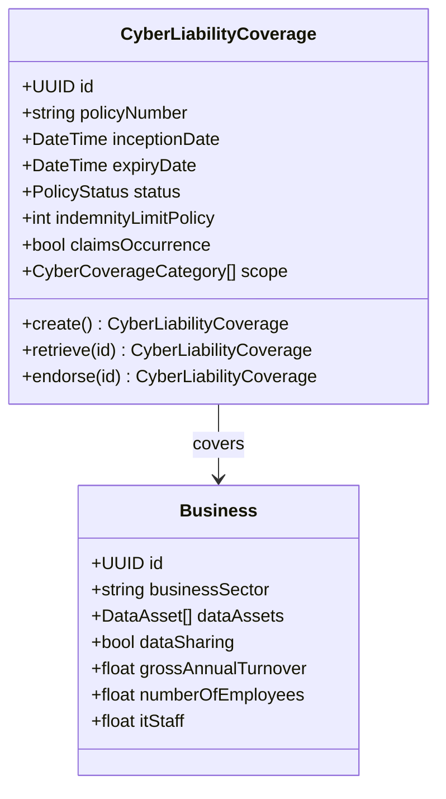
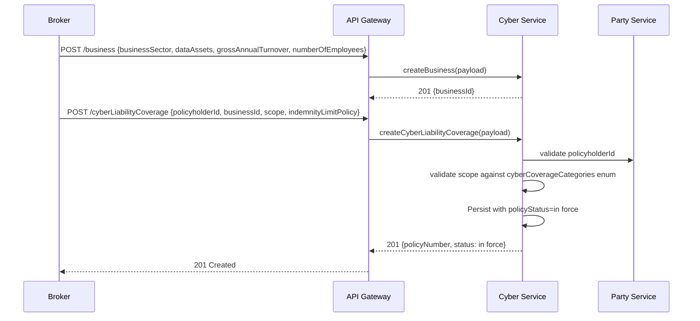
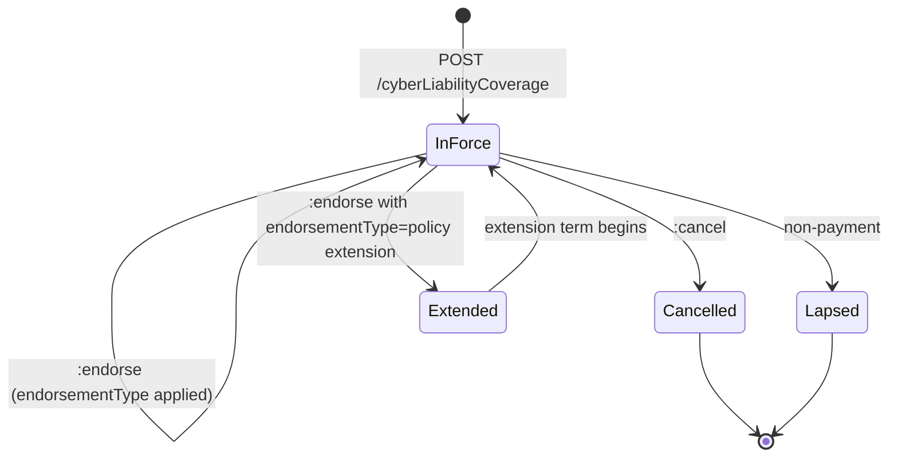
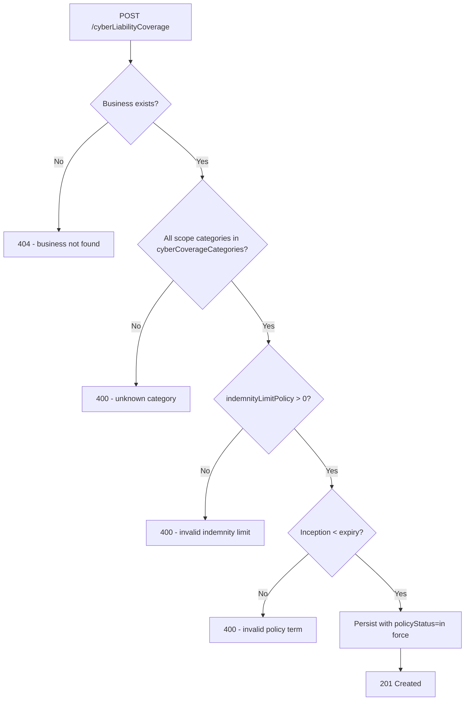

# Module 7: Cyber Liability

Resources, endpoints, primary flow, lifecycle and routing. The entities and fields are in [`data-model.md`](data-model.md). Conventions that apply to every module are in [`../conventions.md`](../conventions.md).

### Resource model

### Endpoints

`[added]`: OPIN publishes the cyberLiabilityCoverage and business schemas but no endpoints.

- `POST /cyberLiabilityCoverage` (admin)
- `GET /cyberLiabilityCoverage` (developer)
- `GET /cyberLiabilityCoverage/{id}` (developer)
- `PUT /cyberLiabilityCoverage/{id}` (admin)
- `POST /cyberLiabilityCoverage/{id}:endorse` (admin)
- `POST /cyberLiabilityCoverage/{id}:cancel` (admin)
- `POST /cyberLiabilityCoverage/{id}:renew` (admin)
- `POST /business` (admin)
- `GET /business` (developer)
- `GET /business/{id}` (developer)
- `PUT /business/{id}` (admin)

`[OPIN concern]`: OPIN does not publish a `cyberIncident` schema or a breach-notification model. Incident reporting and regulator notification timelines are insurance-adjacent operational concerns that an OPIN v1.1 publication should consider, but they are out of scope for this version.

### Primary flow: Bind a cyber liability policy

### Lifecycle

### Routing and error handling

