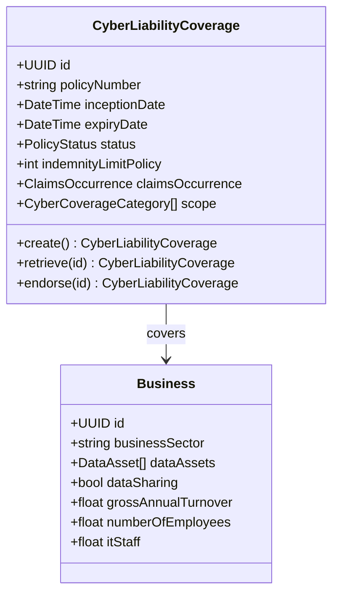
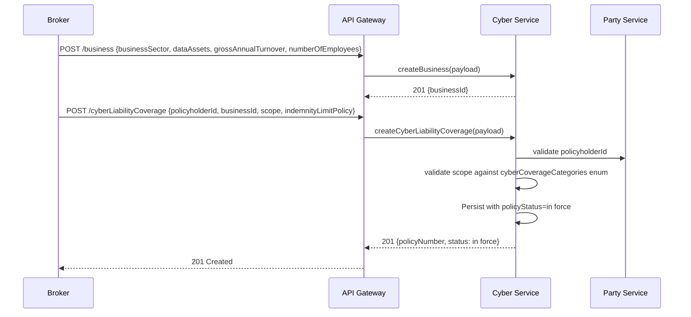
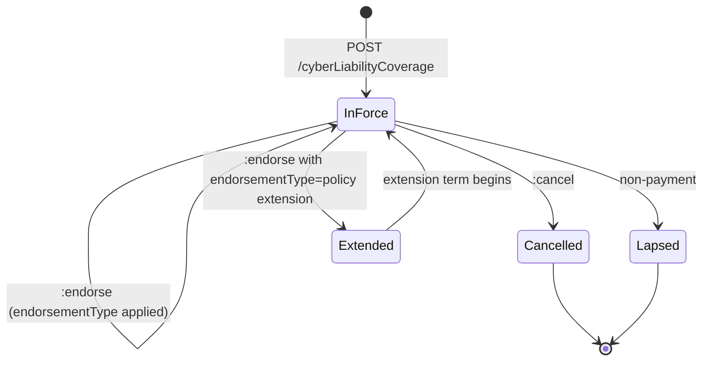
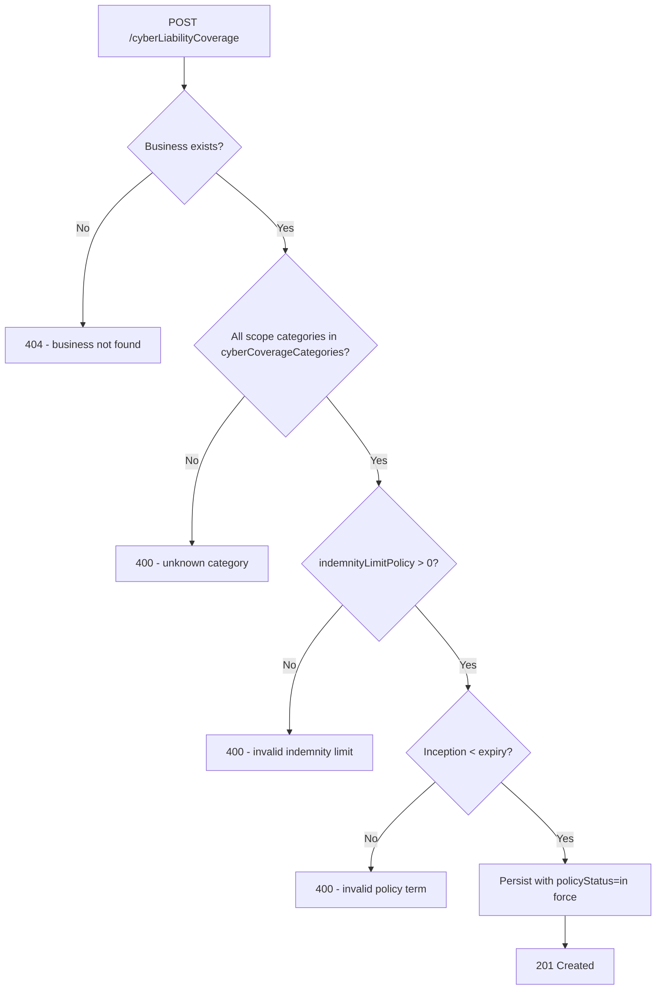

# Module 7: Cyber Liability

The endpoints, the flow that binds a policy, the lifecycle and the error paths. The entities and
fields are in [`data-model.md`](data-model.md), and the rules that apply on every call are in
[`../conventions.md`](../conventions.md).

## Resource model

## Endpoints

| Endpoint | Scope | What it does |
| :--- | :--- | :--- |
| `POST /cyberLiabilityCoverage` | admin | Bind a policy against an existing business |
| `GET /cyberLiabilityCoverage` | developer | List, filterable by `policyNumber` |
| `GET /cyberLiabilityCoverage/{id}` | developer | Retrieve one policy |
| `PUT /cyberLiabilityCoverage/{id}` | admin | Replace a policy |
| `POST /cyberLiabilityCoverage/{id}:endorse` | admin | Amend a policy in force |
| `POST /cyberLiabilityCoverage/{id}:cancel` | admin | End a policy before expiry |
| `POST /cyberLiabilityCoverage/{id}:renew` | admin | Issue a new coverage record for a new term |
| `POST /business` | admin | Create a business |
| `GET /business` | developer | List businesses |
| `GET /business/{id}` | developer | Retrieve one business |
| `PUT /business/{id}` | admin | Replace a business |

There is no incident resource. A cyber loss is filed through `POST /claim` like every other coverage
type. Breach-notification and regulator-notification deadlines sit above the standard, because they
are operational service-level measurement. See [`../SCOPE.md`](../SCOPE.md).

## Primary flow: bind a cyber liability policy

## Lifecycle

**This diagram is normative.** A transition it does not draw is not one an implementation may make.

## Errors

