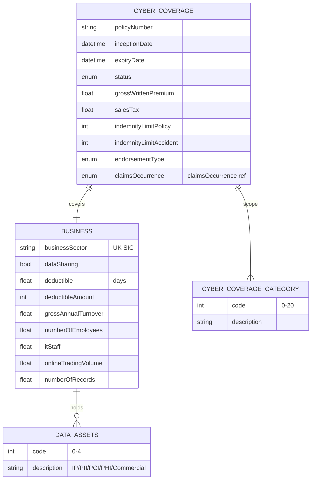

# Module 7: Cyber Liability

The entities, fields, enumerated values and relationships. The endpoints over them are in
[`api.md`](api.md), and the terms used throughout are defined in
[Insurance concepts](../concepts.md).

There is no physical thing insured here, so the model describes the business instead.
**`cyberLiabilityCoverage`** is the policy and **`business`** is the organisation, carrying the
attributes that predict how costly a breach would be. **`dataAssets`** enumerates the kinds of
sensitive data it holds, and **`cyberCoverageCategories`** enumerates the 21 things the policy can
pay for.

## Selected fields

| Entity | Field | Type | What it means |
|---|---|---|---|
| CyberLiabilityCoverage | claimsOccurrence | enum (claimsOccurrence) | Which policy year owns a claim. `Claims occurring` covers losses that happened in the term, whenever reported. `Claims made` covers claims reported in the term, whenever the loss happened. Cyber is usually written claims-made |
| CyberLiabilityCoverage | indemnityLimitPolicy | Number/integer | The most the policy pays across the year |
| Business | businessSector | UK SIC | Industry as a Standard Industrial Classification code. A payment processor and a builder carry very different exposure |
| Business | dataAssets | enum multi (dataAssets) | What kinds of sensitive data the business holds. Five values: IP (intellectual property), PII (personal data), PCI (payment card data), PHI (health data), Commercial. Kind matters more than volume, because each carries a different regulatory consequence |
| Business | numberOfRecords | Number/Float | How many sensitive records are held. Breach response cost scales almost directly with this |
| Business | dataSharing | Boolean | Whether data is shared with third parties or held in the cloud, which extends the attack surface beyond the insured's own control |
| Business | itStaff | Number/Float | How many IT staff there are. A proxy for whether anyone is watching |
| Business | numberOfEmployees | Number/Float | Headcount. Most breaches begin with a person, so this is an exposure measure |
| Business | onlineTradingVolume | Number/Float | How much of the turnover is transacted online, which sets what an outage costs per hour |
| Business | grossAnnualTurnover | Number/Float | Total revenue, the basis for business interruption cover |
| Business | deductible | Number/Float | The excess expressed in **days**, not money. Cover starts once an outage has run past this waiting period |
| Business | deductibleAmount | Number/integer | The excess expressed in money, applied separately from the day-based one |
| CyberCoverageCategory | code | int | One of 21 things the policy pays for, listed in the module overview |

## What to watch

**`claimsOccurrence` matters more here than anywhere else.** A breach is routinely discovered long
after the intrusion that caused it, so which of the two bases applies decides which policy year pays.
Cyber is usually written claims-made. The same enumeration is used in [property](../06-property/)
and [business interruption](../08-business-interruption/).

**`business.cyberCoverageCategories` references the wrong sheet.** It points at
`cyberLiabilityCoverage` rather than the `cyberCoverageCategories` enumeration it is named for.
Validate against the enumeration.

**Two names are wrong at source and shown corrected here.** `claimsOcuurence` on the coverage
entity, and `NumberOfEmployees` in PascalCase where everything around it is camelCase. Two category
descriptions are also misspelled, `Multi-media laibilities` and `Theft of intectual property`. The
codes are stable, so match on code rather than on description text.

**Nothing here models an incident.** Detection, breach notification timelines and remediation are
all absent, and deliberately so. A cyber loss is recorded through the shared `Claim` entity.
