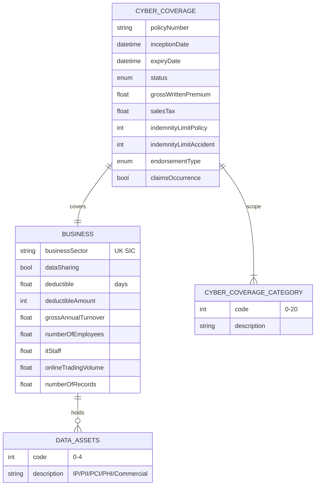

# Module 7: Cyber Liability

Entities, fields, enumerated values and relationships. The API surface for this module is in [`api.md`](api.md).

Covers cyber liability insurance: cyberLiabilityCoverage at policy level; business entity with sector, data assets profile, IT staff and online turnover; coverage categories from a 21-value taxonomy spanning data loss, breach response, business interruption, ransomware, fines.

OPIN sources: `cyberLiabilityCoverage`, `business`, `dataAssets`, `cyberCoverageCategories`.

### Field annotations (Module 7)

| Entity | Field | Type | OPIN source | Notes |
|---|---|---|---|---|
| CyberLiabilityCoverage | claimsOccurrence | Boolean | sheet `cyberLiabilityCoverage` | OPIN spelling `claimsOcuurence` on this sheet; `[OPIN-VN normalisation]` applied. Note Boolean here, separate from the `claimsOccurrence` enum used on Module 6 and Module 8 |
| Business | businessSector | UK SIC | sheet `business` |  |
| Business | dataAssets | enum multi (dataAssets) | sheet `dataAssets` | IP / PII / PCI / PHI / Commercial |
| Business | dataSharing | Boolean | sheet `business` | Third-party / cloud sharing |
| Business | itStaff | Number/Float | sheet `business` |  |
| Business | numberOfRecords | Number/Float | sheet `business` | Sensitive records held |
| Business | grossAnnualTurnover | Number/Float | sheet `business` |  |
| Business | NumberOfEmployees | Number/Float | sheet `business` | OPIN PascalCase; `[OPIN-VN normalisation]` to camelCase `numberOfEmployees` |
| Business | onlineTradingVolume | Number/Float | sheet `business` |  |
| CyberCoverageCategory | code | int | sheet `cyberCoverageCategories` | 21 categories: data loss, breach privacy, incident mgmt, K&R, BI, contingent BI, multi-media liability, legal/defence, reputation, network failure, E&O, professional indemnity, fidelity, IP theft, asset damage, compensation, terrorism, fines, D&O, GL, environmental |
| DataAssets | code | int | sheet `dataAssets` | 0-4: IP, PII, PCI, PHI, Commercial |

`[OPIN concern]`: The `business` sheet's `cyberCoverageCategories` field references the `cyberLiabilityCoverage` sheet rather than the `cyberCoverageCategories` enum sheet. This is a sheet-level reference error. `[OPIN-VN normalisation]` corrects the reference to point to the `cyberCoverageCategories` enum.

`[OPIN concern]`: The `cyberLiabilityCoverage.claimsOcuurence` field name has two typos (`Ocuurence` should be `Occurrence`). `[OPIN-VN normalisation]` renders as `claimsOccurrence`.

`[OPIN concern]`: `cyberCoverageCategories` enum descriptions contain typos: `Multi-media laibilities`, `Theft of intectual property`. Codes are stable; descriptions can be normalised.

Out-of-scope for OPIN: cyber incident lifecycle entities (incident detection, breach notification timelines, remediation activities). OPIN's cyber model captures pre-loss exposure and coverage scope only. Incident response workflow is a domain extension, not modelled here.
