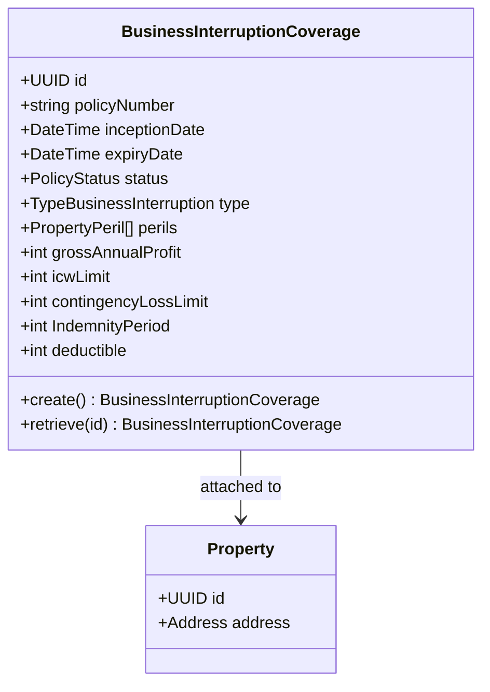
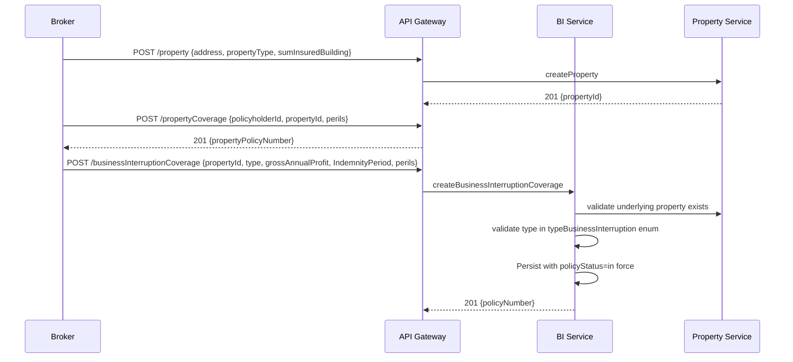
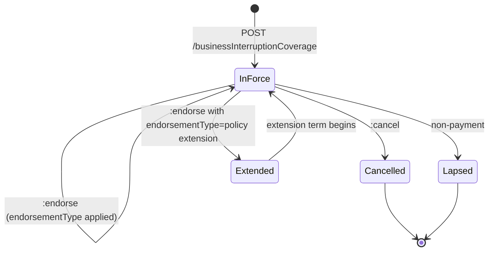
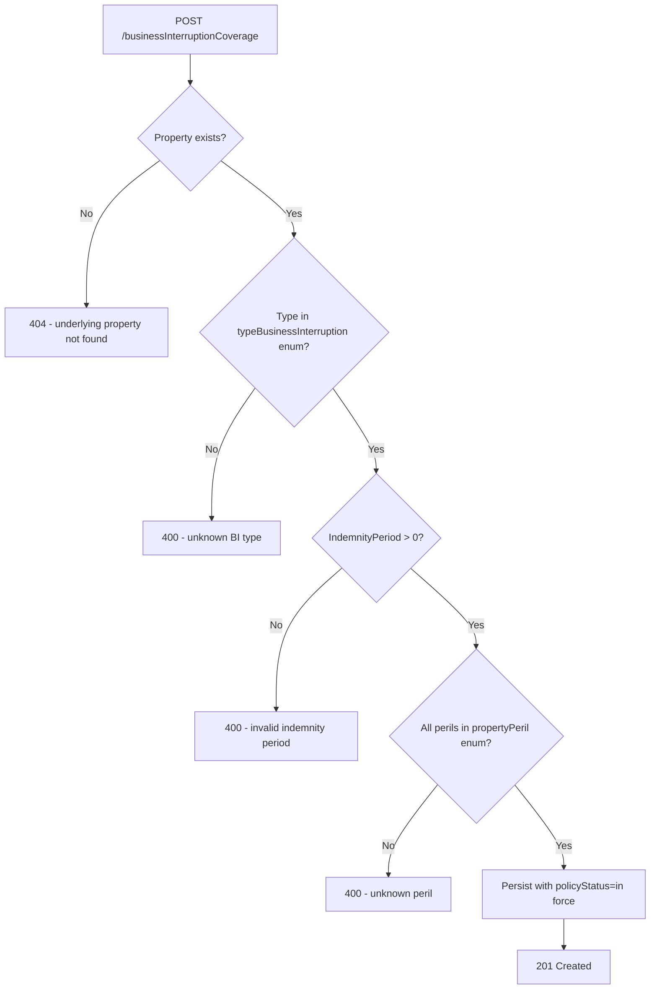

# Module 8: Business Interruption

Resources, endpoints, primary flow, lifecycle and routing. The entities and fields are in [`data-model.md`](data-model.md). Conventions that apply to every module are in [`../conventions.md`](../conventions.md).

### Resource model

### Endpoints

`[added]`: OPIN publishes the businessInterruptionCoverage schema but no endpoints. The Property schema is reused from Module 6.

- `POST /businessInterruptionCoverage` (admin)
- `GET /businessInterruptionCoverage` (developer)
- `GET /businessInterruptionCoverage/{id}` (developer)
- `PUT /businessInterruptionCoverage/{id}` (admin)
- `POST /businessInterruptionCoverage/{id}:endorse` (admin)
- `POST /businessInterruptionCoverage/{id}:cancel` (admin)
- `POST /businessInterruptionCoverage/{id}:renew` (admin)

### Primary flow: Bind a BI policy alongside property

### Lifecycle

### Routing and error handling

