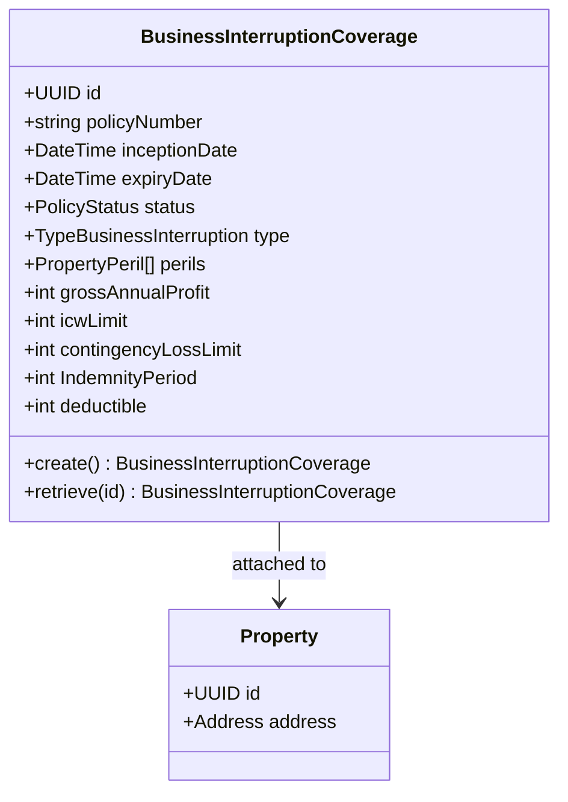
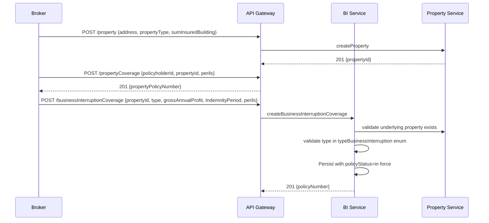
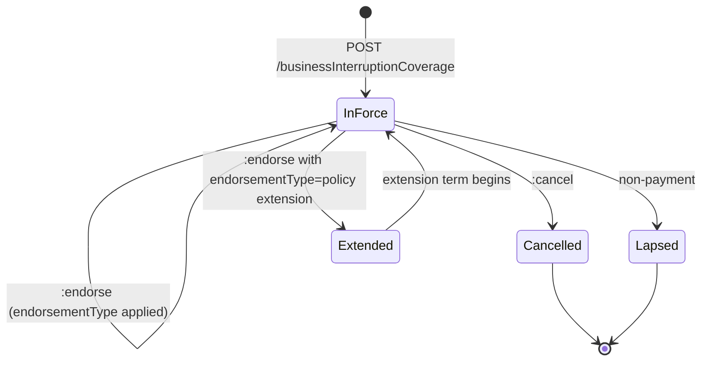
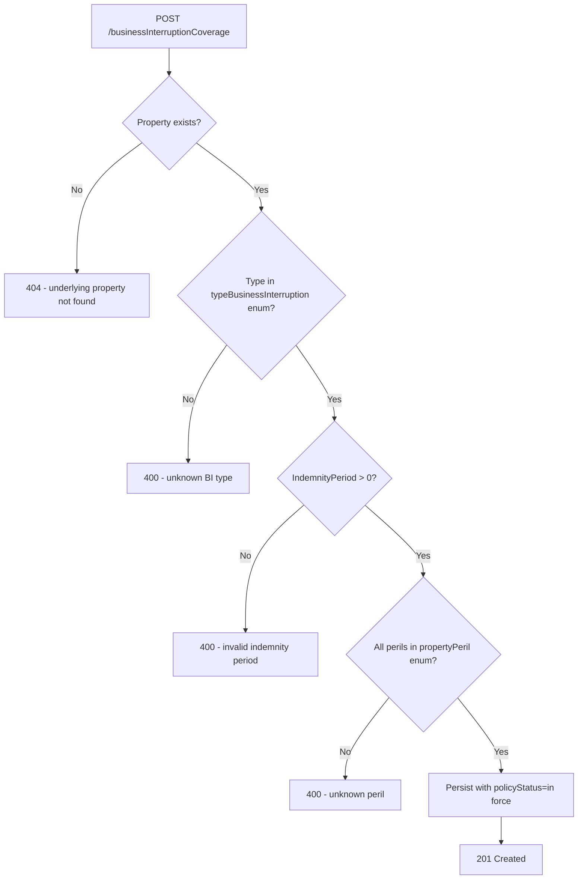

# Module 8: Business Interruption

The endpoints, the flow that binds a policy, the lifecycle and the error paths. The entities and
fields are in [`data-model.md`](data-model.md), and the rules that apply on every call are in
[`../conventions.md`](../conventions.md).

## Resource model

`businessInterruptionCoverage` carries a `propertyRef`. The premises it points at is created through
[property](../06-property/), which is why the flow below writes the property first.

## Endpoints

`Property` is created through [property](../06-property/). There is no property endpoint here.

| Endpoint | Scope | What it does |
| :--- | :--- | :--- |
| `POST /businessInterruptionCoverage` | admin | Bind a policy |
| `GET /businessInterruptionCoverage` | developer | List, filterable by `policyNumber` |
| `GET /businessInterruptionCoverage/{id}` | developer | Retrieve one policy |
| `PUT /businessInterruptionCoverage/{id}` | admin | Replace a policy |
| `POST /businessInterruptionCoverage/{id}:endorse` | admin | Amend a policy in force |
| `POST /businessInterruptionCoverage/{id}:cancel` | admin | End a policy before expiry |
| `POST /businessInterruptionCoverage/{id}:renew` | admin | Issue a new coverage record for a new term |

## Primary flow: bind alongside a property policy

Three writes, in order, because this cover attaches to a premises that has to exist first and is
normally sold with the property policy over the same premises.

## Lifecycle

**This diagram is normative.** A transition it does not draw is not one an implementation may make.

## Errors

