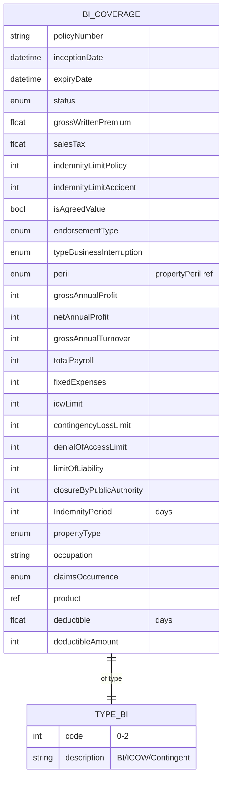

# Module 8: Business Interruption

Entities, fields, enumerated values and relationships. The API surface for this module is in [`api.md`](api.md).

Covers BI insurance: extended property-style policy with profit/turnover/payroll exposure base, ICOW, contingent loss, denial of access, and indemnity period; references propertyType and propertyPeril.

OPIN sources: `businessInterruptionCoverage`, `typeBusinessInterruption`, `claimsOccurrence`.

### Field annotations (Module 8)

| Entity | Field | Type | OPIN source | Notes |
|---|---|---|---|---|
| BICoverage | typeBusinessInterruption | enum (typeBusinessInterruption) | sheet `typeBusinessInterruption` | BI / ICOW / Contingent Loss of Profit |
| BICoverage | grossAnnualProfit | Number/integer | sheet `businessInterruptionCoverage` |  |
| BICoverage | netAnnualProfit | Number/integer | sheet `businessInterruptionCoverage` |  |
| BICoverage | grossAnnualTurnover | Number/integer | sheet `businessInterruptionCoverage` |  |
| BICoverage | totalPayroll | Number/integer | sheet `businessInterruptionCoverage` |  |
| BICoverage | fixedExpenses | Number/integer | sheet `businessInterruptionCoverage` |  |
| BICoverage | icwLimit | Number/integer | sheet `businessInterruptionCoverage` | Increased Cost of Working |
| BICoverage | contingencyLossLimit | Number/integer | sheet `businessInterruptionCoverage` |  |
| BICoverage | denialOfAccessLimit | Number/integer | sheet `businessInterruptionCoverage` |  |
| BICoverage | limitOfLiability | Number/integer | sheet `businessInterruptionCoverage` | Annual policy limit |
| BICoverage | closureByPublicAuthority | Number/integer | sheet `businessInterruptionCoverage` | OPIN field name `closure by public authority` (with spaces); `[normalisation]` to camelCase |
| BICoverage | IndemnityPeriod | Number/integer | sheet `businessInterruptionCoverage` | Days; OPIN PascalCase preserved here as it is the only PascalCase field in this entity |
| BICoverage | claimsOccurrence | enum (claimsOccurrence) | sheet `claimsOccurrence` |  |
| BICoverage | propertyType | enum (propertyType) | sheet `businessInterruptionCoverage` | Reused from Module 6 |
| BICoverage | product | ref (Product) | sheet `businessInterruptionCoverage` | Cross-reference to product entity |

`[OPIN concern]`: `closure by public authority` field name in OPIN contains spaces, which break naming conventions used elsewhere. `[normalisation]` to `closureByPublicAuthority`. Filed as a change proposal.

`[OPIN concern]`: `businessInterruptionCoverage` types most numeric fields as `Number/fFloat` (lower-f typo for `Float`). `[normalisation]` renders as `Number/Float`. Filed as a change proposal.

`[OPIN concern]`: BI coverage typically attaches to a Property; OPIN does not declare an explicit foreign key from `businessInterruptionCoverage` to `property`. A `propertyRef` would tighten the model. Filed as a change proposal.
