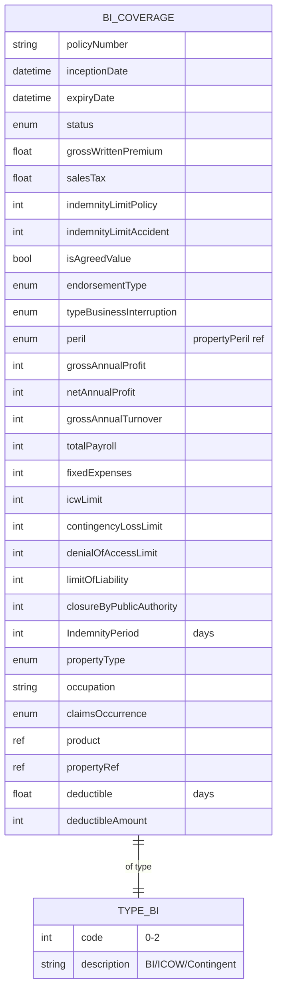

# Module 8: Business Interruption

The entities, fields, enumerated values and relationships. The endpoints over them are in
[`api.md`](api.md), and the terms used throughout are defined in
[Insurance concepts](../concepts.md).

One entity, **`businessInterruptionCoverage`**. It has the shape of a property policy with a
financial exposure base added, and it reuses `propertyType` and `propertyPeril` from
[property](../06-property/) because the events that stop a business are the events that damage its
premises.

Where a property claim is settled against the cost of physical things, this one is settled against
accounts: what the business would have earned, less what it did earn, over a defined period.

## Selected fields

| Entity | Field | Type | What it means |
|---|---|---|---|
| BICoverage | typeBusinessInterruption | enum | Which form of cover this is. Standard business interruption, increased cost of working alone, or contingent loss of profit, which covers an interruption at a supplier or customer rather than at the insured's own premises |
| BICoverage | IndemnityPeriod | Number/integer | **Days the policy keeps paying after an interruption starts.** Not the policy term. A twelve-month policy can carry a 24-month indemnity period, because rebuilding outlasts the policy year. Set too short, the business is underinsured and nobody finds out until the claim |
| BICoverage | grossAnnualProfit | Number/integer | Profit before the interruption, and the usual basis for the loss calculation |
| BICoverage | netAnnualProfit | Number/integer | Profit after overheads |
| BICoverage | grossAnnualTurnover | Number/integer | Revenue before the interruption |
| BICoverage | totalPayroll | Number/integer | Wage cost, which usually continues while the business is stopped and is therefore part of the loss |
| BICoverage | fixedExpenses | Number/integer | Costs that run whether or not the business trades: rent, leases, insurance |
| BICoverage | icwLimit | Number/integer | Increased cost of working. Money spent to keep trading through the interruption, such as temporary premises or an extra shift. Separate from lost profit, because spending it reduces the eventual claim |
| BICoverage | contingencyLossLimit | Number/integer | Cap where the interruption happened at a supplier or customer instead of at the insured |
| BICoverage | denialOfAccessLimit | Number/integer | Cap where nothing is damaged and the business still cannot trade because access is blocked |
| BICoverage | closureByPublicAuthority | Number/integer | Cap where an authority orders the premises shut. The source field name contains spaces and cannot travel as written |
| BICoverage | limitOfLiability | Number/integer | The most the policy pays across the year |
| BICoverage | deductible | Number/Float | The excess in **days**. Cover begins once the interruption has run past this waiting period |
| BICoverage | deductibleAmount | Number/integer | The excess in money, applied separately |
| BICoverage | claimsOccurrence | enum (claimsOccurrence) | Claims-occurring or claims-made basis |
| BICoverage | propertyType | enum (propertyType) | Reused from [property](../06-property/) |
| BICoverage | product | ref (Product) | The product this policy was written against |
| BICoverage | propertyRef | ref (Property) | The premises this cover attaches to. Business interruption only makes sense against a place, and this is the link to it. The `property` entity is defined in [property](../06-property/) |

## What to watch

**`propertyRef` points at a `property` this module does not create.** The premises is created
through [property](../06-property/) and referenced here. There is no property endpoint on this
module.

**`deductible` is measured in days, not money.** The monetary excess is `deductibleAmount`, and both
can apply.

**`closure by public authority` contains spaces at source** and cannot travel as a field name. This
page shows `closureByPublicAuthority`.

**`IndemnityPeriod` is the only PascalCase field on the entity** and is kept as written.

**Most numeric fields here are typed `Number/fFloat` at source**, with a lower-case `f` in the middle.
Read them all as `Number/Float`.
