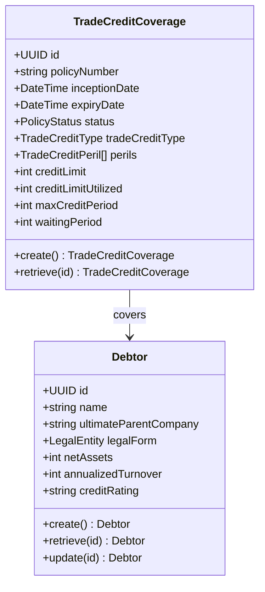
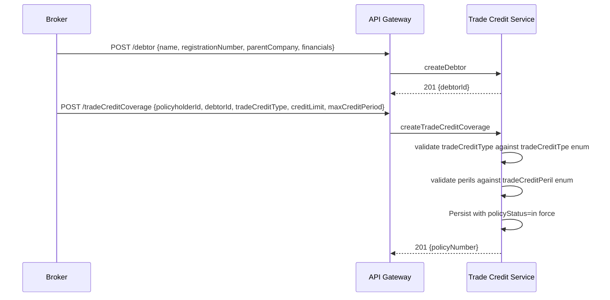
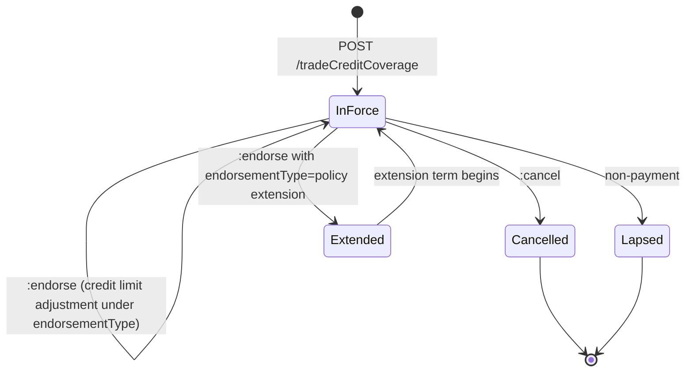
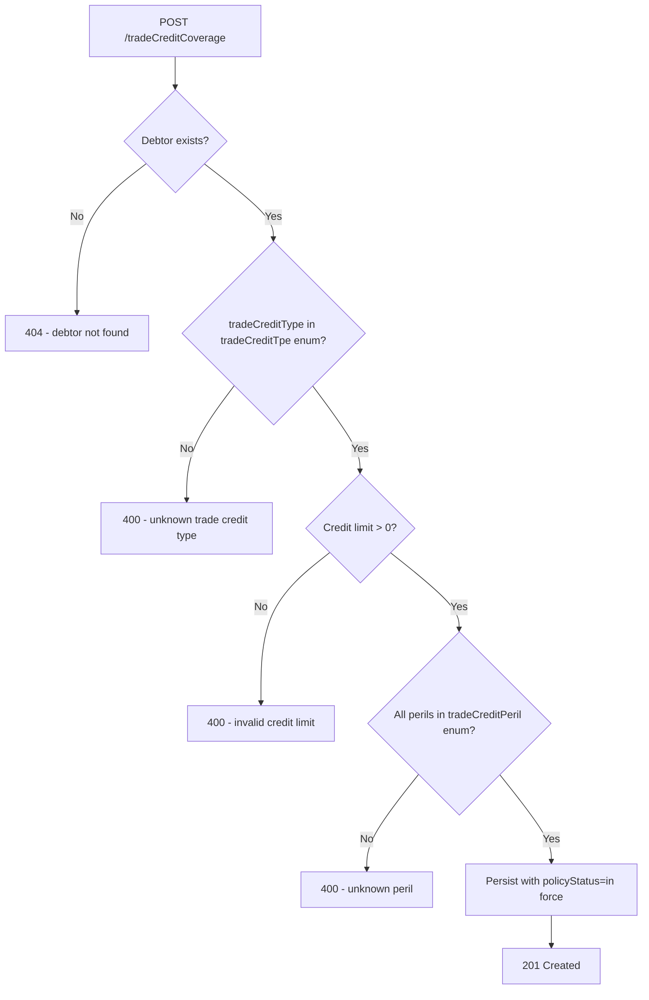

# Module 9: Trade Credit

Resources, endpoints, primary flow, lifecycle and routing. The entities and fields are in [`data-model.md`](data-model.md). Conventions that apply to every module are in [`../conventions.md`](../conventions.md).

### Resource model

### Endpoints

`[added]`: OPIN publishes the tradeCreditCoverage and debtor schemas but no endpoints.

- `POST /tradeCreditCoverage` (admin)
- `GET /tradeCreditCoverage` (developer)
- `GET /tradeCreditCoverage/{id}` (developer)
- `PUT /tradeCreditCoverage/{id}` (admin)
- `POST /tradeCreditCoverage/{id}:endorse` (admin), supports credit limit changes via OPIN `endorsementType=addition/increase` or `deletion/decrease`
- `POST /tradeCreditCoverage/{id}:cancel` (admin)
- `POST /tradeCreditCoverage/{id}:renew` (admin)
- `POST /debtor` (admin)
- `GET /debtor` (developer)
- `GET /debtor/{id}` (developer)
- `PUT /debtor/{id}` (admin)

### Primary flow: Bind a single-buyer trade credit policy

### Lifecycle

`[OPIN concern]`: OPIN ships a `waitingPeriod` field on tradeCreditCoverage but no operational signal for entering or exiting it. This standard does not invent a waiting-period state; the waiting period is a derived calculation against the loss-event date when a claim is filed.

### Routing and error handling

