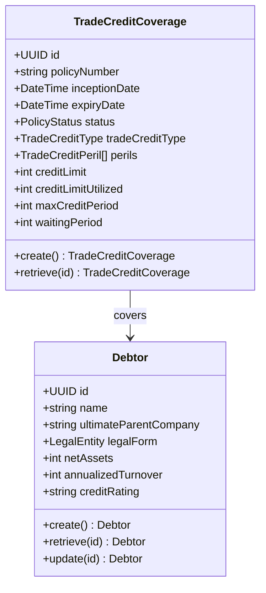
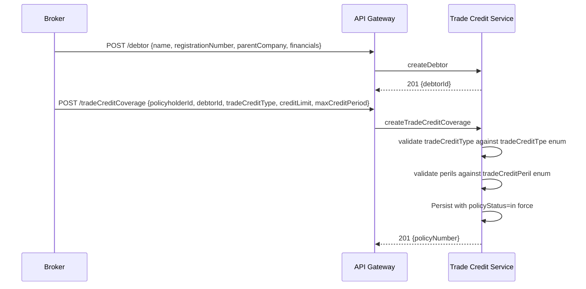
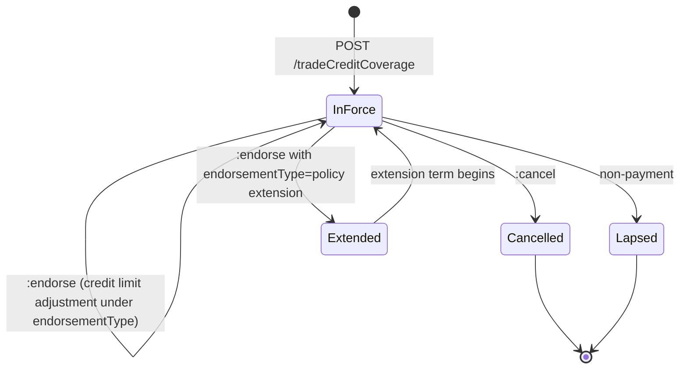
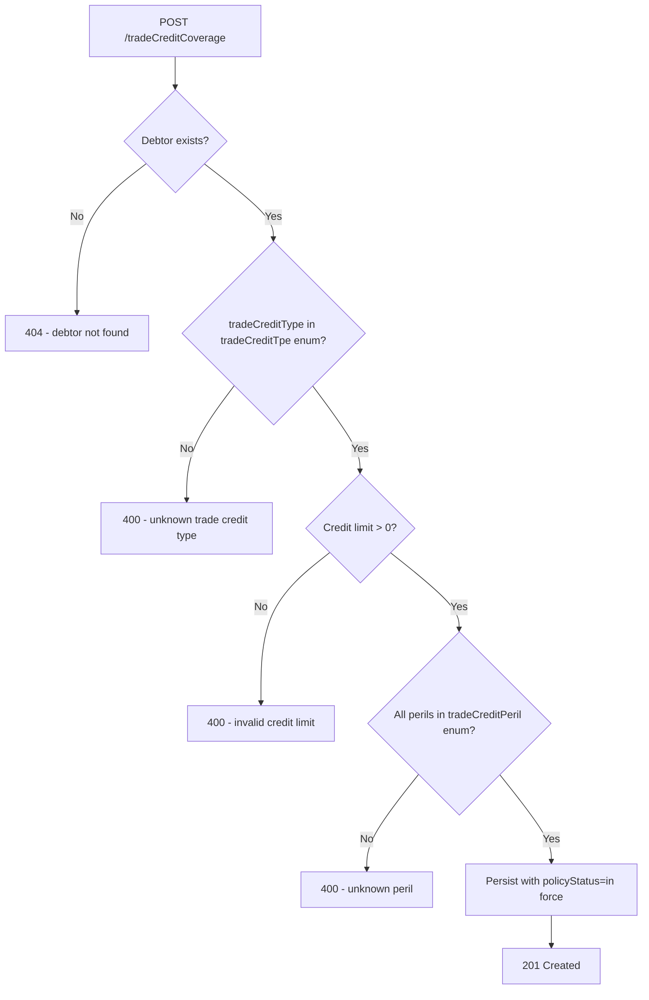

# Module 9: Trade Credit

The endpoints, the flow that binds a policy, the lifecycle and the error paths. The entities and
fields are in [`data-model.md`](data-model.md), and the rules that apply on every call are in
[`../conventions.md`](../conventions.md).

## Resource model

## Endpoints

| Endpoint | Scope | What it does |
| :--- | :--- | :--- |
| `POST /tradeCreditCoverage` | admin | Bind a policy against an existing debtor |
| `GET /tradeCreditCoverage` | developer | List, filterable by `policyNumber` |
| `GET /tradeCreditCoverage/{id}` | developer | Retrieve one policy |
| `PUT /tradeCreditCoverage/{id}` | admin | Replace a policy |
| `POST /tradeCreditCoverage/{id}:endorse` | admin | Amend a policy in force. This is how a credit limit is raised or lowered, under an `endorsementType` of addition or deletion |
| `POST /tradeCreditCoverage/{id}:cancel` | admin | End a policy before expiry |
| `POST /tradeCreditCoverage/{id}:renew` | admin | Issue a new coverage record for a new term |
| `POST /debtor` | admin | Create a debtor |
| `GET /debtor` | developer | List debtors |
| `GET /debtor/{id}` | developer | Retrieve one debtor |
| `PUT /debtor/{id}` | admin | Replace a debtor |

Credit limits move often, and `:endorse` is the only route. There is no separate limit endpoint, so
a limit change is an endorsement on a policy that stays in force.

## Primary flow: bind a single-buyer policy

## Lifecycle

**This diagram is normative.** A transition it does not draw is not one an implementation may make.

There is no waiting-period state, although `waitingPeriod` is a field on the record. The waiting
period is calculated against the loss date at the point a claim is filed, and the policy does not
move while it runs.

## Errors

