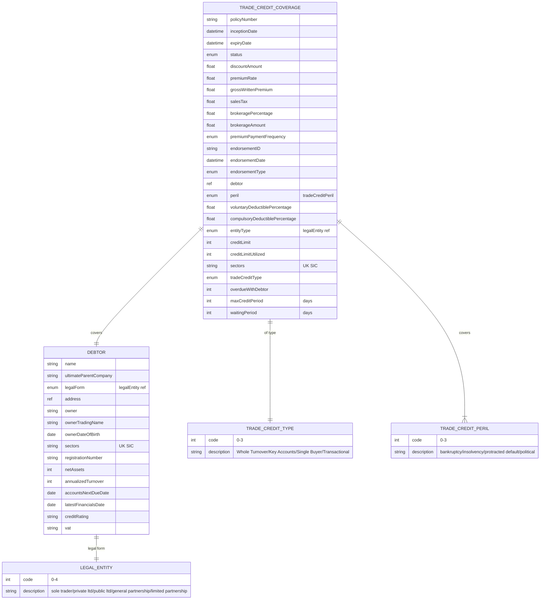

# Module 9: Trade Credit

The entities, fields, enumerated values and relationships. The endpoints over them are in
[`api.md`](api.md), and the terms used throughout are defined in
[Insurance concepts](../concepts.md).

**`tradeCreditCoverage`** is the policy held by a seller, and **`debtor`** is the buyer whose
failure to pay is the insured event. The buyer is not a party to the policy and need not know it
exists, which is why `debtor` carries financial statements, a credit rating and a parent company:
the insurer is underwriting a company that never signed anything.

## Selected fields

`tradeCreditCoverage` carries the standard policy lifecycle in full: `inceptionDate`, `expiryDate`,
`status`, `discountAmount`, `premiumRate`, `grossWrittenPremium`, `salesTax`,
`brokeragePercentage`, `brokerageAmount`, `premiumPaymentFrequency`, `endorsementID`,
`endorsementDate` and `endorsementType`. Same names, same types and same value sets as every other
coverage type, so anything that already handles motor or property handles these unchanged. The
fields below are the ones specific to this line.

| Entity | Field | Type | What it means |
|---|---|---|---|
| TradeCreditCoverage | tradeCreditType | enum | How much of the seller's book is covered. Whole turnover (every customer), key accounts (the largest few), single buyer (one), or transactional (one shipment) |
| TradeCreditCoverage | peril | enum (tradeCreditPeril) | Which causes of non-payment count. Bankruptcy, insolvency, protracted default, political risk |
| TradeCreditCoverage | creditLimit | Number/integer | The most the insurer will cover against this buyer |
| TradeCreditCoverage | creditLimitUtilized | Number/integer | How much of the limit is currently in use. Headroom is the difference. Spelled `creditLimitUtiilized` on the wire |
| TradeCreditCoverage | maxCreditPeriod | Number/integer | The longest payment term the cover allows, in days. Invoice a buyer on longer terms and the debt falls outside the policy |
| TradeCreditCoverage | waitingPeriod | Number/integer | How long a debt must stay unpaid before it can be claimed. Protracted default is time passing rather than an event, so it needs a threshold |
| TradeCreditCoverage | overdueWithDebtor | Number/integer | How much is currently past due with this buyer |
| TradeCreditCoverage | sectors | Text (UK SIC) | The industries covered, as SIC codes |
| TradeCreditCoverage | entityType | enum (legalEntity) | The buyer's legal form. Spelled `entitytype` at source |
| Debtor | ultimateParentCompany | Text | The group parent. A subsidiary's creditworthiness often rests on whoever stands behind it |
| Debtor | legalForm | enum (legalEntity) | Sole trader, private limited, public limited, general partnership or limited partnership. This decides who can be pursued for the debt |
| Debtor | netAssets | Number/integer | Fixed plus current assets, less current plus long-term liabilities |
| Debtor | annualizedTurnover | Number/integer | Revenue, which sizes what an exposure to this buyer means |
| Debtor | latestFinancialsDate | Date | When the accounts being relied on were drawn up. Stale accounts are a risk signal in themselves |
| Debtor | accountsNextDueDate | Date | When the next filing is due |
| Debtor | creditRating | Text | Rating from S&P, AM Best or Fitch |

## What to watch

**Two names are misspelled on the wire and stay as they are.** The type enumeration is
`tradeCreditTpe` and the utilisation field is `creditLimitUtiilized`, with a doubled `i`. Both are
already implemented everywhere the standard was adopted, so correcting them would break working
integrations. Send them as written. A third, `entitytype` with a lowercase `t`, is shown corrected
above.

**Political risk overlaps with a separate product.** `tradeCreditPeril` code 3 is political risk,
and the product catalogue carries political risk insurance as its own line of business. Nothing
draws the boundary between them. Decide which you are selling before you rely on the peril.

**`waitingPeriod` has no state behind it.** Nothing signals entering or leaving it. Treat it as a
calculation against the loss date at the point a claim is filed.
