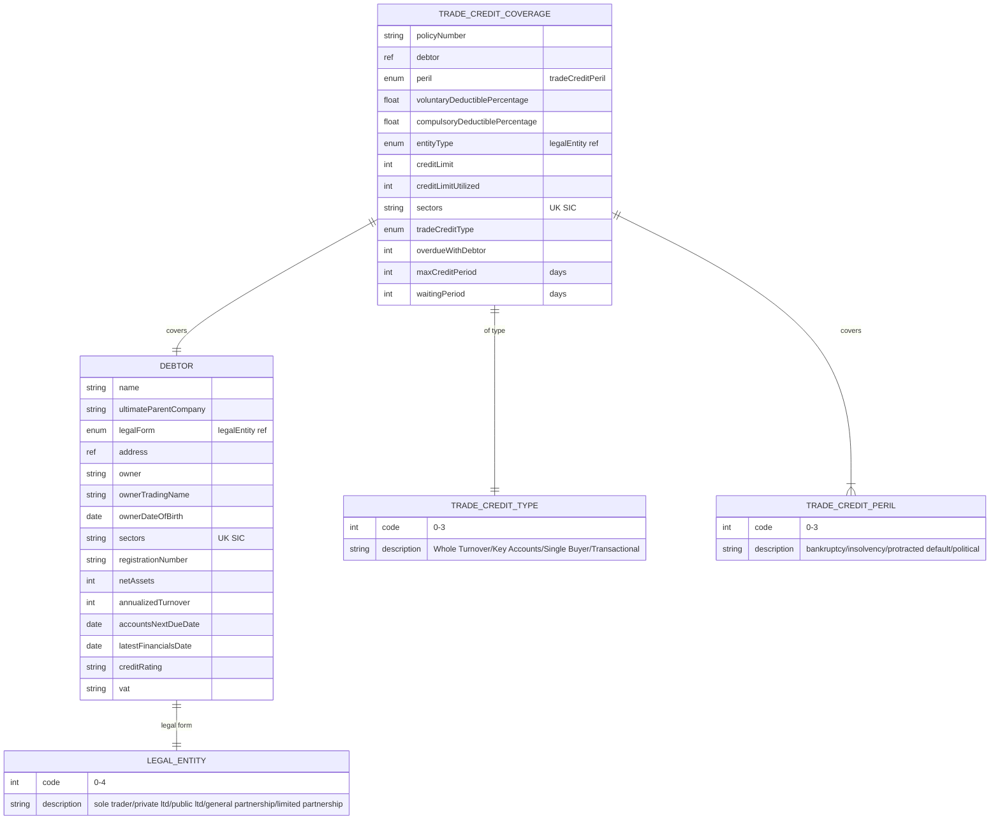

# Module 9: Trade Credit

Entities, fields, enumerated values and relationships. The API surface for this module is in [`api.md`](api.md).

Covers trade credit insurance: tradeCreditCoverage with debtor-specific limits, deductibles, sectors, and waiting periods; debtor entity with parent company, financials, credit rating; coverage type enum (Whole Turnover, Key Accounts, Single Buyer, Transactional).

OPIN sources: `tradeCreditCoverage`, `debtor`, `tradeCreditTpe` (sheet name typo), `tradeCreditPeril`, `legalEntity`.

### Field annotations (Module 9)

| Entity | Field | Type | OPIN source | Notes |
|---|---|---|---|---|
| TradeCreditCoverage | debtor | ref (Debtor) | sheet `tradeCreditCoverage` |  |
| TradeCreditCoverage | tradeCreditType | enum (tradeCreditType) | sheet `tradeCreditTpe` | OPIN sheet name `tradeCreditTpe` is a typo; `[OPIN-VN normalisation]` to `tradeCreditType` |
| TradeCreditCoverage | creditLimit | Number/integer | sheet `tradeCreditCoverage` |  |
| TradeCreditCoverage | creditLimitUtilized | Number/integer | sheet `tradeCreditCoverage` | OPIN spelling `creditLimitUtiilized` (double-i); `[OPIN-VN normalisation]` applied |
| TradeCreditCoverage | maxCreditPeriod | Number/integer | sheet `tradeCreditCoverage` | Days |
| TradeCreditCoverage | waitingPeriod | Number/integer | sheet `tradeCreditCoverage` |  |
| TradeCreditCoverage | overdueWithDebtor | Number/integer | sheet `tradeCreditCoverage` |  |
| TradeCreditCoverage | sectors | Text (UK SIC) | sheet `tradeCreditCoverage` |  |
| TradeCreditCoverage | entitytype | enum (legalEntity) | sheet `tradeCreditCoverage` | OPIN field name `entitytype` (lowercase t); `[OPIN-VN normalisation]` to `entityType` |
| Debtor | ultimateParentCompany | Text | sheet `debtor` |  |
| Debtor | legalForm | enum (legalEntity) | sheet `debtor` |  |
| Debtor | netAssets | Number/integer | sheet `debtor` | Formula in OPIN: (Total Fixed Assets + Total Current Assets) - (Total Current Liabilities + Total Long Term Liabilities) |
| Debtor | annualizedTurnover | Number/integer | sheet `debtor` |  |
| Debtor | accountsNextDueDate | Date | sheet `debtor` |  |
| Debtor | latestFinancialsDate | Date | sheet `debtor` |  |
| Debtor | creditRating | Text | sheet `debtor` | S&P, AM Best, Fitch |

`[OPIN concern]`: `tradeCreditCoverage` is missing the standard policy lifecycle fields that every other coverage carries: `inceptionDate`, `expiryDate`, `status`, `discountAmount`, `premiumRate`, `grossWrittenPremium`, `salesTax`, `brokeragePercentage`, `brokerageAmount`, `premiumPaymentFrequency`, `endorsementID`, `endorsementDate`, `endorsementType`. These are required for any policy and their absence makes the trade credit coverage entity inconsistent with the rest of the OPIN model. Upstream candidate to add.

`[OPIN concern]`: OPIN sheet name `tradeCreditTpe` is a typo (should be `tradeCreditType`). `[OPIN-VN normalisation]` applies the corrected spelling but the original sheet name is flagged here for upstream report.

`[OPIN concern]`: OPIN field `creditLimitUtiilized` on `tradeCreditCoverage` is misspelled (double-i, should be `creditLimitUtilized`). `[OPIN-VN normalisation]` applied.

`[OPIN concern]`: `tradeCreditPeril` includes `political risks` (code 3), which overlaps with broader political risk insurance products in `productCatalog`. The line between trade credit and political risk insurance is not clean in OPIN. Upstream candidate to clarify scope.
