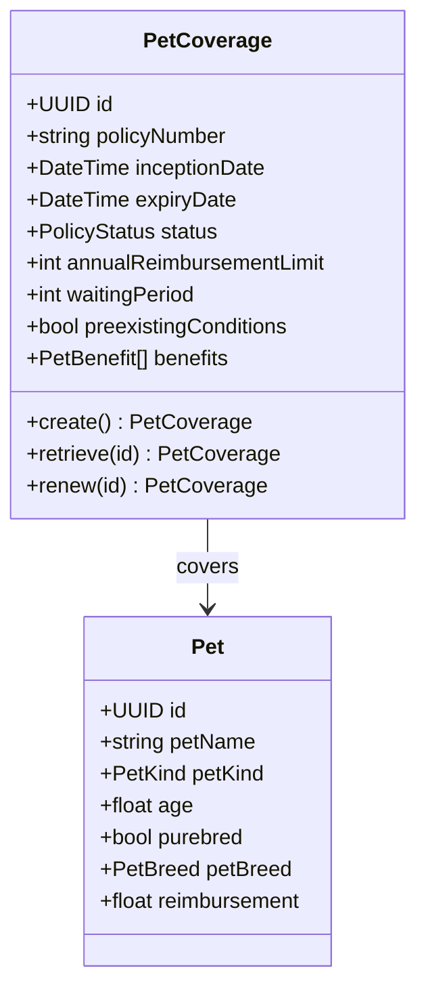
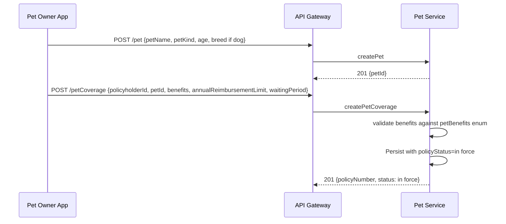
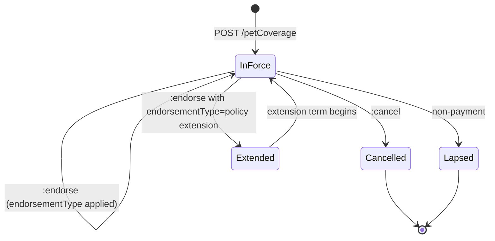
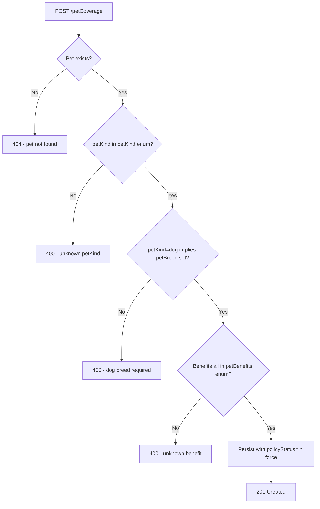

# Module 10: Pet

The endpoints, the flow that binds a policy, the lifecycle and the error paths. The entities and
fields are in [`data-model.md`](data-model.md), and the rules that apply on every call are in
[`../conventions.md`](../conventions.md).

## Resource model

## Endpoints

| Endpoint | Scope | What it does |
| :--- | :--- | :--- |
| `POST /petCoverage` | admin | Bind a policy against an existing pet |
| `GET /petCoverage` | developer | List, filterable by `policyNumber` |
| `GET /petCoverage/{id}` | developer | Retrieve one policy |
| `PUT /petCoverage/{id}` | admin | Replace a policy |
| `POST /petCoverage/{id}:endorse` | admin | Amend a policy in force |
| `POST /petCoverage/{id}:cancel` | admin | End a policy before expiry |
| `POST /petCoverage/{id}:renew` | admin | Issue a new coverage record for a new term |
| `POST /pet` | admin | Create a pet |
| `GET /pet` | developer | List pets |
| `GET /pet/{id}` | developer | Retrieve one pet |
| `PUT /pet/{id}` | admin | Replace a pet |

## Primary flow: bind a pet policy

## Lifecycle

**This diagram is normative.** A transition it does not draw is not one an implementation may make.

There is no waiting state, although `waitingPeriod` is a field on the record. The policy is in force
from binding, and the waiting period is calculated against `inceptionDate` when a claim is
evaluated. [Trade credit](../09-trade-credit/) handles its own waiting period the same way.

## Errors

