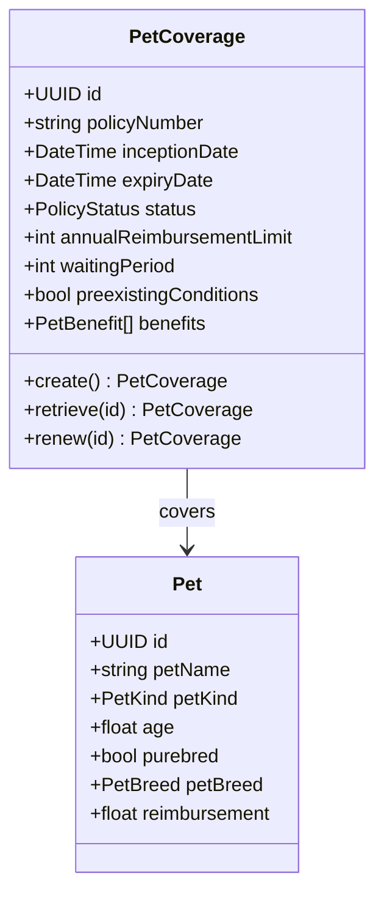
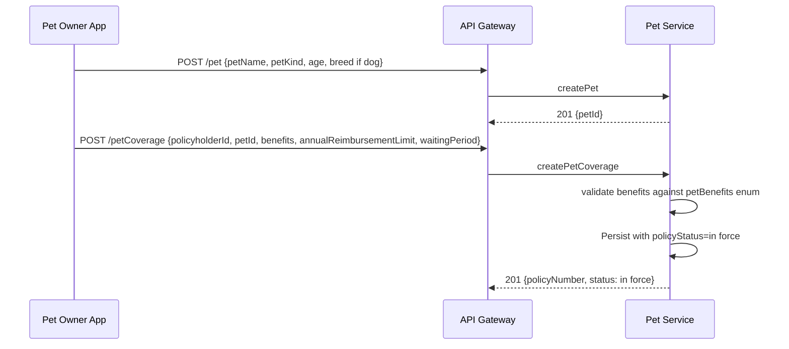
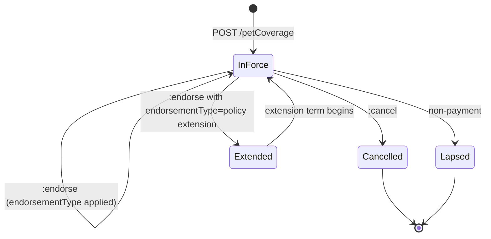
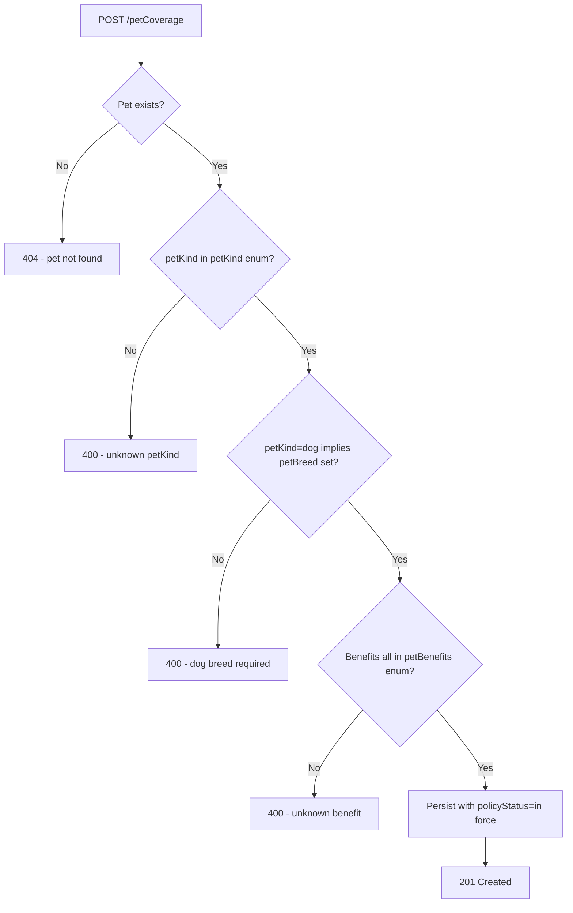

# Module 10: Pet

Resources, endpoints, primary flow, lifecycle and routing. The entities and fields are in [`data-model.md`](data-model.md). Conventions that apply to every module are in [`../conventions.md`](../conventions.md).

### Resource model

### Endpoints

`[added]`: OPIN publishes both the petCoverage and pet schemas but no endpoints.

- `POST /petCoverage` (admin)
- `GET /petCoverage` (developer)
- `GET /petCoverage/{id}` (developer)
- `PUT /petCoverage/{id}` (admin)
- `POST /petCoverage/{id}:endorse` (admin)
- `POST /petCoverage/{id}:cancel` (admin)
- `POST /petCoverage/{id}:renew` (admin)
- `POST /pet` (admin)
- `GET /pet` (developer)
- `GET /pet/{id}` (developer)
- `PUT /pet/{id}` (admin)

### Primary flow: Bind a pet policy

### Lifecycle

`[OPIN concern]`: OPIN ships a `waitingPeriod` field on petCoverage but, as with tradeCreditCoverage, no lifecycle state for it. This standard treats the waiting period as a derived calculation against `inceptionDate` when a claim is evaluated; the policy itself is `in force` from binding.

### Routing and error handling

