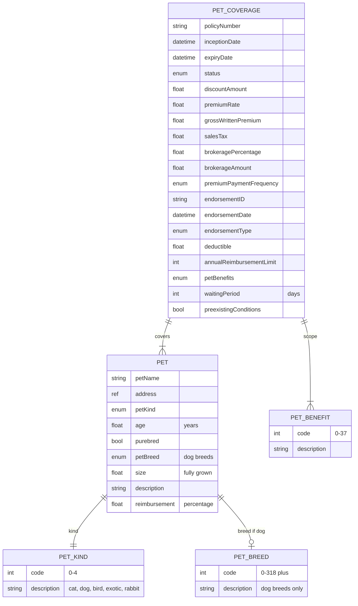

# Module 10: Pet

The entities, fields, enumerated values and relationships. The endpoints over them are in
[`api.md`](api.md), and the terms used throughout are defined in
[Insurance concepts](../concepts.md).

**`petCoverage`** is the policy and **`pet`** is the animal. **`petBenefits`** is the 38-value list
of treatment the policy pays for, across veterinary, surgical, diagnostic, preventive and
behavioural care.

This line reimburses rather than indemnifies. The customer pays the vet, the deductible comes off,
and the policy pays back a percentage of the remainder up to an annual cap.

## Selected fields

| Entity | Field | Type | What it means |
|---|---|---|---|
| PetCoverage | annualReimbursementLimit | Number/integer | The most the policy pays back across the year |
| PetCoverage | deductible | Number/Float | The share of each claim the customer bears, as a percentage. Typed `Number/fFloat` at source; read it as `Number/Float` |
| PetCoverage | waitingPeriod | Number/integer | Days from inception during which nothing is covered. It exists because a pet owner can buy a policy on the way to the vet |
| PetCoverage | preexistingConditions | Boolean | Whether conditions the animal already had are covered. Usually they are not |
| PetCoverage | petBenefits | enum (petBenefits) | Which of the 38 treatment categories this policy pays for. The subset is most of what separates a cheap policy from an expensive one |
| Pet | petKind | enum (petKind) | Five values: cat, dog, bird, exotic, rabbit |
| Pet | petBreed | enum (petBreed) | About 320 values, all of them dog breeds. See below |
| Pet | reimbursement | Number/Float | The percentage of an admitted claim paid back after the deductible. 80% on a 10,000,000 bill with a 1,000,000 deductible pays 7,200,000 |
| Pet | age | Number/Float | Age in years. The dominant pricing factor, as it is in health cover |
| Pet | purebred | Boolean | Whether the animal is pedigree. Pedigree animals carry known hereditary conditions, which changes the risk |
| Pet | size | Number/Float | Expected size when fully grown. Larger dogs cost more to treat and live shorter lives |
| Pet | address | ref (address) | Where the animal lives |

## What to watch

**`petBreed` covers dog breeds and nothing else.** Five kinds of animal are enumerated and only one
of them has breeds. Cats, rabbits, birds and exotics have no breed values at all. Decide before you
build whether you will leave the field empty for non-dogs, carry an extension field, or fall back to
free text. Whatever you choose, another implementation will have chosen differently, so do not
assume breed data is comparable across systems.

**There is no per-occurrence limit.** Every other coverage type carries `indemnityLimitAccident`.
This one does not. `annualReimbursementLimit` may be serving as the policy limit, and the
relationship between the annual cap and any single claim is not declared. Agree the reading
explicitly.

**`waitingPeriod` has no lifecycle state.** The policy is in force from the moment it is bound. The
waiting period is calculated against `inceptionDate` when a claim is evaluated, not tracked on the
record.
