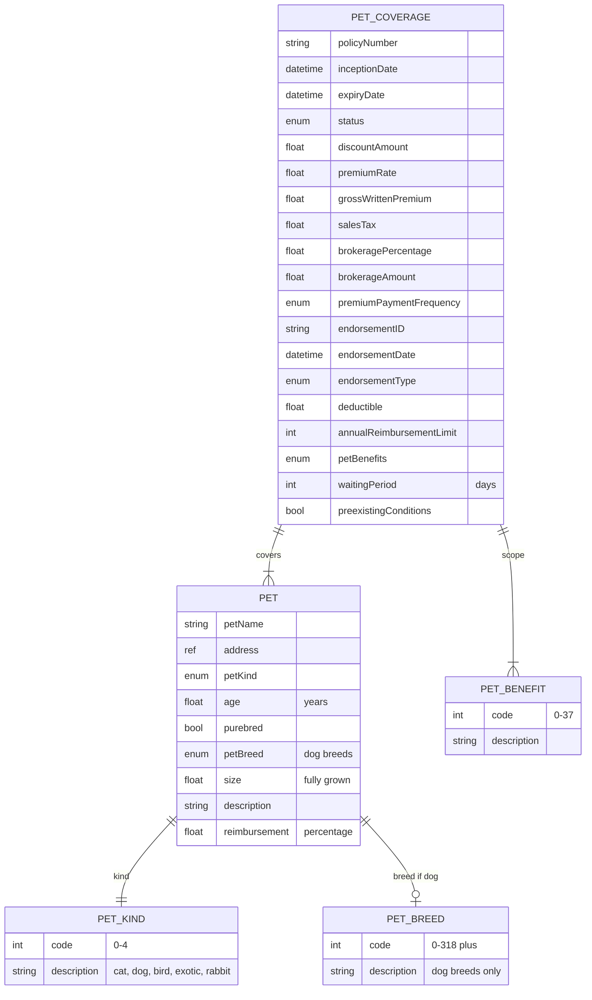

# Module 10: Pet

Entities, fields, enumerated values and relationships. The API surface for this module is in [`api.md`](api.md).

Covers pet insurance: petCoverage with reimbursement, deductible, waiting period, and pre-existing conditions flag; pet entity with kind (cat, dog, bird, exotic, rabbit, 5 values per OPIN), age, size, purebred flag; breed (dog breeds only in OPIN, ~320 values); petBenefits taxonomy (38 values across veterinary, surgical, diagnostic, preventive, behavioural).

OPIN sources: `petCoverage`, `pet`, `petBenefits`, `petBreed`, `petKind`.

### Field annotations (Module 10)

| Entity | Field | Type | OPIN source | Notes |
|---|---|---|---|---|
| PetCoverage | annualReimbursementLimit | Number/integer | sheet `petCoverage` |  |
| PetCoverage | waitingPeriod | Number/integer | sheet `petCoverage` | Days before coverage active |
| PetCoverage | preexistingConditions | Boolean | sheet `petCoverage` |  |
| PetCoverage | deductible | Number/Float | sheet `petCoverage` | Percentage of each claim |
| Pet | petKind | enum (petKind) | sheet `petKind`, API enum `petKind` | 5 values: cat, dog, bird, exotic, rabbit |
| Pet | petBreed | enum (petBreed) | sheet `petBreed`, API enum `petBreed` | ~320 values, dog breeds only |
| Pet | reimbursement | Number/Float | sheet `pet` | Percentage of admitted claim |
| Pet | size | Number/Float | sheet `pet` | Expected size when fully grown (dogs) |
| Pet | address | ref (address) | sheet `pet` | Place of residence of pet |
| PetBenefit | code | int | sheet `petBenefits` | 38 values |

`[OPIN concern]`: `petKind` covers cat, dog, bird, exotic, and rabbit (5 values). However, `petBreed` enumerates dog breeds only (~320 entries). Cat, rabbit, bird, and exotic-pet breed-level enumerations are not in OPIN. The result is that breed-level data exists for one of the five kinds. Upstream candidate to either drop breed for non-dog kinds explicitly, add per-kind breed enumerations, or model breed as a free-text fallback.

`[OPIN concern]`: `petCoverage` is missing the per-occurrence indemnity limit field (`indemnityLimitAccident`) that other coverages carry. `annualReimbursementLimit` may be acting as the policy limit, but the relationship to per-occurrence claims is ambiguous. Upstream candidate.

`[OPIN concern]`: `petCoverage` types `deductible` as `Number/fFloat` (typo). `[normalisation]` to `Number/Float`. The same lower-f typo appears across multiple sheets (`businessInterruptionCoverage`, `tradeCreditCoverage`, `pet`, `petCoverage`).
