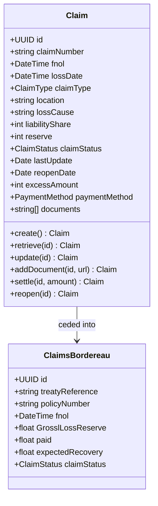
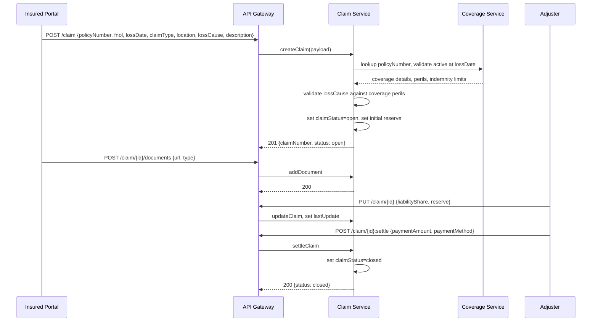
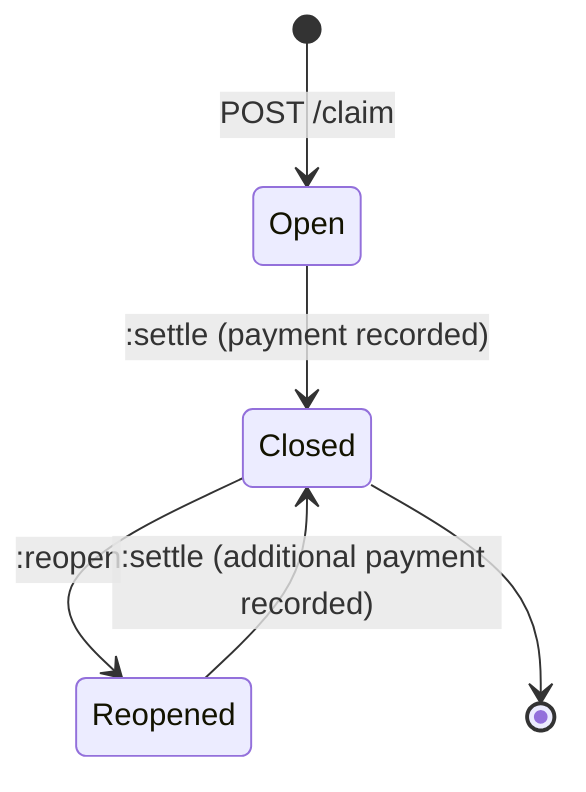
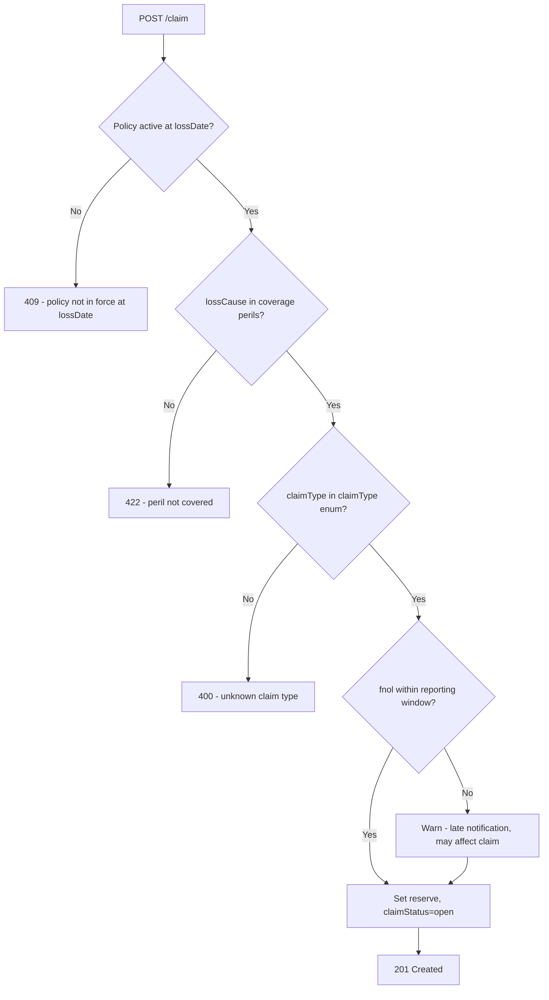

# Module 11: Claims

The endpoints, the flow from first notification to settlement, the lifecycle and the error paths.
The entities and fields are in [`data-model.md`](data-model.md), and the rules that apply on every
call are in [`../conventions.md`](../conventions.md).

## Resource model

**`policyNumber` is what links a claim to its policy.** It is globally unique across the namespace,
it travels in the claim payload, and `/claim` accepts it as a collection filter. That constraint is
what makes one polymorphic endpoint possible across all eight coverage types, and it is set out in
[`../SCOPE.md`](../SCOPE.md).

## Endpoints

`POST /claim` accepts a claim against any coverage type. The caller does not say which kind of
policy it is, because `policyNumber` already determines that.

| Endpoint | Scope | What it does |
| :--- | :--- | :--- |
| `POST /claim` | admin | File a claim against any coverage type |
| `GET /claim` | developer | List, filterable by `policyNumber` and `claimNumber` |
| `GET /claim/{id}` | developer | Retrieve one claim |
| `PUT /claim/{id}` | admin | Replace a claim, which is how an adjuster revises the reserve and the liability share |
| `POST /claim/{id}/documents` | admin | Append to the claim's documents |
| `POST /claim/{id}:settle` | admin | Pay and close. Records the amount and the payment method |
| `POST /claim/{id}:reopen` | admin | Reopen a closed claim and set `reopenDate` |
| `POST /claimsBordereau` | admin | Create a reinsurance report |
| `GET /claimsBordereau` | developer | List, filterable by `treatyReference` |
| `GET /claimsBordereau/{id}` | developer | Retrieve one report |

## Primary flow: first notification through settlement

## Lifecycle

**This diagram is normative.** A transition it does not draw is not one an implementation may make.

Three states: open, closed, reopened. Settlement closes a claim and it does not end it, because
something further can always emerge. A reopened claim settles again, and a second payment is
recorded against it.

Triage, investigation, awaiting documents, awaiting payment and fraud review are not states here and
will not become states. They describe where a claim sits in one operator's process, which is not
something two insurers need to agree on to exchange a claim.

## Errors

The check that matters most is the first one. A policy has to have been in force on the **loss
date**, not on the date the claim was filed, so a claim can be admitted against a policy that has
since expired and refused against one that is currently active.

