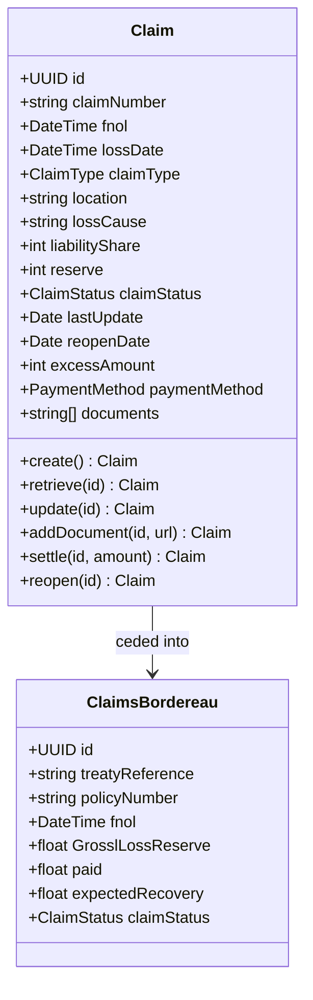
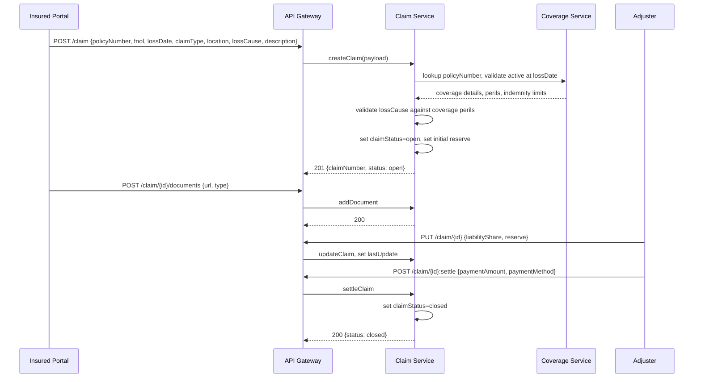
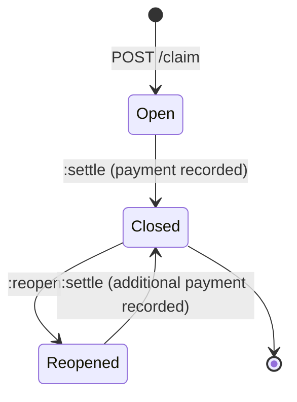
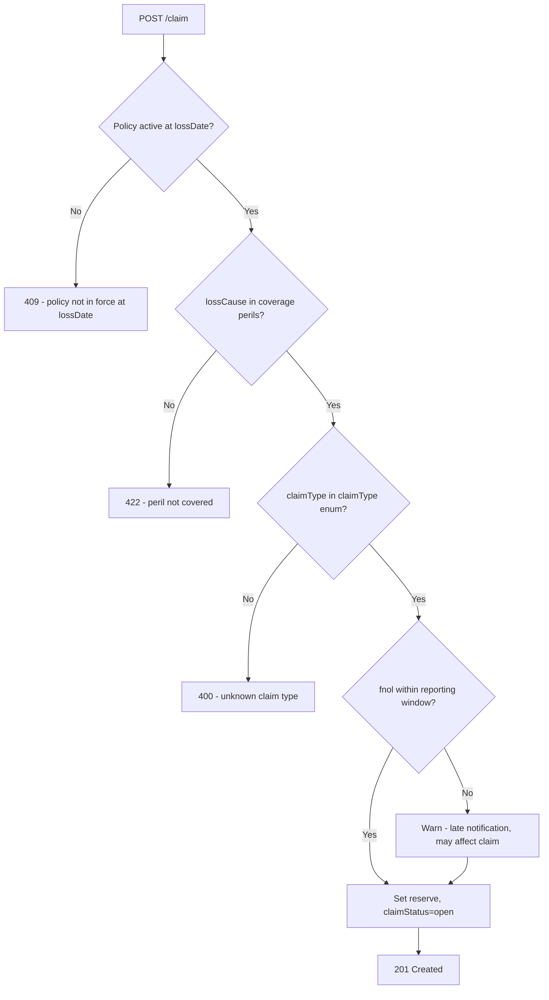

# Module 11: Claims

Resources, endpoints, primary flow, lifecycle and routing. The entities and fields are in [`data-model.md`](data-model.md). Conventions that apply to every module are in [`../conventions.md`](../conventions.md).

### Resource model

`[OPIN concern]`: OPIN's Claim schema does not carry an explicit foreign-key field linking to the policy or coverage being claimed against. Implementations must associate claims to coverage out-of-band (typically via `policyNumber` carried in the claim payload). An OPIN v1.1 should add an explicit linkage field to Claim.

### Endpoints

OPIN endpoints (kept verbatim, attributed to OPIN, polymorphic across coverages):

- `POST /claim` (admin) `[OPIN]`
- `GET /claim` (developer) `[OPIN]`

Added here, on the same OPIN schemas:

- `GET /claim/{id}` (developer) `[added]`
- `PUT /claim/{id}` (admin) `[added]`
- `POST /claim/{id}/documents` (admin) `[added]`: append to OPIN `documents` array
- `POST /claim/{id}:settle` (admin) `[added]`: transitions claimStatus from open to closed and records payment amount/method
- `POST /claim/{id}:reopen` (admin) `[added]`: transitions claimStatus from closed to reopened, sets reopenDate
- `POST /claimsBordereau` (admin) `[added]`
- `GET /claimsBordereau` (developer) `[added]`: filter by treatyReference
- `GET /claimsBordereau/{id}` (developer) `[added]`

### Primary flow: Submit a claim (FNOL through settlement)

### Lifecycle

States are exactly OPIN `claimStatus` (open, closed, reopened). All operational sub-states (triage, investigation, awaiting documents, awaiting payment, fraud review) are implementer-side workflow concerns and do not appear on the wire.

### Routing and error handling

