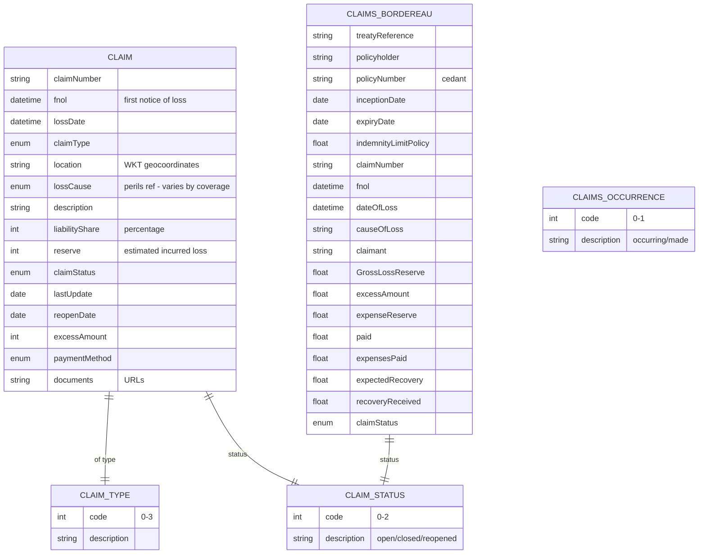

# Module 11: Claims

Entities, fields, enumerated values and relationships. The API surface for this module is in [`api.md`](api.md).

Covers the claims lifecycle: Claim entity with FNOL, loss date, type, location, liability share, reserve, status, payments; ClaimsBordereau for reinsurance reporting; claimsOccurrence basis (occurring vs made); claim type and status enums.

OPIN sources: `Claim`, `ClaimsBordereau`, `claimsOccurrence`, `claimType`, `claimStatus`.

### Field annotations (Module 11)

| Entity | Field | Type | OPIN source | Notes |
|---|---|---|---|---|
| Claim | claimNumber | Text | sheet `Claim` |  |
| Claim | fnol | DateTime (ISO 8601) | sheet `Claim` | First notice of loss |
| Claim | lossDate | DateTime (ISO 8601) | sheet `Claim` |  |
| Claim | claimType | enum (claimType) | sheet `claimType` | Own property / 3PL bodily / 3PL property / other |
| Claim | location | Text (WKT geo) | sheet `Claim` |  |
| Claim | lossCause | enum (perils, polymorphic) | sheet `Claim` | OPIN references `perils` (lowercase, plural) without specifying the peril enum |
| Claim | liabilityShare | Number/integer | sheet `Claim` | Percentage |
| Claim | reserve | Number/integer | sheet `Claim` | Inclusive of expenses |
| Claim | claimStatus | enum (claimStatus) | sheet `claimStatus` | Open / closed / reopened |
| Claim | lastUpdate | Date | sheet `Claim` |  |
| Claim | reopenDate | Date | sheet `Claim` |  |
| Claim | excessAmount | Number/integer | sheet `Claim` | Deductible |
| Claim | paymentMethod | enum (paymentMethod) | sheet `Claim` |  |
| Claim | documents | Text/URL | sheet `Claim` | Police report, photos, etc. |
| ClaimsBordereau | treatyReference | Text | sheet `ClaimsBordereau` | Reinsurance treaty |
| ClaimsBordereau | GrossLossReserve | Number/Float | sheet `ClaimsBordereau` | OPIN typo `GrosslLossReserve` (lowercase l between Gross and Loss); `[normalisation]` applied |
| ClaimsBordereau | expectedRecovery | Number/Float | sheet `ClaimsBordereau` | Salvage estimate |
| ClaimsBordereau | recoveryReceived | Number/Float | sheet `ClaimsBordereau` |  |
| ClaimsBordereau | dateOfLoss | DateTime (ISO 8601) | sheet `ClaimsBordereau` |  |
| ClaimsBordereau | causeOfLoss | Text | sheet `ClaimsBordereau` | Free-text on bordereau, vs `lossCause` enum on Claim |

`[OPIN concern]`: `Claim.lossCause` references a generic `perils` (lowercase, plural) without specifying which peril enum (`motorPeril`, `propertyPeril`, `tradeCreditPeril`). The intended resolution appears to be polymorphic by coverage type, but OPIN does not declare this. On the work list: define `lossCause` resolution explicitly.

`[OPIN concern]`: The `Claim` entity has no explicit foreign key back to a `Coverage` (or any coverage type) or to a policy identifier. The relationship is only inferable from `claimNumber`/`policyNumber` correlation maintained by the cedant. On the work list: add an explicit `coverageRef` or `policyNumber` field.

`[OPIN concern]`: `ClaimsBordereau.GrosslLossReserve` field name is misspelled (extra `l` between `Gross` and `Loss`). `[normalisation]` applied.

`[OPIN concern]`: `Claim` has no field for cumulative `paid` to date (cumulative claim payments). `ClaimsBordereau` has `paid` for reinsurance reporting, but the direct-insurance Claim entity carries only `reserve`. Reconciling reserve to paid-out requires this field. On the work list.

Out-of-scope for OPIN: claim sub-states beyond open/closed/reopened (such as intake, triage, in-investigation, awaiting-documents, awaiting-payment, settled-pending-recovery, voided), claim-event audit trails, and multi-actor claim workflow. These are operational extensions not modelled by OPIN.
