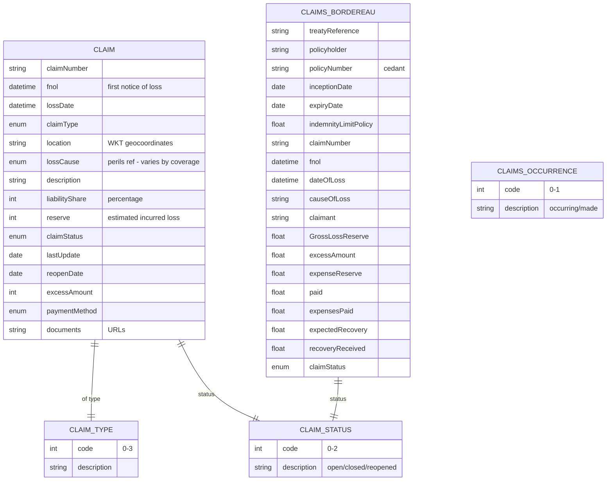

# Module 11: Claims

The entities, fields, enumerated values and relationships. The endpoints over them are in
[`api.md`](api.md), and the terms used throughout are defined in
[Insurance concepts](../concepts.md).

**`Claim`** is one entity serving all eight coverage types. **`ClaimsBordereau`** is the periodic
report to a reinsurer listing what has been claimed, which is why several figures appear in both
records.

A claim reaches its policy through `policyNumber`, which is globally unique across every coverage
type. That single rule is what lets one endpoint accept a claim against any of the eight.

## Selected fields

| Entity | Field | Type | What it means |
|---|---|---|---|
| Claim | claimNumber | Text | The claim's own identifier, distinct from the policy number it was claimed against |
| Claim | fnol | DateTime (ISO 8601) | First notification of loss: when the insurer was told. Not when it happened |
| Claim | lossDate | DateTime (ISO 8601) | When the loss actually happened. The policy must have been in force on this date, not on the notification date |
| Claim | claimType | enum (claimType) | Own property, third-party bodily injury, third-party property, or other. This decides who is being compensated |
| Claim | location | Text (WKT geo) | Where the loss happened, as well-known-text geometry |
| Claim | lossCause | enum (perils) | What caused it. Checked against the perils the coverage names, and that check is what admits or refuses the claim. Which peril list applies is not declared. See below |
| Claim | liabilityShare | Number/integer | The percentage of the loss this insurer is responsible for, where fault is split between parties |
| Claim | reserve | Number/integer | Money set aside for a claim that is open and not yet settled. An estimate, revised as the claim is understood, and inclusive of expenses |
| Claim | claimStatus | enum (claimStatus) | Open, closed or reopened |
| Claim | excessAmount | Number/integer | The deductible withheld from this settlement |
| Claim | reopenDate | Date | When a closed claim was reopened |
| Claim | documents | Text/URL | Supporting evidence: police report, photographs, estimates |
| ClaimsBordereau | treatyReference | Text | Which reinsurance treaty this claim is ceded under |
| ClaimsBordereau | GrossLossReserve | Number/Float | The reserve as reported to the reinsurer. Spelled `GrosslLossReserve` on the wire, with an extra `l` |
| ClaimsBordereau | paid | Number/Float | Cumulative payments made. Note that `Claim` itself carries no equivalent |
| ClaimsBordereau | expenseReserve | Number/Float | Money set aside for handling costs, held apart from the loss itself |
| ClaimsBordereau | expectedRecovery | Number/Float | What the insurer expects to recover through salvage or subrogation |
| ClaimsBordereau | recoveryReceived | Number/Float | What has actually been recovered |
| ClaimsBordereau | causeOfLoss | Text | Free text here, where `Claim.lossCause` is enumerated. The two do not have the same type |

## What to watch

**`lossCause` does not name which peril enumeration applies.** It references a generic set without
saying whether that means `motorPeril`, `propertyPeril` or `tradeCreditPeril`. The intended
resolution is polymorphic by coverage type and it is not declared anywhere. Resolve it from the
coverage that `policyNumber` points at, and expect other implementations to have resolved it
differently.

**`Claim` has no cumulative paid figure.** It carries `reserve` and nothing recording what has
actually been paid out. `ClaimsBordereau` has `paid`, so the reinsurance report can be reconciled and
the direct claim record cannot. Carry a paid total yourself.

**`causeOfLoss` on the bordereau is free text while `lossCause` on the claim is enumerated.** The
same fact is typed two ways across the two records, so a bordereau cannot be validated against the
claim it reports.

**`GrosslLossReserve` is misspelled and stays that way.** Extra `l` between `Gross` and `Loss`. It
is on the wire, so send it as written. This page shows the corrected form.

**No operational sub-states exist and none will be added.** Intake, triage, investigation, awaiting
documents, awaiting payment, settled pending recovery and voided are all absent by design, along
with claim-event audit trails and multi-actor workflow. Those describe a claim's position in one
operator's process rather than its status under the contract.
