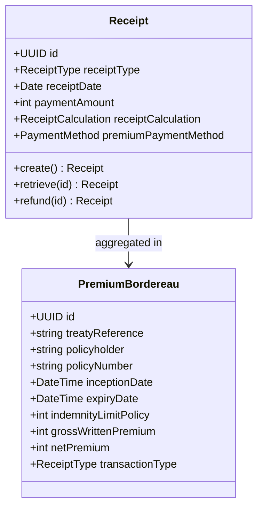
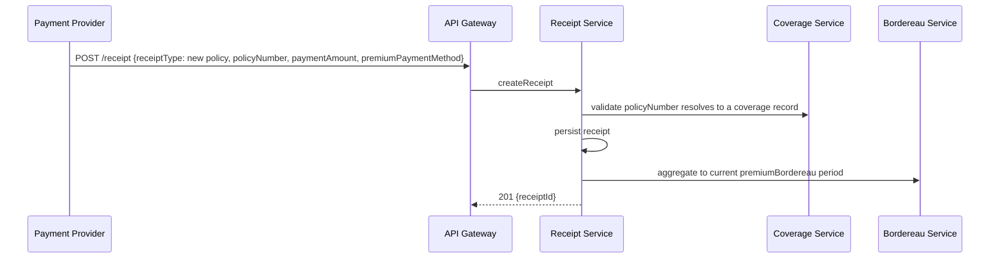
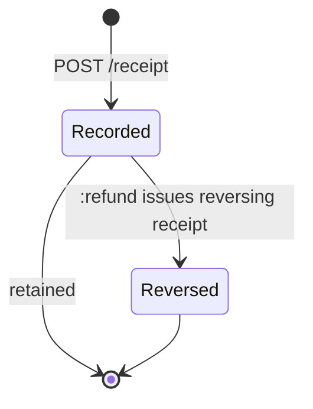
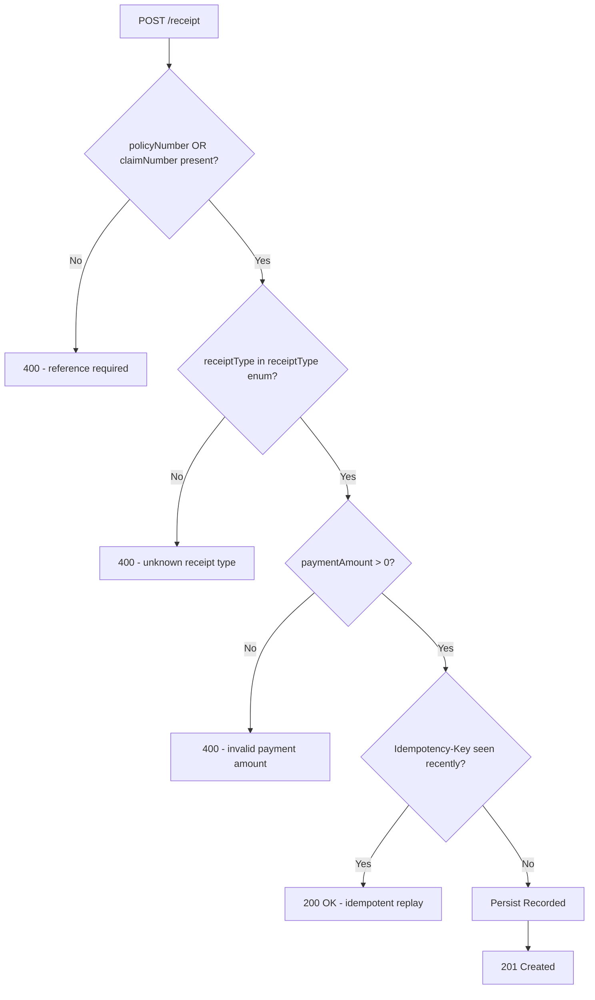

# Module 12: Premium and Receipts

The endpoints, the flow that records a payment, the lifecycle and the error paths. The entities and
fields are in [`data-model.md`](data-model.md), and the rules that apply on every call are in
[`../conventions.md`](../conventions.md).

## Resource model

**A receipt carries no foreign key to the policy or claim it settles.** The linkage runs through the
collection filters: `/receipt` accepts `policyNumber` and `claimNumber`, and `policyNumber` is
globally unique across every coverage type, which makes that lookup deterministic. See
[`../SCOPE.md`](../SCOPE.md).

## Endpoints

Claims bordereaux are created through [Claims](../11-claims/). Only the premium side lives here.

| Endpoint | Scope | What it does |
| :--- | :--- | :--- |
| `POST /receipt` | admin | Record a payment in either direction |
| `GET /receipt` | developer | List, filterable by `policyNumber`, `claimNumber`, `receiptType` and a `receiptDate` range |
| `GET /receipt/{id}` | developer | Retrieve one receipt |
| `PUT /receipt/{id}` | admin | Replace a receipt |
| `POST /receipt/{id}:refund` | admin | Issue a reversing receipt. The original is not modified |
| `POST /premiumBordereau` | admin | Create a premium report |
| `GET /premiumBordereau` | developer | List, filterable by `treatyReference` |
| `GET /premiumBordereau/{id}` | developer | Retrieve one report |
| `PUT /premiumBordereau/{id}` | admin | Replace a report |

## Primary flow: record a premium and aggregate it

## Lifecycle

**This diagram is normative.** A transition it does not draw is not one an implementation may make.

A receipt is a recorded financial event and it is immutable once recorded. A refund does not modify
it. `:refund` writes a second receipt carrying a reversing `receiptType`, so the ledger keeps both
sides and stays auditable.

Reconciliation status, dispute status and ledger postings are not modelled and will not be. They are
accounting process rather than facts two parties need to agree on to exchange a payment record.

## Errors

