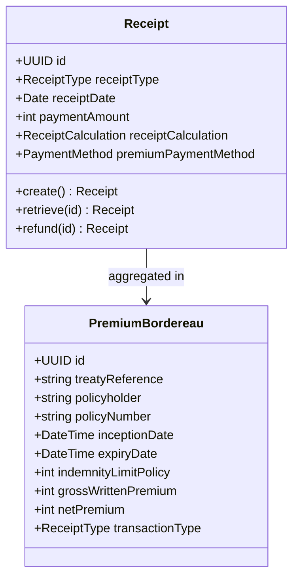
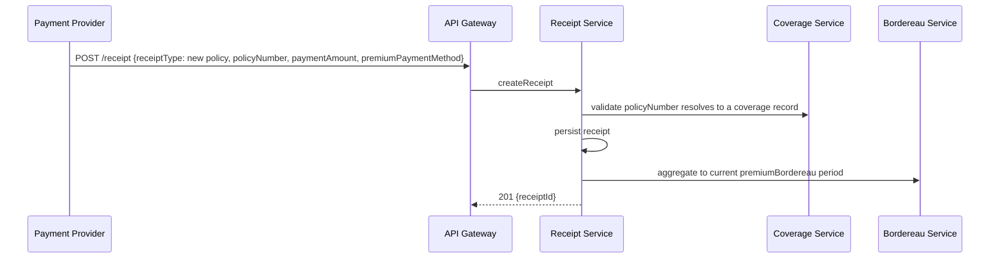
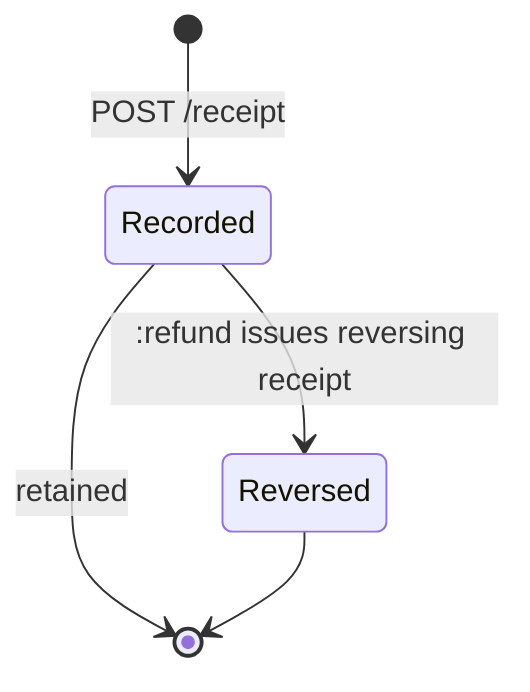
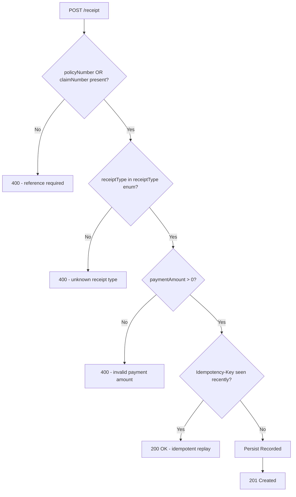

# Module 12: Premium and Receipts

Resources, endpoints, primary flow, lifecycle and routing. The entities and fields are in [`data-model.md`](data-model.md). Conventions that apply to every module are in [`../conventions.md`](../conventions.md).

### Resource model

`[OPIN concern]`: OPIN's Receipt schema has no foreign-key field linking the receipt to the policy or claim it settles. Without a linkage, reconciliation is impossible. This standard exposes `policyNumber` and `claimNumber` as collection filter parameters on `/receipt` so receipts can be located by their settled obligation, but the underlying schema gap remains and an OPIN v1.1 should resolve it.

### Endpoints

`[added]`: OPIN publishes the Receipt, PremiumBordereau, and ClaimsBordereau (Module 11) schemas but no endpoints.

- `POST /receipt` (admin)
- `GET /receipt` (developer), filter by `policyNumber`, `claimNumber`, `receiptType`, `receiptDate` range
- `GET /receipt/{id}` (developer)
- `PUT /receipt/{id}` (admin)
- `POST /receipt/{id}:refund` (admin), issues a reversing receipt rather than mutating the original
- `POST /premiumBordereau` (admin)
- `GET /premiumBordereau` (developer), filter by `treatyReference`
- `GET /premiumBordereau/{id}` (developer)
- `PUT /premiumBordereau/{id}` (admin)

### Primary flow: Record a premium payment and aggregate to bordereau

### Lifecycle

`[OPIN concern]`: OPIN does not declare a Receipt lifecycle. This standard keeps it conservative: a receipt is a recorded financial event, immutable once recorded, and a refund is itself a new receipt with `receiptType` set to a reversing value. Reconciliation status, dispute status, and ledger postings are out of scope and live in implementer-specific extensions.

### Routing and error handling

