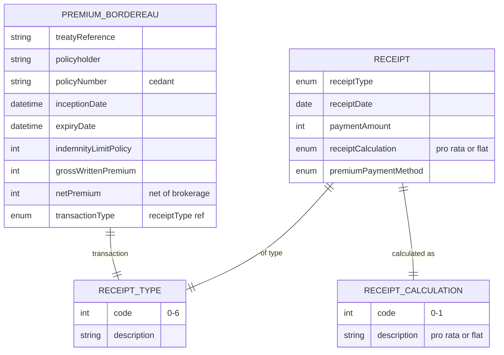

# Module 12: Premium and Receipts

The entities, fields, enumerated values and relationships. The endpoints over them are in
[`api.md`](api.md), and the terms used throughout are defined in
[Insurance concepts](../concepts.md).

**`Receipt`** records one financial event, in either direction. A premium coming in and a settlement
going out are the same entity with a different `receiptType`. **`PremiumBordereau`** is the periodic
premium report an insurer sends its reinsurer.

## Selected fields

| Entity | Field | Type | What it means |
|---|---|---|---|
| Receipt | receiptType | enum (receiptType) | What this money is for. New policy, renewal, mid-term adjustment, claim payment, brokerage, profit share, or other. This is the only thing distinguishing money in from money out |
| Receipt | receiptDate | Date | When the money moved |
| Receipt | paymentAmount | Number/integer | How much |
| Receipt | receiptCalculation | enum (receiptCalculation) | How the amount was worked out. Pro rata means proportioned to the time actually covered, which is what a mid-term cancellation produces. Flat means the whole amount regardless |
| Receipt | premiumPaymentMethod | enum (paymentMethod) | Cash, card, cheque, transfer or crypto |
| PremiumBordereau | treatyReference | Text | Which reinsurance treaty the premium is ceded under |
| PremiumBordereau | policyNumber | Text | The ceding insurer's policy number |
| PremiumBordereau | grossWrittenPremium | Number/integer | Premium before brokerage and tax |
| PremiumBordereau | netPremium | Number/integer | Premium after brokerage. The reinsurer sees both, because it pays commission against one and carries risk against the other |
| PremiumBordereau | transactionType | enum (receiptType) | What produced the entry: new business, renewal or mid-term adjustment |

## What to watch

**A receipt has no foreign key to what it settles.** No policy reference and no claim reference sit
on the entity. Reconciliation runs through the collection filters instead: `/receipt` accepts
`policyNumber` and `claimNumber`, and `policyNumber` is globally unique across every coverage type,
which is what makes the lookup deterministic. A receipt is found by the obligation it settles rather
than by a field it carries. See [`../SCOPE.md`](../SCOPE.md).

**A receipt is immutable.** It is not edited after it is recorded. A refund is a second receipt that
reverses the first, under a reversing `receiptType`.

**There is no direct-insurance premium ledger.** `PremiumBordereau` and
[`ClaimsBordereau`](../11-claims/) both report to reinsurers. Nothing reconciles premium accrued,
collected and remitted at the direct level, so that ledger is yours to build.

**Commission ledgers, partner payout schedules and channel revenue splits are out of scope by
design.** They sit above the standard in whatever platform you build.
