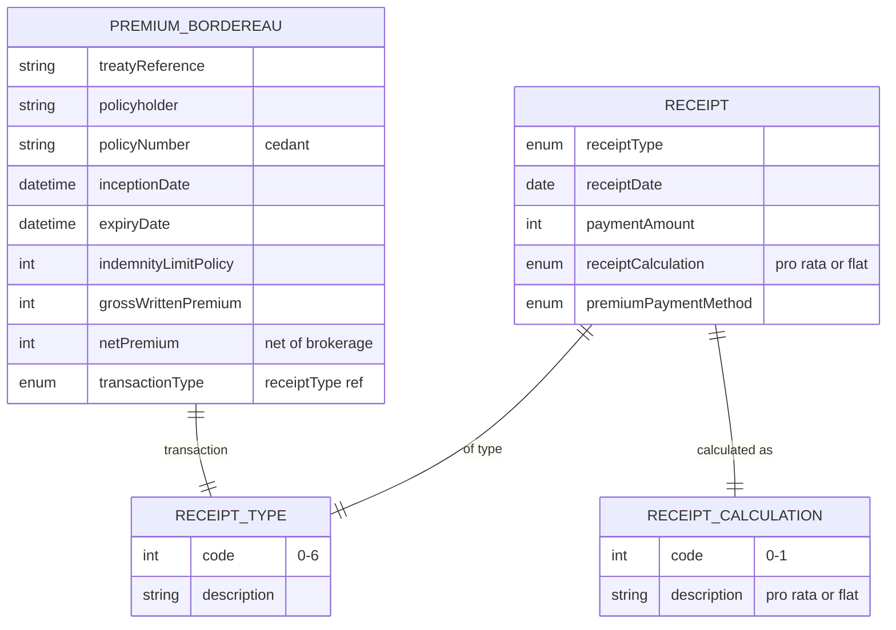

# Module 12: Premium and Receipts

Entities, fields, enumerated values and relationships. The API surface for this module is in [`api.md`](api.md).

Covers payment lifecycle: Receipt for transactions of any type (new policy, renewal, MTA, claim payment, brokerage, profit share); PremiumBordereau for reinsurance premium reporting; receiptType, receiptCalculation enums.

OPIN sources: `Receipt`, `PremiumBordereau`, `receiptType`, `receiptCalculation`, `paymentMethod`.

### Field annotations (Module 12)

| Entity | Field | Type | OPIN source | Notes |
|---|---|---|---|---|
| Receipt | receiptType | enum (receiptType) | sheet `receiptType` | new / renewal / MTA / claim payment / brokerage / profit share / other |
| Receipt | receiptDate | Date | sheet `Receipt` |  |
| Receipt | paymentAmount | Number/integer | sheet `Receipt` |  |
| Receipt | receiptCalculation | enum (receiptCalculation) | sheet `receiptCalculation` | Pro rata or flat |
| Receipt | premiumPaymentMethod | enum (paymentMethod) | sheet `paymentMethod` |  |
| PremiumBordereau | treatyReference | Text | sheet `PremiumBordereau` | Reinsurance treaty ref |
| PremiumBordereau | grossWrittenPremium | Number/integer | sheet `PremiumBordereau` | Pre-tax |
| PremiumBordereau | netPremium | Number/integer | sheet `PremiumBordereau` | After brokerage |
| PremiumBordereau | transactionType | enum (receiptType) | sheet `PremiumBordereau` | New / renewal / mid-term adjustment |

`[OPIN concern]`: `Receipt` lacks linkage fields to a Policy or Claim. There is no `policyNumber`, `policyRef`, or `claimNumber` on the Receipt entity. Reconciliation between cash-in/cash-out and the policy or claim that originated the transaction therefore cannot be performed using OPIN fields alone. On the work list: add `policyRef` (required for new/renewal/MTA/brokerage/profit-share) and `claimRef` (required for claim payment).

`[OPIN concern]`: OPIN publishes `PremiumBordereau` and `ClaimsBordereau` for reinsurance reporting but does not publish a corresponding direct-insurance premium ledger entity. Reconciling premium accruals, collections, and remittances at the direct-insurance level is not supported by OPIN. On the work list.

Out-of-scope for OPIN: commission ledgers, payout schedules to distribution partners, and microinsurance distribution-channel revenue splits. These are operational concerns not in OPIN's scope.
