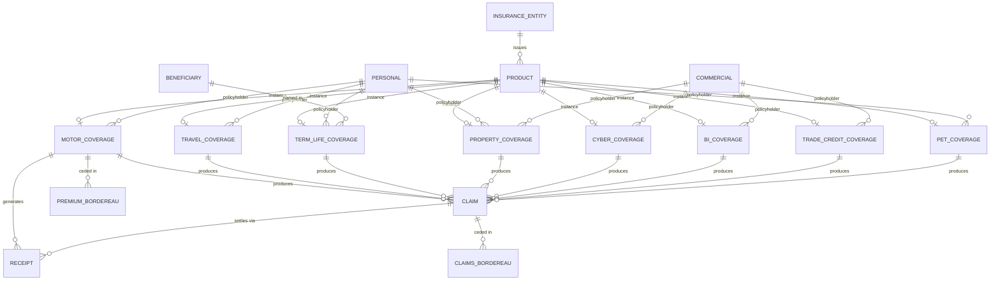
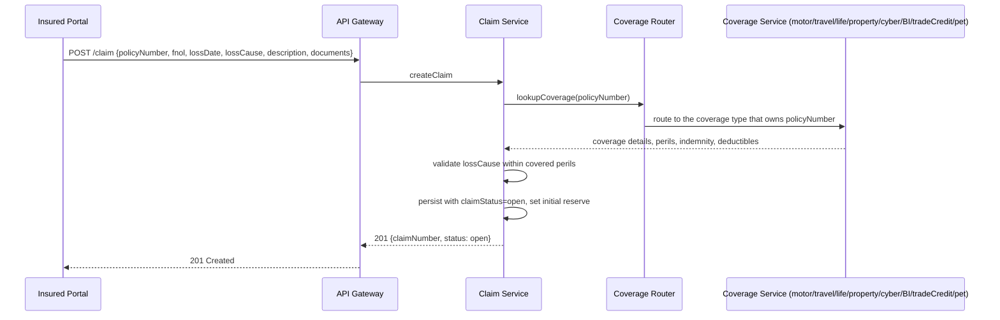

# Across the modules

What only makes sense above a single module: how the entities relate to each other, and the one flow
that spans every coverage type.

If the vocabulary here is unfamiliar, read [Insurance concepts](concepts.md) first.

## How the entities relate

Read that diagram in five steps.

**A product becomes a coverage.** An insurer publishes products, and a product instantiates exactly
one of the eight coverage types. The product is what is for sale; the coverage record is what one
customer holds.

**A party holds the coverage.** `Personal` or `Commercial` is the policyholder. Which of the two can
hold which coverage is not arbitrary: cyber, business interruption and trade credit are commercial
lines and have no personal policyholder, while pet and term life are the reverse. Property takes
both.

**A beneficiary attaches at policy level.** Canonically on [term life](05-term-life/), where the
insured cannot collect their own death benefit.

**A claim arises from any coverage.** One `Claim` entity serves all eight. A receipt records the
cash, in either direction: premium coming in, settlement going out.

**Bordereaux report to reinsurers.** `PremiumBordereau` and `ClaimsBordereau` are periodic reports
of what has been ceded. They are reports rather than transactions, which is why figures in them also
exist elsewhere.

**Everything hangs on one key.** Claim and Receipt reach their coverage through `policyNumber`,
which is globally unique across the namespace. No foreign key field carries that relationship; the
uniqueness rule does. It is set out in [`SCOPE.md`](SCOPE.md).

## The one flow that spans every coverage type

Submitting a claim is the only flow that crosses modules, and it works the same way whichever of the
eight coverage types is involved.

**One endpoint serves every coverage type.** The caller does not say what kind of policy it is
claiming against, and does not need to. The coverage-routing step in the middle of that diagram is
internal to the implementation and never appears on the wire.

**It works because of one rule.** `policyNumber` is globally unique across the namespace, so it
resolves to exactly one coverage record among all eight types. An implementation therefore assigns
policy numbers from **one sequence across every coverage type it writes**. Scope them per line of
business and this endpoint stops working, because a number would no longer identify a single policy.
See [`SCOPE.md`](SCOPE.md).
