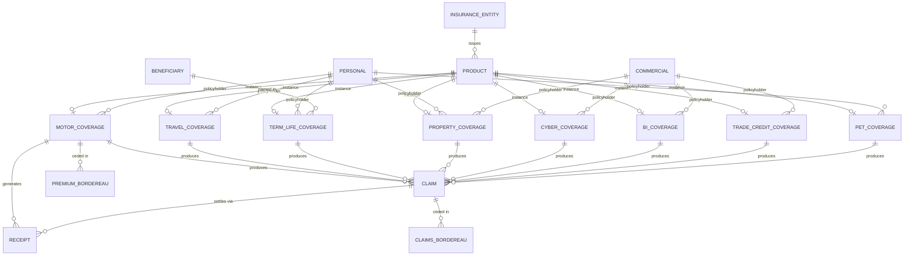
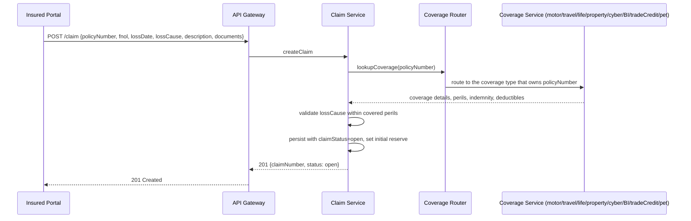

# Across the modules

What only makes sense above a single module: how the entities relate to each other, and the one
flow that spans every coverage type.

## Cross-module relationships (composite view)

The composite view shows OPIN's coverage-centric model: Product instantiates one of the eight coverage types, Personal or Commercial parties act as policyholders, Beneficiary attaches at policy level (canonically term life), Claim arises from any coverage, Receipt records the cash leg, and PremiumBordereau/ClaimsBordereau are reinsurance-side reports. Claim and Receipt reach their coverage through `policyNumber`, which this standard declares globally unique across the namespace. That rule is what carries the two associations the inherited schema left implicit, and it is set out in [`SCOPE.md`](SCOPE.md).

---

## Cross-module primary flow

This standard exposes one cross-module primary flow: the universal claim submission flow. It is OPIN-aligned because OPIN's `POST /claim` is itself polymorphic across coverages.

### Flow A: Submit claim (universal, polymorphic across coverages)

`[OPIN]`: the `POST /claim` entry point is exactly OPIN's. The internal coverage-routing step is implementer-side, hidden from the wire contract. From the caller's perspective, one endpoint serves all coverage types.

`[added]`: the polymorphism works because `policyNumber` resolves deterministically to a single coverage record across all eight coverage types. The inherited standard assumed that constraint without declaring it. This version declares it: `policyNumber` is globally unique across the namespace, and an implementation assigns policy numbers from one sequence across every coverage type it writes. See [`SCOPE.md`](SCOPE.md).
