# OPIN-VN API Design v0.2 (OPIN-grounded)

## What this is

This document defines the OPIN-VN API surface, structurally aligned to the data schema work in `opin-vn-data-schema.md`. It is grounded in the OPIN API Specification v1.0 published by the Open Insurance Initiative.

OPIN-VN is the Vietnam-localised derivative of OPIN. Its scope in v0.2 is to **complete the OPIN API to match the OPIN data standard**, not to introduce new entity schemas, not to encode any Trisilva product behaviour, and not to extend OPIN beyond what its own data standard already implies.

`[OPIN concern]`: The OPIN v1.0 API spec is structurally three-tiered relative to the OPIN v1.2.1 data standard. Coverage is non-uniform across modules:

- **Motor module**: complete. Entity schemas (Vehicle, Claim, Driver, motorCoverage) plus full collection-level CRUD endpoints under two role-based tags (Admins, Developers). Eight endpoints total: `POST/GET /vehicle`, `POST/GET /claim`, `POST/GET /driver`, `POST/GET /motorCoverage`. Item-level retrieval and update are not declared.
- **Cross-cutting modules** (Module 1 Parties, Module 2 Products, Module 11 Claims partial, Module 12 Premium and Receipts): OPIN publishes entity schemas (InsuranceEntity, Personal, Commercial, Product, Beneficiary, Receipt, PremiumBordereau, ClaimsBordereau, address, policyWording) but **no endpoints**. OPIN-VN extends the API surface by mirroring the motor CRUD pattern; the underlying schemas are OPIN-defined and reused without modification.
- **Non-motor coverage modules** (Module 4 Travel, Module 5 Term Life, Module 6 Property, Module 7 Cyber Liability, Module 8 Business Interruption, Module 9 Trade Credit, Module 10 Pet): OPIN publishes the coverage-line entity schemas (`travelCoverage`, `termLifeCoverage`, `propertyCoverage`, `cyberLiabilityCoverage`, `businessInterruptionCoverage`, `tradeCreditCoverage`, `petCoverage`) plus their related party schemas (`traveller`, `lifeInsured`, `business`, `debtor`, `pet`, `property`). OPIN does not publish endpoints for any of them. OPIN-VN extends the API surface; the underlying schemas are OPIN-defined and reused without modification.

Extension annotation conventions used below:

- `[OPIN]`: the endpoint exists in OPIN v1.0 verbatim. Kept as-is.
- `[OPIN-VN extension to API; OPIN schema reused]`: the schema exists in the OPIN data standard, the endpoint does not exist in the OPIN API spec; OPIN-VN adds the endpoint.
- `[OPIN concern]`: a structural inconsistency or omission in OPIN itself, flagged so the upstream initiative can resolve it.

This is consistent with the decision to extrapolate OPIN's motor pattern across all coverage types and cross-cutting entities. **No new entity schemas are introduced in this document.** Schema-level work lives in the sibling document `opin-vn-data-schema.md`.

The document is organised by twelve modules matching the OPIN data standard. Each module presents four pure Mermaid diagram types: `classDiagram` for the resource model, `sequenceDiagram` for the primary flow, `stateDiagram-v2` for the entity lifecycle, and `flowchart` for routing and error handling.

OPIN API source: https://github.com/The-Open-Insurance-Initiative/API-spec/blob/main/Open-Insurance-io-Open_Insurance_API-1.0-resolved.json

Mermaid syntax reference: https://mermaid.js.org/intro/

---

## API conventions

These apply across every module. Each line is annotated with whether OPIN declares it or whether OPIN-VN adds it for operational viability.

- **Base URL**: `https://api.opin-vn.{tld}/v1` where `{tld}` matches the deploying tenant. `[OPIN-VN]`: OPIN does not specify a base URL convention beyond the SwaggerHub virtserver host.
- **Versioning**: URL-prefix versioning (`/v1`, `/v2`). `[OPIN]`: OPIN's `info.version` is `1.0`; URL prefix is implicit in the SwaggerHub server entry.
- **Authentication**: OAuth 2.0 Bearer tokens. `[OPIN-VN]`: OPIN's spec is silent on auth. OPIN-VN adopts OAuth 2.0 with two role scopes that mirror OPIN's two declared tags:
  - `opin-vn.admin` (full write, mirrors OPIN's `admins` tag).
  - `opin-vn.developer` (read-only, mirrors OPIN's `developers` tag).
  No third operator scope is introduced. State-changing operations live under `opin-vn.admin` only.
- **Content-Type**: `application/json` for all requests and responses. `[OPIN]`: OPIN declares `application/json` on every request and response body.
- **Error model**: RFC 7807 Problem Details. `[OPIN-VN]`: OPIN does not declare an error model beyond bare `400`, `409` descriptions on its four endpoints.
- **Pagination**: cursor-based via `?cursor=` and `Link` header on collection GETs. `[OPIN-VN]`: OPIN declares `skip` and `limit` query parameters on its four GET endpoints. OPIN-VN supersedes this with cursor-based pagination, which scales better and is stable under concurrent writes. The OPIN `skip`/`limit` form remains accepted as a fallback for backward compatibility.
- **Idempotency**: `Idempotency-Key` header on POST and PUT. `[OPIN-VN]`: OPIN does not declare idempotency.
- **Action endpoints**: state transitions are exposed as `POST /resource/{id}:action` (colon-action style). `[OPIN-VN]`: OPIN declares no action endpoints. OPIN-VN uses the colon-action form for endorsements, cancellations, renewals, settlements, reopenings, and refunds because they map to OPIN data-standard concepts (`endorsementType` enum, `policyStatus` transitions, `claimStatus` transitions, `receiptType` reversals) but are not pure CRUD.

`[OPIN concern]`: four of the seven conventions above (auth, error model, pagination, idempotency) are entirely absent from OPIN v1.0. An OPIN v1.1 publication should declare them, otherwise every implementer will diverge.

---

## Module index

1. [Core Parties and Entities](#module-1-core-parties-and-entities)
2. [Products and Catalog](#module-2-products-and-catalog)
3. [Motor](#module-3-motor)
4. [Travel](#module-4-travel)
5. [Term Life](#module-5-term-life)
6. [Property](#module-6-property)
7. [Cyber Liability](#module-7-cyber-liability)
8. [Business Interruption](#module-8-business-interruption)
9. [Trade Credit](#module-9-trade-credit)
10. [Pet](#module-10-pet)
11. [Claims](#module-11-claims)
12. [Premium and Receipts](#module-12-premium-and-receipts)
13. [Cross-module primary flow](#cross-module-primary-flow)

---

## Module 1: Core Parties and Entities

### Resource model

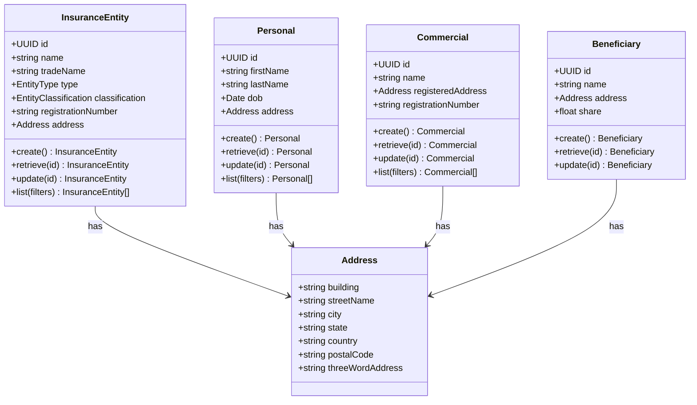
```mermaid
classDiagram
    class InsuranceEntity {
        +UUID id
        +string name
        +string tradeName
        +EntityType type
        +EntityClassification classification
        +string registrationNumber
        +Address address
        +create() InsuranceEntity
        +retrieve(id) InsuranceEntity
        +update(id) InsuranceEntity
        +list(filters) InsuranceEntity[]
    }
    class Personal {
        +UUID id
        +string firstName
        +string lastName
        +Date dob
        +Address address
        +create() Personal
        +retrieve(id) Personal
        +update(id) Personal
        +list(filters) Personal[]
    }
    class Commercial {
        +UUID id
        +string name
        +Address registeredAddress
        +string registrationNumber
        +create() Commercial
        +retrieve(id) Commercial
        +update(id) Commercial
        +list(filters) Commercial[]
    }
    class Beneficiary {
        +UUID id
        +string name
        +Address address
        +float share
        +create() Beneficiary
        +retrieve(id) Beneficiary
        +update(id) Beneficiary
    }
    class Address {
        +string building
        +string streetName
        +string city
        +string state
        +string country
        +string postalCode
        +string threeWordAddress
    }
    InsuranceEntity --> Address : has
    Personal --> Address : has
    Commercial --> Address : has
    Beneficiary --> Address : has
```

`[OPIN concern]`: Address is an embedded value object in the OPIN data standard. It is not a top-level resource and OPIN-VN does not expose it as one. Address fields are only ever sent and received inline within their owning entity.

### Endpoints

`[OPIN-VN extension to API; OPIN schema reused]`: OPIN publishes the InsuranceEntity, Personal, Commercial, Beneficiary, and address schemas but no endpoints. OPIN-VN adds CRUD endpoints modelled on the motor `/vehicle`, `/driver` pattern.

- `POST /insuranceEntity` (admin)
- `GET /insuranceEntity` (developer), search by name or registration number
- `GET /insuranceEntity/{id}` (developer)
- `PUT /insuranceEntity/{id}` (admin)
- `POST /personal` (admin)
- `GET /personal` (developer), search
- `GET /personal/{id}` (developer)
- `PUT /personal/{id}` (admin)
- `POST /commercial` (admin)
- `GET /commercial` (developer), search
- `GET /commercial/{id}` (developer)
- `PUT /commercial/{id}` (admin)
- `POST /beneficiary` (admin)
- `GET /beneficiary` (developer)
- `GET /beneficiary/{id}` (developer)
- `PUT /beneficiary/{id}` (admin)

### Primary flow: Onboard a Personal party

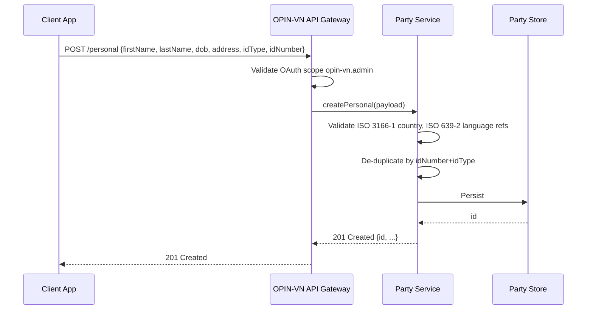
```mermaid
sequenceDiagram
    participant Client as Client App
    participant Gateway as OPIN-VN API Gateway
    participant Service as Party Service
    participant Store as Party Store
    Client->>Gateway: POST /personal {firstName, lastName, dob, address, idType, idNumber}
    Gateway->>Gateway: Validate OAuth scope opin-vn.admin
    Gateway->>Service: createPersonal(payload)
    Service->>Service: Validate ISO 3166-1 country, ISO 639-2 language refs
    Service->>Service: De-duplicate by idNumber+idType
    Service->>Store: Persist
    Store-->>Service: id
    Service-->>Gateway: 201 Created {id, ...}
    Gateway-->>Client: 201 Created
```

### Lifecycle

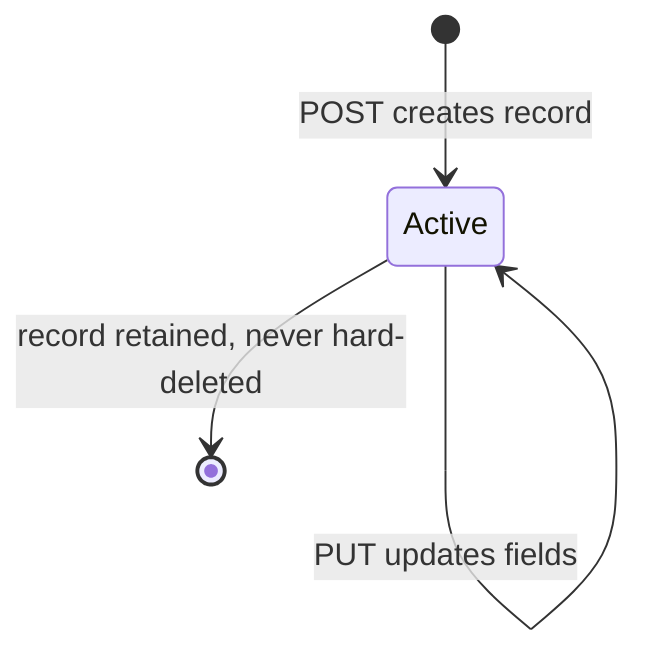
```mermaid
stateDiagram-v2
    [*] --> Active : POST creates record
    Active --> Active : PUT updates fields
    Active --> [*] : record retained, never hard-deleted
```

`[OPIN concern]`: OPIN does not declare a party lifecycle. OPIN-VN keeps the lifecycle conservative: a party record exists or it does not. Status flags such as KYC status, suspension, or closure are out of scope for v0.2 and live in implementer-specific extensions.

### Routing and error handling

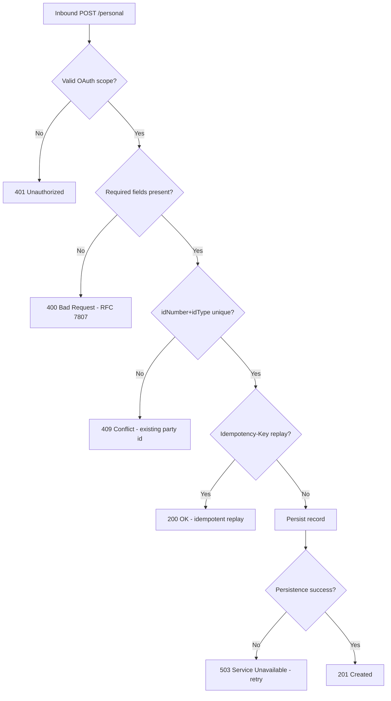
```mermaid
flowchart TD
    A[Inbound POST /personal] --> B{Valid OAuth scope?}
    B -->|No| E1[401 Unauthorized]
    B -->|Yes| C{Required fields present?}
    C -->|No| E2[400 Bad Request - RFC 7807]
    C -->|Yes| D{idNumber+idType unique?}
    D -->|No| E3[409 Conflict - existing party id]
    D -->|Yes| F{Idempotency-Key replay?}
    F -->|Yes| R1[200 OK - idempotent replay]
    F -->|No| G[Persist record]
    G --> H{Persistence success?}
    H -->|No| E4[503 Service Unavailable - retry]
    H -->|Yes| I[201 Created]
```

---

## Module 2: Products and Catalog

### Resource model

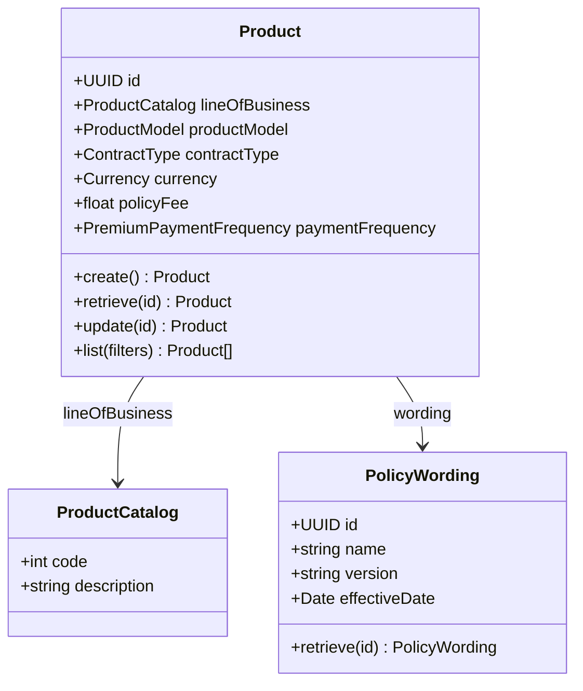
```mermaid
classDiagram
    class Product {
        +UUID id
        +ProductCatalog lineOfBusiness
        +ProductModel productModel
        +ContractType contractType
        +Currency currency
        +float policyFee
        +PremiumPaymentFrequency paymentFrequency
        +create() Product
        +retrieve(id) Product
        +update(id) Product
        +list(filters) Product[]
    }
    class ProductCatalog {
        +int code
        +string description
    }
    class PolicyWording {
        +UUID id
        +string name
        +string version
        +Date effectiveDate
        +retrieve(id) PolicyWording
    }
    Product --> ProductCatalog : lineOfBusiness
    Product --> PolicyWording : wording
```

### Endpoints

`[OPIN-VN extension to API; OPIN schema reused]`: OPIN publishes the Product and policyWording schemas but no endpoints. OPIN-VN adds CRUD on Product and a read endpoint for the productCatalog enum lookup.

- `POST /product` (admin)
- `GET /product` (developer), filter by lineOfBusiness, productModel, currency
- `GET /product/{id}` (developer)
- `PUT /product/{id}` (admin)
- `GET /productCatalog` (developer), list 65 OPIN productCatalog entries
- `GET /policyWording` (developer)
- `GET /policyWording/{id}` (developer)
- `POST /policyWording` (admin)
- `PUT /policyWording/{id}` (admin)

### Primary flow: Register a new product

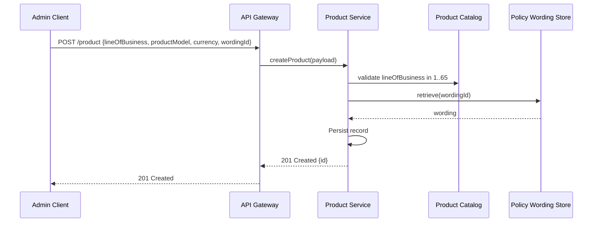
```mermaid
sequenceDiagram
    participant Client as Admin Client
    participant Gateway as API Gateway
    participant Service as Product Service
    participant Catalog as Product Catalog
    participant Wording as Policy Wording Store
    Client->>Gateway: POST /product {lineOfBusiness, productModel, currency, wordingId}
    Gateway->>Service: createProduct(payload)
    Service->>Catalog: validate lineOfBusiness in 1..65
    Service->>Wording: retrieve(wordingId)
    Wording-->>Service: wording
    Service->>Service: Persist record
    Service-->>Gateway: 201 Created {id}
    Gateway-->>Client: 201 Created
```

### Lifecycle

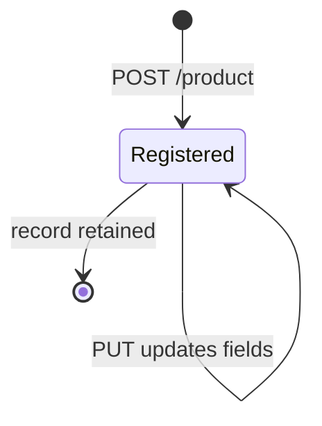
```mermaid
stateDiagram-v2
    [*] --> Registered : POST /product
    Registered --> Registered : PUT updates fields
    Registered --> [*] : record retained
```

`[OPIN concern]`: OPIN does not declare a Product lifecycle (no draft, active, deprecated states). OPIN-VN keeps the lifecycle conservative. Product activation and deprecation are operational concerns to be encoded in implementer-specific extensions.

### Routing and error handling

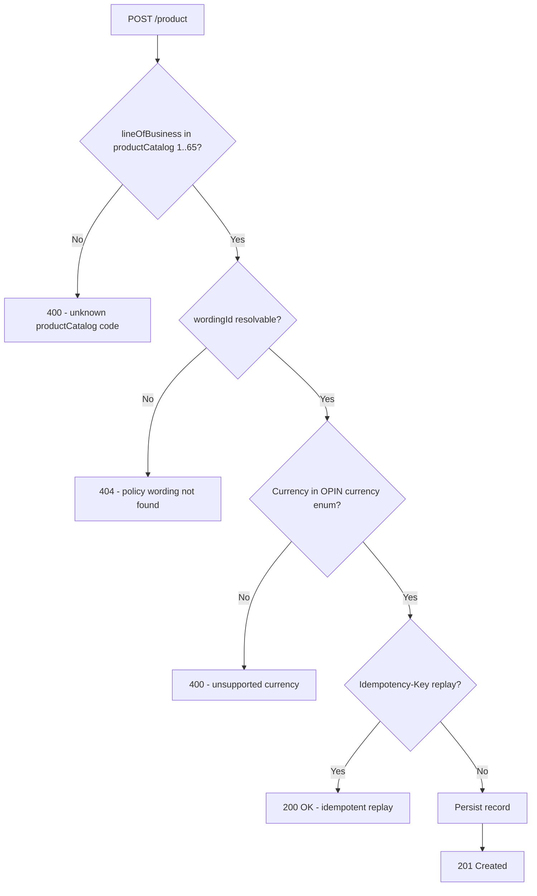
```mermaid
flowchart TD
    A[POST /product] --> B{lineOfBusiness in productCatalog 1..65?}
    B -->|No| E1[400 - unknown productCatalog code]
    B -->|Yes| C{wordingId resolvable?}
    C -->|No| E2[404 - policy wording not found]
    C -->|Yes| D{Currency in OPIN currency enum?}
    D -->|No| E3[400 - unsupported currency]
    D -->|Yes| F{Idempotency-Key replay?}
    F -->|Yes| R1[200 OK - idempotent replay]
    F -->|No| G[Persist record]
    G --> H[201 Created]
```

---

## Module 3: Motor

### Resource model

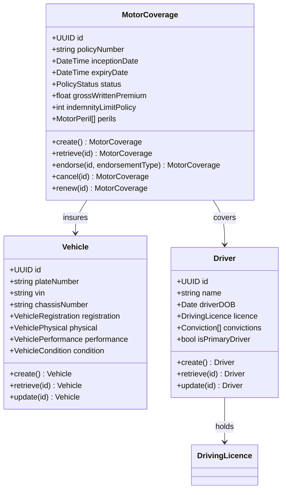
```mermaid
classDiagram
    class MotorCoverage {
        +UUID id
        +string policyNumber
        +DateTime inceptionDate
        +DateTime expiryDate
        +PolicyStatus status
        +float grossWrittenPremium
        +int indemnityLimitPolicy
        +MotorPeril[] perils
        +create() MotorCoverage
        +retrieve(id) MotorCoverage
        +endorse(id, endorsementType) MotorCoverage
        +cancel(id) MotorCoverage
        +renew(id) MotorCoverage
    }
    class Vehicle {
        +UUID id
        +string plateNumber
        +string vin
        +string chassisNumber
        +VehicleRegistration registration
        +VehiclePhysical physical
        +VehiclePerformance performance
        +VehicleCondition condition
        +create() Vehicle
        +retrieve(id) Vehicle
        +update(id) Vehicle
    }
    class Driver {
        +UUID id
        +string name
        +Date driverDOB
        +DrivingLicence licence
        +Conviction[] convictions
        +bool isPrimaryDriver
        +create() Driver
        +retrieve(id) Driver
        +update(id) Driver
    }
    MotorCoverage --> Vehicle : insures
    MotorCoverage --> Driver : covers
    Driver --> DrivingLicence : holds
```

### Endpoints

OPIN spec endpoints (kept verbatim, motor only, attributed to OPIN):

- `POST /vehicle` (admin) `[OPIN]`
- `GET /vehicle` (developer) `[OPIN]`
- `POST /claim` (admin) `[OPIN]`: polymorphic across coverages, see Module 11
- `GET /claim` (developer) `[OPIN]`
- `POST /driver` (admin) `[OPIN]`
- `GET /driver` (developer) `[OPIN]`
- `POST /motorCoverage` (admin) `[OPIN]`
- `GET /motorCoverage` (developer) `[OPIN]`

OPIN-VN extensions on the same OPIN schemas:

- `GET /vehicle/{id}` (developer) `[OPIN-VN extension to API; OPIN schema reused]`
- `PUT /vehicle/{id}` (admin) `[OPIN-VN extension to API; OPIN schema reused]`
- `GET /driver/{id}` (developer) `[OPIN-VN extension to API; OPIN schema reused]`
- `PUT /driver/{id}` (admin) `[OPIN-VN extension to API; OPIN schema reused]`
- `GET /motorCoverage/{id}` (developer) `[OPIN-VN extension to API; OPIN schema reused]`
- `PUT /motorCoverage/{id}` (admin) `[OPIN-VN extension to API; OPIN schema reused]`
- `POST /motorCoverage/{id}:endorse` (admin) `[OPIN-VN extension to API; OPIN schema reused]`: body carries OPIN `endorsementType`
- `POST /motorCoverage/{id}:cancel` (admin) `[OPIN-VN extension to API; OPIN schema reused]`
- `POST /motorCoverage/{id}:renew` (admin) `[OPIN-VN extension to API; OPIN schema reused]`

### Primary flow: Bind a motor policy

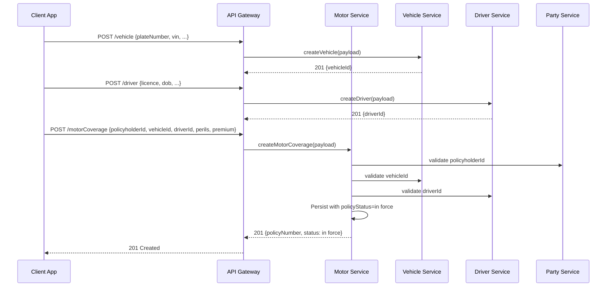
```mermaid
sequenceDiagram
    participant Client as Client App
    participant Gateway as API Gateway
    participant Motor as Motor Service
    participant Vehicle as Vehicle Service
    participant Driver as Driver Service
    participant Party as Party Service
    Client->>Gateway: POST /vehicle {plateNumber, vin, ...}
    Gateway->>Vehicle: createVehicle(payload)
    Vehicle-->>Gateway: 201 {vehicleId}
    Client->>Gateway: POST /driver {licence, dob, ...}
    Gateway->>Driver: createDriver(payload)
    Driver-->>Gateway: 201 {driverId}
    Client->>Gateway: POST /motorCoverage {policyholderId, vehicleId, driverId, perils, premium}
    Gateway->>Motor: createMotorCoverage(payload)
    Motor->>Party: validate policyholderId
    Motor->>Vehicle: validate vehicleId
    Motor->>Driver: validate driverId
    Motor->>Motor: Persist with policyStatus=in force
    Motor-->>Gateway: 201 {policyNumber, status: in force}
    Gateway-->>Client: 201 Created
```

### Lifecycle

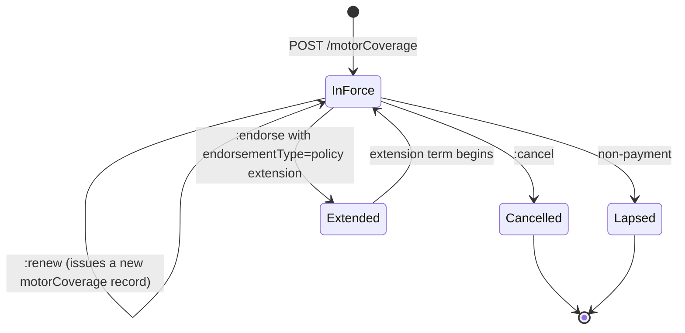
```mermaid
stateDiagram-v2
    [*] --> InForce : POST /motorCoverage
    InForce --> InForce : :endorse (endorsementType applied, status unchanged)
    InForce --> Cancelled : :cancel
    InForce --> Lapsed : non-payment
    InForce --> Extended : :endorse with endorsementType=policy extension
    Extended --> InForce : extension term begins
    InForce --> InForce : :renew (issues a new motorCoverage record)
    Cancelled --> [*]
    Lapsed --> [*]
```

States are exactly OPIN `policyStatus` (in force, cancelled, lapsed, extended). Endorsement is an operation on an in-force policy that mutates fields under an OPIN `endorsementType` value but does not introduce a new lifecycle state. Renewal issues a new record rather than transitioning the existing one.

### Routing and error handling

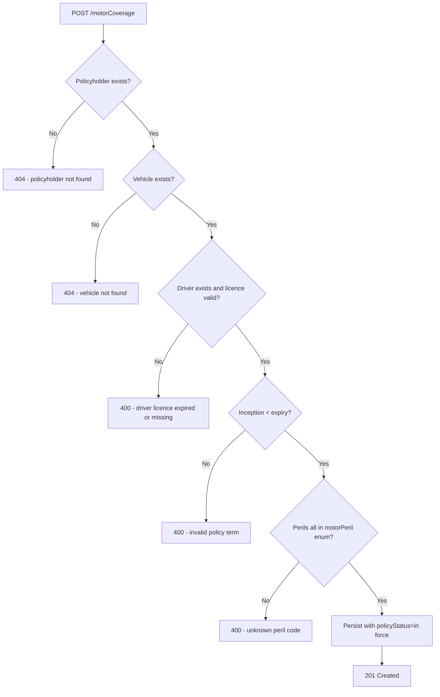
```mermaid
flowchart TD
    A[POST /motorCoverage] --> B{Policyholder exists?}
    B -->|No| E1[404 - policyholder not found]
    B -->|Yes| C{Vehicle exists?}
    C -->|No| E2[404 - vehicle not found]
    C -->|Yes| D{Driver exists and licence valid?}
    D -->|No| E3[400 - driver licence expired or missing]
    D -->|Yes| F{Inception &lt; expiry?}
    F -->|No| E4[400 - invalid policy term]
    F -->|Yes| G{Perils all in motorPeril enum?}
    G -->|No| E5[400 - unknown peril code]
    G -->|Yes| H[Persist with policyStatus=in force]
    H --> I[201 Created]
```

---

## Module 4: Travel

### Resource model

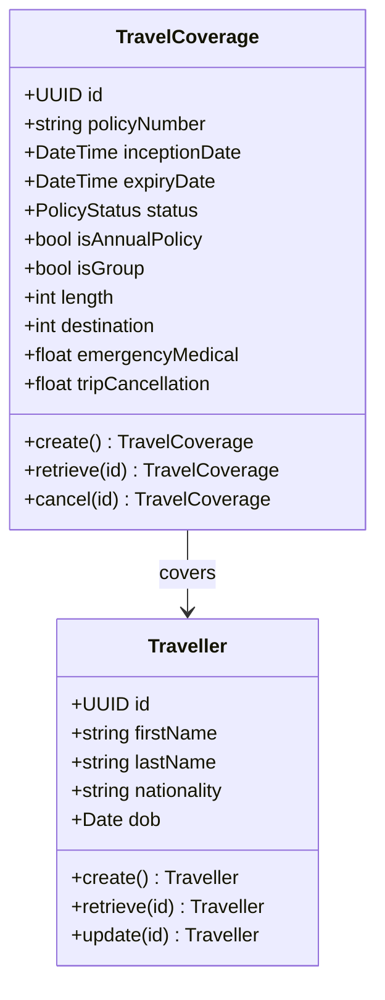
```mermaid
classDiagram
    class TravelCoverage {
        +UUID id
        +string policyNumber
        +DateTime inceptionDate
        +DateTime expiryDate
        +PolicyStatus status
        +bool isAnnualPolicy
        +bool isGroup
        +int length
        +int destination
        +float emergencyMedical
        +float tripCancellation
        +create() TravelCoverage
        +retrieve(id) TravelCoverage
        +cancel(id) TravelCoverage
    }
    class Traveller {
        +UUID id
        +string firstName
        +string lastName
        +string nationality
        +Date dob
        +create() Traveller
        +retrieve(id) Traveller
        +update(id) Traveller
    }
    TravelCoverage --> Traveller : covers
```

### Endpoints

`[OPIN-VN extension to API; OPIN schema reused]`: OPIN publishes the travelCoverage and traveller schemas but no endpoints. OPIN-VN adds CRUD modelled on the motor pattern.

- `POST /travelCoverage` (admin)
- `GET /travelCoverage` (developer)
- `GET /travelCoverage/{id}` (developer)
- `PUT /travelCoverage/{id}` (admin)
- `POST /travelCoverage/{id}:cancel` (admin)
- `POST /traveller` (admin)
- `GET /traveller` (developer)
- `GET /traveller/{id}` (developer)
- `PUT /traveller/{id}` (admin)

### Primary flow: Bind a single-trip travel policy

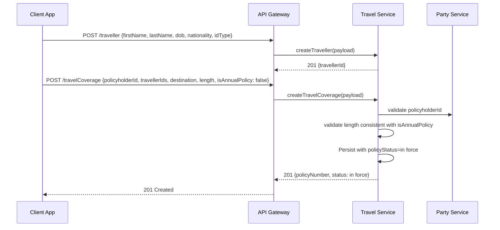
```mermaid
sequenceDiagram
    participant Client as Client App
    participant Gateway as API Gateway
    participant Travel as Travel Service
    participant Party as Party Service
    Client->>Gateway: POST /traveller {firstName, lastName, dob, nationality, idType}
    Gateway->>Travel: createTraveller(payload)
    Travel-->>Gateway: 201 {travellerId}
    Client->>Gateway: POST /travelCoverage {policyholderId, travellerIds, destination, length, isAnnualPolicy: false}
    Gateway->>Travel: createTravelCoverage(payload)
    Travel->>Party: validate policyholderId
    Travel->>Travel: validate length consistent with isAnnualPolicy
    Travel->>Travel: Persist with policyStatus=in force
    Travel-->>Gateway: 201 {policyNumber, status: in force}
    Gateway-->>Client: 201 Created
```

### Lifecycle

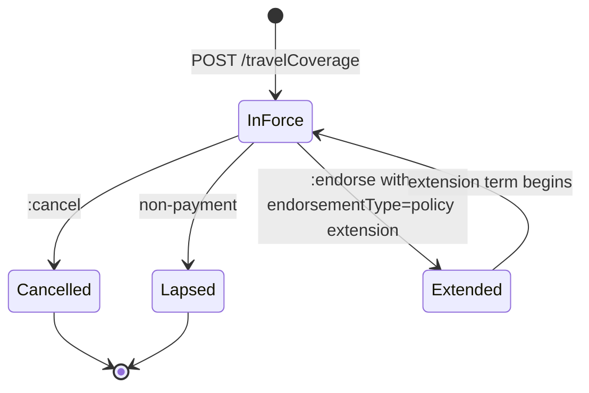
```mermaid
stateDiagram-v2
    [*] --> InForce : POST /travelCoverage
    InForce --> Cancelled : :cancel
    InForce --> Lapsed : non-payment
    InForce --> Extended : :endorse with endorsementType=policy extension
    Extended --> InForce : extension term begins
    Cancelled --> [*]
    Lapsed --> [*]
```

States are exactly OPIN `policyStatus`. Trip expiry is a derived property from `expiryDate` and is not a separate lifecycle state.

### Routing and error handling

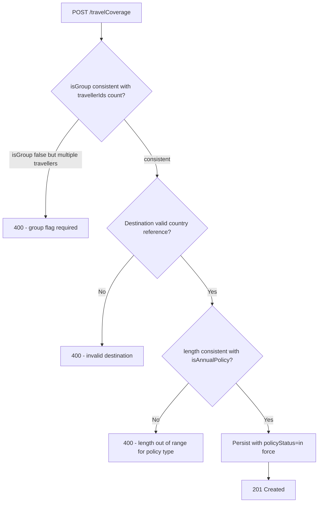
```mermaid
flowchart TD
    A[POST /travelCoverage] --> B{isGroup consistent with travellerIds count?}
    B -->|isGroup false but multiple travellers| E1[400 - group flag required]
    B -->|consistent| C{Destination valid country reference?}
    C -->|No| E2[400 - invalid destination]
    C -->|Yes| D{length consistent with isAnnualPolicy?}
    D -->|No| E3[400 - length out of range for policy type]
    D -->|Yes| F[Persist with policyStatus=in force]
    F --> G[201 Created]
```

---

## Module 5: Term Life

### Resource model

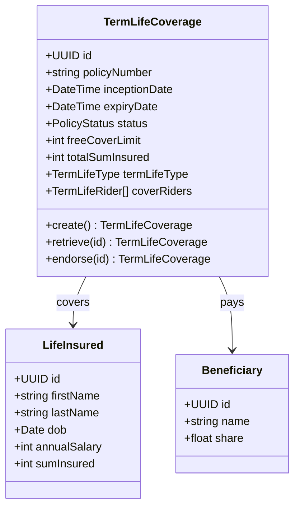
```mermaid
classDiagram
    class TermLifeCoverage {
        +UUID id
        +string policyNumber
        +DateTime inceptionDate
        +DateTime expiryDate
        +PolicyStatus status
        +int freeCoverLimit
        +int totalSumInsured
        +TermLifeType termLifeType
        +TermLifeRider[] coverRiders
        +create() TermLifeCoverage
        +retrieve(id) TermLifeCoverage
        +endorse(id) TermLifeCoverage
    }
    class LifeInsured {
        +UUID id
        +string firstName
        +string lastName
        +Date dob
        +int annualSalary
        +int sumInsured
    }
    class Beneficiary {
        +UUID id
        +string name
        +float share
    }
    TermLifeCoverage --> LifeInsured : covers
    TermLifeCoverage --> Beneficiary : pays
```

### Endpoints

`[OPIN-VN extension to API; OPIN schema reused]`: OPIN publishes the termLifeCoverage and lifeInsured schemas but no endpoints. Beneficiary CRUD lives in Module 1.

- `POST /termLifeCoverage` (admin)
- `GET /termLifeCoverage` (developer)
- `GET /termLifeCoverage/{id}` (developer)
- `PUT /termLifeCoverage/{id}` (admin)
- `POST /termLifeCoverage/{id}:endorse` (admin)
- `POST /termLifeCoverage/{id}:cancel` (admin)
- `POST /termLifeCoverage/{id}:renew` (admin)
- `POST /lifeInsured` (admin)
- `GET /lifeInsured` (developer)
- `GET /lifeInsured/{id}` (developer)
- `PUT /lifeInsured/{id}` (admin)

### Primary flow: Bind a term life policy with riders

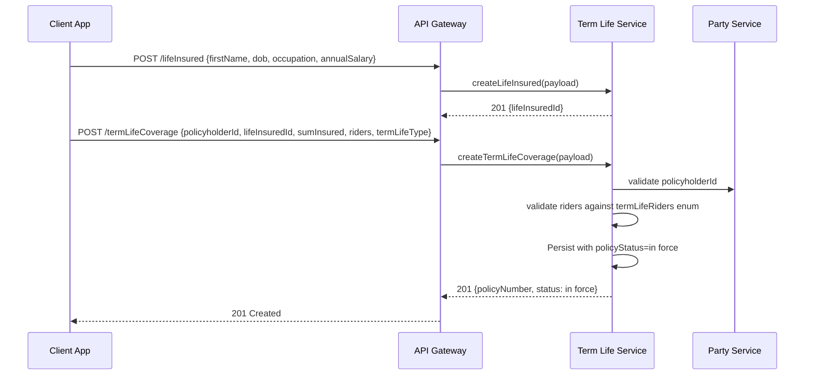
```mermaid
sequenceDiagram
    participant Client as Client App
    participant Gateway as API Gateway
    participant Life as Term Life Service
    participant Party as Party Service
    Client->>Gateway: POST /lifeInsured {firstName, dob, occupation, annualSalary}
    Gateway->>Life: createLifeInsured(payload)
    Life-->>Gateway: 201 {lifeInsuredId}
    Client->>Gateway: POST /termLifeCoverage {policyholderId, lifeInsuredId, sumInsured, riders, termLifeType}
    Gateway->>Life: createTermLifeCoverage(payload)
    Life->>Party: validate policyholderId
    Life->>Life: validate riders against termLifeRiders enum
    Life->>Life: Persist with policyStatus=in force
    Life-->>Gateway: 201 {policyNumber, status: in force}
    Gateway-->>Client: 201 Created
```

### Lifecycle

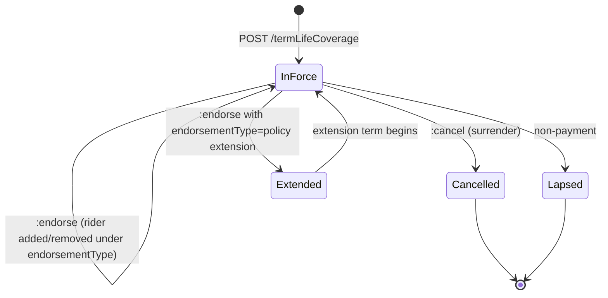
```mermaid
stateDiagram-v2
    [*] --> InForce : POST /termLifeCoverage
    InForce --> InForce : :endorse (rider added/removed under endorsementType)
    InForce --> Cancelled : :cancel (surrender)
    InForce --> Lapsed : non-payment
    InForce --> Extended : :endorse with endorsementType=policy extension
    Extended --> InForce : extension term begins
    Cancelled --> [*]
    Lapsed --> [*]
```

States are exactly OPIN `policyStatus`. Underwriting outcomes (declined, awaiting medicals) and claim settlement are out of scope here. Underwriting belongs to a future OPIN module not in v1.0; settlement of a death claim is the same flow as any other claim and lives in Module 11.

`[OPIN concern]`: OPIN does not model underwriting (quote, decision, decline). An OPIN v1.1 underwriting module would close this gap.

### Routing and error handling

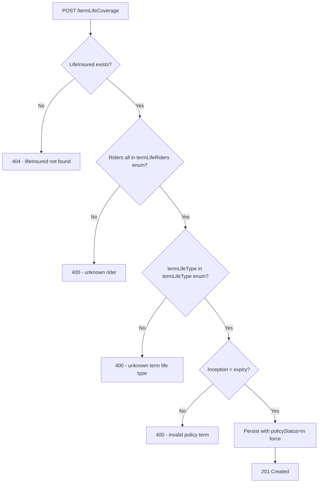
```mermaid
flowchart TD
    A[POST /termLifeCoverage] --> B{LifeInsured exists?}
    B -->|No| E1[404 - lifeInsured not found]
    B -->|Yes| C{Riders all in termLifeRiders enum?}
    C -->|No| E2[400 - unknown rider]
    C -->|Yes| D{termLifeType in termLifeType enum?}
    D -->|No| E3[400 - unknown term life type]
    D -->|Yes| F{Inception &lt; expiry?}
    F -->|No| E4[400 - invalid policy term]
    F -->|Yes| G[Persist with policyStatus=in force]
    G --> H[201 Created]
```

---

## Module 6: Property

### Resource model

```mermaid
classDiagram
    class PropertyCoverage {
        +UUID id
        +string policyNumber
        +DateTime inceptionDate
        +DateTime expiryDate
        +PolicyStatus status
        +int indemnityLimitPolicy
        +bool isAgreedValue
        +PropertyPeril[] perils
        +int deductibleAmountBuilding
        +int deductibleAmountContent
        +ClaimsOccurrence claimsOccurrence
        +create() PropertyCoverage
        +retrieve(id) PropertyCoverage
        +endorse(id) PropertyCoverage
    }
    class Property {
        +UUID id
        +Address address
        +string latitude
        +string longitude
        +PropertyType propertyType
        +int sumInsuredBuilding
        +int sumInsuredContent
        +WallConstruction wall
        +RoofConstruction roof
    }
    PropertyCoverage --> Property : insures
```

### Endpoints

`[OPIN-VN extension to API; OPIN schema reused]`: OPIN publishes the propertyCoverage and property schemas but no endpoints.

- `POST /propertyCoverage` (admin)
- `GET /propertyCoverage` (developer)
- `GET /propertyCoverage/{id}` (developer)
- `PUT /propertyCoverage/{id}` (admin)
- `POST /propertyCoverage/{id}:endorse` (admin)
- `POST /propertyCoverage/{id}:cancel` (admin)
- `POST /propertyCoverage/{id}:renew` (admin)
- `POST /property` (admin)
- `GET /property` (developer)
- `GET /property/{id}` (developer)
- `PUT /property/{id}` (admin)

### Primary flow: Bind a home and contents policy

```mermaid
sequenceDiagram
    participant Client as Client App
    participant Gateway as API Gateway
    participant Property as Property Service
    Client->>Gateway: POST /property {address, propertyType, wall, roof, sumInsuredBuilding}
    Gateway->>Property: createProperty(payload)
    Property->>Property: validate propertyType, wall, roof against OPIN enums
    Property-->>Gateway: 201 {propertyId}
    Client->>Gateway: POST /propertyCoverage {policyholderId, propertyId, perils, deductibles}
    Gateway->>Property: createPropertyCoverage(payload)
    Property->>Property: persist with policyStatus=in force
    Property-->>Gateway: 201 {policyNumber}
```

### Lifecycle

```mermaid
stateDiagram-v2
    [*] --> InForce : POST /propertyCoverage
    InForce --> InForce : :endorse (endorsementType applied)
    InForce --> Cancelled : :cancel
    InForce --> Lapsed : non-payment
    InForce --> Extended : :endorse with endorsementType=policy extension
    Extended --> InForce : extension term begins
    Cancelled --> [*]
    Lapsed --> [*]
```

### Routing and error handling

```mermaid
flowchart TD
    A[POST /propertyCoverage] --> B{Property exists?}
    B -->|No| E1[404 - property not found]
    B -->|Yes| C{propertyType in OPIN propertyType enum?}
    C -->|No| E2[400 - unknown propertyType]
    C -->|Yes| D{All perils in propertyPeril enum?}
    D -->|No| E3[400 - unknown peril]
    D -->|Yes| F{Inception &lt; expiry?}
    F -->|No| E4[400 - invalid policy term]
    F -->|Yes| G[Persist with policyStatus=in force]
    G --> H[201 Created]
```

---

## Module 7: Cyber Liability

### Resource model

```mermaid
classDiagram
    class CyberLiabilityCoverage {
        +UUID id
        +string policyNumber
        +DateTime inceptionDate
        +DateTime expiryDate
        +PolicyStatus status
        +int indemnityLimitPolicy
        +bool claimsOccurrence
        +CyberCoverageCategory[] scope
        +create() CyberLiabilityCoverage
        +retrieve(id) CyberLiabilityCoverage
        +endorse(id) CyberLiabilityCoverage
    }
    class Business {
        +UUID id
        +string businessSector
        +DataAsset[] dataAssets
        +bool dataSharing
        +float grossAnnualTurnover
        +float numberOfEmployees
        +float itStaff
    }
    CyberLiabilityCoverage --> Business : covers
```

### Endpoints

`[OPIN-VN extension to API; OPIN schema reused]`: OPIN publishes the cyberLiabilityCoverage and business schemas but no endpoints.

- `POST /cyberLiabilityCoverage` (admin)
- `GET /cyberLiabilityCoverage` (developer)
- `GET /cyberLiabilityCoverage/{id}` (developer)
- `PUT /cyberLiabilityCoverage/{id}` (admin)
- `POST /cyberLiabilityCoverage/{id}:endorse` (admin)
- `POST /cyberLiabilityCoverage/{id}:cancel` (admin)
- `POST /cyberLiabilityCoverage/{id}:renew` (admin)
- `POST /business` (admin)
- `GET /business` (developer)
- `GET /business/{id}` (developer)
- `PUT /business/{id}` (admin)

`[OPIN concern]`: OPIN does not publish a `cyberIncident` schema or a breach-notification model. Incident reporting and regulator notification timelines are insurance-adjacent operational concerns that an OPIN v1.1 publication should consider, but they are out of scope for OPIN-VN v0.2.

### Primary flow: Bind a cyber liability policy

```mermaid
sequenceDiagram
    participant Client as Broker
    participant Gateway as API Gateway
    participant Cyber as Cyber Service
    participant Party as Party Service
    Client->>Gateway: POST /business {businessSector, dataAssets, grossAnnualTurnover, numberOfEmployees}
    Gateway->>Cyber: createBusiness(payload)
    Cyber-->>Gateway: 201 {businessId}
    Client->>Gateway: POST /cyberLiabilityCoverage {policyholderId, businessId, scope, indemnityLimitPolicy}
    Gateway->>Cyber: createCyberLiabilityCoverage(payload)
    Cyber->>Party: validate policyholderId
    Cyber->>Cyber: validate scope against cyberCoverageCategories enum
    Cyber->>Cyber: Persist with policyStatus=in force
    Cyber-->>Gateway: 201 {policyNumber, status: in force}
    Gateway-->>Client: 201 Created
```

### Lifecycle

```mermaid
stateDiagram-v2
    [*] --> InForce : POST /cyberLiabilityCoverage
    InForce --> InForce : :endorse (endorsementType applied)
    InForce --> Cancelled : :cancel
    InForce --> Lapsed : non-payment
    InForce --> Extended : :endorse with endorsementType=policy extension
    Extended --> InForce : extension term begins
    Cancelled --> [*]
    Lapsed --> [*]
```

### Routing and error handling

```mermaid
flowchart TD
    A[POST /cyberLiabilityCoverage] --> B{Business exists?}
    B -->|No| E1[404 - business not found]
    B -->|Yes| C{All scope categories in cyberCoverageCategories?}
    C -->|No| E2[400 - unknown category]
    C -->|Yes| D{indemnityLimitPolicy &gt; 0?}
    D -->|No| E3[400 - invalid indemnity limit]
    D -->|Yes| F{Inception &lt; expiry?}
    F -->|No| E4[400 - invalid policy term]
    F -->|Yes| G[Persist with policyStatus=in force]
    G --> H[201 Created]
```

---

## Module 8: Business Interruption

### Resource model

```mermaid
classDiagram
    class BusinessInterruptionCoverage {
        +UUID id
        +string policyNumber
        +DateTime inceptionDate
        +DateTime expiryDate
        +PolicyStatus status
        +TypeBusinessInterruption type
        +PropertyPeril[] perils
        +int grossAnnualProfit
        +int icwLimit
        +int contingencyLossLimit
        +int IndemnityPeriod
        +int deductible
        +create() BusinessInterruptionCoverage
        +retrieve(id) BusinessInterruptionCoverage
    }
    class Property {
        +UUID id
        +Address address
    }
    BusinessInterruptionCoverage --> Property : attached to
```

### Endpoints

`[OPIN-VN extension to API; OPIN schema reused]`: OPIN publishes the businessInterruptionCoverage schema but no endpoints. The Property schema is reused from Module 6.

- `POST /businessInterruptionCoverage` (admin)
- `GET /businessInterruptionCoverage` (developer)
- `GET /businessInterruptionCoverage/{id}` (developer)
- `PUT /businessInterruptionCoverage/{id}` (admin)
- `POST /businessInterruptionCoverage/{id}:endorse` (admin)
- `POST /businessInterruptionCoverage/{id}:cancel` (admin)
- `POST /businessInterruptionCoverage/{id}:renew` (admin)

### Primary flow: Bind a BI policy alongside property

```mermaid
sequenceDiagram
    participant Client as Broker
    participant Gateway as API Gateway
    participant BI as BI Service
    participant Property as Property Service
    Client->>Gateway: POST /property {address, propertyType, sumInsuredBuilding}
    Gateway->>Property: createProperty
    Property-->>Gateway: 201 {propertyId}
    Client->>Gateway: POST /propertyCoverage {policyholderId, propertyId, perils}
    Gateway-->>Client: 201 {propertyPolicyNumber}
    Client->>Gateway: POST /businessInterruptionCoverage {propertyId, type, grossAnnualProfit, IndemnityPeriod, perils}
    Gateway->>BI: createBusinessInterruptionCoverage
    BI->>Property: validate underlying property exists
    BI->>BI: validate type in typeBusinessInterruption enum
    BI->>BI: Persist with policyStatus=in force
    BI-->>Gateway: 201 {policyNumber}
```

### Lifecycle

```mermaid
stateDiagram-v2
    [*] --> InForce : POST /businessInterruptionCoverage
    InForce --> InForce : :endorse (endorsementType applied)
    InForce --> Cancelled : :cancel
    InForce --> Lapsed : non-payment
    InForce --> Extended : :endorse with endorsementType=policy extension
    Extended --> InForce : extension term begins
    Cancelled --> [*]
    Lapsed --> [*]
```

### Routing and error handling

```mermaid
flowchart TD
    A[POST /businessInterruptionCoverage] --> B{Property exists?}
    B -->|No| E1[404 - underlying property not found]
    B -->|Yes| C{Type in typeBusinessInterruption enum?}
    C -->|No| E2[400 - unknown BI type]
    C -->|Yes| D{IndemnityPeriod &gt; 0?}
    D -->|No| E3[400 - invalid indemnity period]
    D -->|Yes| F{All perils in propertyPeril enum?}
    F -->|No| E4[400 - unknown peril]
    F -->|Yes| G[Persist with policyStatus=in force]
    G --> H[201 Created]
```

---

## Module 9: Trade Credit

### Resource model

```mermaid
classDiagram
    class TradeCreditCoverage {
        +UUID id
        +string policyNumber
        +DateTime inceptionDate
        +DateTime expiryDate
        +PolicyStatus status
        +TradeCreditType tradeCreditType
        +TradeCreditPeril[] perils
        +int creditLimit
        +int creditLimitUtilized
        +int maxCreditPeriod
        +int waitingPeriod
        +create() TradeCreditCoverage
        +retrieve(id) TradeCreditCoverage
    }
    class Debtor {
        +UUID id
        +string name
        +string ultimateParentCompany
        +LegalEntity legalForm
        +int netAssets
        +int annualizedTurnover
        +string creditRating
        +create() Debtor
        +retrieve(id) Debtor
        +update(id) Debtor
    }
    TradeCreditCoverage --> Debtor : covers
```

### Endpoints

`[OPIN-VN extension to API; OPIN schema reused]`: OPIN publishes the tradeCreditCoverage and debtor schemas but no endpoints.

- `POST /tradeCreditCoverage` (admin)
- `GET /tradeCreditCoverage` (developer)
- `GET /tradeCreditCoverage/{id}` (developer)
- `PUT /tradeCreditCoverage/{id}` (admin)
- `POST /tradeCreditCoverage/{id}:endorse` (admin), supports credit limit changes via OPIN `endorsementType=addition/increase` or `deletion/decrease`
- `POST /tradeCreditCoverage/{id}:cancel` (admin)
- `POST /tradeCreditCoverage/{id}:renew` (admin)
- `POST /debtor` (admin)
- `GET /debtor` (developer)
- `GET /debtor/{id}` (developer)
- `PUT /debtor/{id}` (admin)

### Primary flow: Bind a single-buyer trade credit policy

```mermaid
sequenceDiagram
    participant Client as Broker
    participant Gateway as API Gateway
    participant TC as Trade Credit Service
    Client->>Gateway: POST /debtor {name, registrationNumber, parentCompany, financials}
    Gateway->>TC: createDebtor
    TC-->>Gateway: 201 {debtorId}
    Client->>Gateway: POST /tradeCreditCoverage {policyholderId, debtorId, tradeCreditType, creditLimit, maxCreditPeriod}
    Gateway->>TC: createTradeCreditCoverage
    TC->>TC: validate tradeCreditType against tradeCreditTpe enum
    TC->>TC: validate perils against tradeCreditPeril enum
    TC->>TC: Persist with policyStatus=in force
    TC-->>Gateway: 201 {policyNumber}
```

### Lifecycle

```mermaid
stateDiagram-v2
    [*] --> InForce : POST /tradeCreditCoverage
    InForce --> InForce : :endorse (credit limit adjustment under endorsementType)
    InForce --> Cancelled : :cancel
    InForce --> Lapsed : non-payment
    InForce --> Extended : :endorse with endorsementType=policy extension
    Extended --> InForce : extension term begins
    Cancelled --> [*]
    Lapsed --> [*]
```

`[OPIN concern]`: OPIN ships a `waitingPeriod` field on tradeCreditCoverage but no operational signal for entering or exiting it. OPIN-VN does not invent a waiting-period state; the waiting period is a derived calculation against the loss-event date when a claim is filed.

### Routing and error handling

```mermaid
flowchart TD
    A[POST /tradeCreditCoverage] --> B{Debtor exists?}
    B -->|No| E1[404 - debtor not found]
    B -->|Yes| C{tradeCreditType in tradeCreditTpe enum?}
    C -->|No| E2[400 - unknown trade credit type]
    C -->|Yes| D{Credit limit &gt; 0?}
    D -->|No| E3[400 - invalid credit limit]
    D -->|Yes| F{All perils in tradeCreditPeril enum?}
    F -->|No| E4[400 - unknown peril]
    F -->|Yes| G[Persist with policyStatus=in force]
    G --> H[201 Created]
```

---

## Module 10: Pet

### Resource model

```mermaid
classDiagram
    class PetCoverage {
        +UUID id
        +string policyNumber
        +DateTime inceptionDate
        +DateTime expiryDate
        +PolicyStatus status
        +int annualReimbursementLimit
        +int waitingPeriod
        +bool preexistingConditions
        +PetBenefit[] benefits
        +create() PetCoverage
        +retrieve(id) PetCoverage
        +renew(id) PetCoverage
    }
    class Pet {
        +UUID id
        +string petName
        +PetKind petKind
        +float age
        +bool purebred
        +PetBreed petBreed
        +float reimbursement
    }
    PetCoverage --> Pet : covers
```

### Endpoints

`[OPIN-VN extension to API; OPIN schema reused]`: OPIN publishes both the petCoverage and pet schemas but no endpoints.

- `POST /petCoverage` (admin)
- `GET /petCoverage` (developer)
- `GET /petCoverage/{id}` (developer)
- `PUT /petCoverage/{id}` (admin)
- `POST /petCoverage/{id}:endorse` (admin)
- `POST /petCoverage/{id}:cancel` (admin)
- `POST /petCoverage/{id}:renew` (admin)
- `POST /pet` (admin)
- `GET /pet` (developer)
- `GET /pet/{id}` (developer)
- `PUT /pet/{id}` (admin)

### Primary flow: Bind a pet policy

```mermaid
sequenceDiagram
    participant Client as Pet Owner App
    participant Gateway as API Gateway
    participant Pet as Pet Service
    Client->>Gateway: POST /pet {petName, petKind, age, breed if dog}
    Gateway->>Pet: createPet
    Pet-->>Gateway: 201 {petId}
    Client->>Gateway: POST /petCoverage {policyholderId, petId, benefits, annualReimbursementLimit, waitingPeriod}
    Gateway->>Pet: createPetCoverage
    Pet->>Pet: validate benefits against petBenefits enum
    Pet->>Pet: Persist with policyStatus=in force
    Pet-->>Gateway: 201 {policyNumber, status: in force}
```

### Lifecycle

```mermaid
stateDiagram-v2
    [*] --> InForce : POST /petCoverage
    InForce --> InForce : :endorse (endorsementType applied)
    InForce --> Cancelled : :cancel
    InForce --> Lapsed : non-payment
    InForce --> Extended : :endorse with endorsementType=policy extension
    Extended --> InForce : extension term begins
    Cancelled --> [*]
    Lapsed --> [*]
```

`[OPIN concern]`: OPIN ships a `waitingPeriod` field on petCoverage but, as with tradeCreditCoverage, no lifecycle state for it. OPIN-VN treats the waiting period as a derived calculation against `inceptionDate` when a claim is evaluated; the policy itself is `in force` from binding.

### Routing and error handling

```mermaid
flowchart TD
    A[POST /petCoverage] --> B{Pet exists?}
    B -->|No| E1[404 - pet not found]
    B -->|Yes| C{petKind in petKind enum?}
    C -->|No| E2[400 - unknown petKind]
    C -->|Yes| D{petKind=dog implies petBreed set?}
    D -->|No| E3[400 - dog breed required]
    D -->|Yes| F{Benefits all in petBenefits enum?}
    F -->|No| E4[400 - unknown benefit]
    F -->|Yes| G[Persist with policyStatus=in force]
    G --> H[201 Created]
```

---

## Module 11: Claims

### Resource model

```mermaid
classDiagram
    class Claim {
        +UUID id
        +string claimNumber
        +DateTime fnol
        +DateTime lossDate
        +ClaimType claimType
        +string location
        +string lossCause
        +int liabilityShare
        +int reserve
        +ClaimStatus claimStatus
        +Date lastUpdate
        +Date reopenDate
        +int excessAmount
        +PaymentMethod paymentMethod
        +string[] documents
        +create() Claim
        +retrieve(id) Claim
        +update(id) Claim
        +addDocument(id, url) Claim
        +settle(id, amount) Claim
        +reopen(id) Claim
    }
    class ClaimsBordereau {
        +UUID id
        +string treatyReference
        +string policyNumber
        +DateTime fnol
        +float GrosslLossReserve
        +float paid
        +float expectedRecovery
        +ClaimStatus claimStatus
    }
    Claim --> ClaimsBordereau : ceded into
```

`[OPIN concern]`: OPIN's Claim schema does not carry an explicit foreign-key field linking to the policy or coverage being claimed against. Implementations must associate claims to coverage out-of-band (typically via `policyNumber` carried in the claim payload). An OPIN v1.1 should add an explicit linkage field to Claim.

### Endpoints

OPIN endpoints (kept verbatim, attributed to OPIN, polymorphic across coverages):

- `POST /claim` (admin) `[OPIN]`
- `GET /claim` (developer) `[OPIN]`

OPIN-VN extensions on the same OPIN schemas:

- `GET /claim/{id}` (developer) `[OPIN-VN extension to API; OPIN schema reused]`
- `PUT /claim/{id}` (admin) `[OPIN-VN extension to API; OPIN schema reused]`
- `POST /claim/{id}/documents` (admin) `[OPIN-VN extension to API; OPIN schema reused]`: append to OPIN `documents` array
- `POST /claim/{id}:settle` (admin) `[OPIN-VN extension to API; OPIN schema reused]`: transitions claimStatus from open to closed and records payment amount/method
- `POST /claim/{id}:reopen` (admin) `[OPIN-VN extension to API; OPIN schema reused]`: transitions claimStatus from closed to reopened, sets reopenDate
- `POST /claimsBordereau` (admin) `[OPIN-VN extension to API; OPIN schema reused]`
- `GET /claimsBordereau` (developer) `[OPIN-VN extension to API; OPIN schema reused]`: filter by treatyReference
- `GET /claimsBordereau/{id}` (developer) `[OPIN-VN extension to API; OPIN schema reused]`

### Primary flow: Submit a claim (FNOL through settlement)

```mermaid
sequenceDiagram
    participant Insured as Insured Portal
    participant Gateway as API Gateway
    participant Claim as Claim Service
    participant Coverage as Coverage Service
    participant Adjuster as Adjuster
    Insured->>Gateway: POST /claim {policyNumber, fnol, lossDate, claimType, location, lossCause, description}
    Gateway->>Claim: createClaim(payload)
    Claim->>Coverage: lookup policyNumber, validate active at lossDate
    Coverage-->>Claim: coverage details, perils, indemnity limits
    Claim->>Claim: validate lossCause against coverage perils
    Claim->>Claim: set claimStatus=open, set initial reserve
    Claim-->>Gateway: 201 {claimNumber, status: open}
    Insured->>Gateway: POST /claim/{id}/documents {url, type}
    Gateway->>Claim: addDocument
    Claim-->>Gateway: 200
    Adjuster->>Gateway: PUT /claim/{id} {liabilityShare, reserve}
    Gateway->>Claim: updateClaim, set lastUpdate
    Adjuster->>Gateway: POST /claim/{id}:settle {paymentAmount, paymentMethod}
    Gateway->>Claim: settleClaim
    Claim->>Claim: set claimStatus=closed
    Claim-->>Gateway: 200 {status: closed}
```

### Lifecycle

```mermaid
stateDiagram-v2
    [*] --> Open : POST /claim
    Open --> Closed : :settle (payment recorded)
    Closed --> Reopened : :reopen
    Reopened --> Closed : :settle (additional payment recorded)
    Closed --> [*]
```

States are exactly OPIN `claimStatus` (open, closed, reopened). All operational sub-states (triage, investigation, awaiting documents, awaiting payment, fraud review) are implementer-side workflow concerns and do not appear on the OPIN-VN wire.

### Routing and error handling

```mermaid
flowchart TD
    A[POST /claim] --> B{Policy active at lossDate?}
    B -->|No| E1[409 - policy not in force at lossDate]
    B -->|Yes| C{lossCause in coverage perils?}
    C -->|No| E2[422 - peril not covered]
    C -->|Yes| D{claimType in claimType enum?}
    D -->|No| E3[400 - unknown claim type]
    D -->|Yes| F{fnol within reporting window?}
    F -->|No| W1[Warn - late notification, may affect claim]
    F -->|Yes| G[Set reserve, claimStatus=open]
    W1 --> G
    G --> H[201 Created]
```

---

## Module 12: Premium and Receipts

### Resource model

```mermaid
classDiagram
    class Receipt {
        +UUID id
        +ReceiptType receiptType
        +Date receiptDate
        +int paymentAmount
        +ReceiptCalculation receiptCalculation
        +PaymentMethod premiumPaymentMethod
        +create() Receipt
        +retrieve(id) Receipt
        +refund(id) Receipt
    }
    class PremiumBordereau {
        +UUID id
        +string treatyReference
        +string policyholder
        +string policyNumber
        +DateTime inceptionDate
        +DateTime expiryDate
        +int indemnityLimitPolicy
        +int grossWrittenPremium
        +int netPremium
        +ReceiptType transactionType
    }
    Receipt --> PremiumBordereau : aggregated in
```

`[OPIN concern]`: OPIN's Receipt schema has no foreign-key field linking the receipt to the policy or claim it settles. Without a linkage, reconciliation is impossible. OPIN-VN exposes `policyNumber` and `claimNumber` as collection filter parameters on `/receipt` so receipts can be located by their settled obligation, but the underlying schema gap remains and an OPIN v1.1 should resolve it.

### Endpoints

`[OPIN-VN extension to API; OPIN schema reused]`: OPIN publishes the Receipt, PremiumBordereau, and ClaimsBordereau (Module 11) schemas but no endpoints.

- `POST /receipt` (admin)
- `GET /receipt` (developer), filter by `policyNumber`, `claimNumber`, `receiptType`, `receiptDate` range
- `GET /receipt/{id}` (developer)
- `PUT /receipt/{id}` (admin)
- `POST /receipt/{id}:refund` (admin), issues a reversing receipt rather than mutating the original
- `POST /premiumBordereau` (admin)
- `GET /premiumBordereau` (developer), filter by `treatyReference`
- `GET /premiumBordereau/{id}` (developer)
- `PUT /premiumBordereau/{id}` (admin)

### Primary flow: Record a premium payment and aggregate to bordereau

```mermaid
sequenceDiagram
    participant Payment as Payment Provider
    participant Gateway as API Gateway
    participant Receipt as Receipt Service
    participant Coverage as Coverage Service
    participant Bordereau as Bordereau Service
    Payment->>Gateway: POST /receipt {receiptType: new policy, policyNumber, paymentAmount, premiumPaymentMethod}
    Gateway->>Receipt: createReceipt
    Receipt->>Coverage: validate policyNumber resolves to a coverage record
    Receipt->>Receipt: persist receipt
    Receipt->>Bordereau: aggregate to current premiumBordereau period
    Receipt-->>Gateway: 201 {receiptId}
```

### Lifecycle

```mermaid
stateDiagram-v2
    [*] --> Recorded : POST /receipt
    Recorded --> Reversed : :refund issues reversing receipt
    Recorded --> [*] : retained
    Reversed --> [*]
```

`[OPIN concern]`: OPIN does not declare a Receipt lifecycle. OPIN-VN keeps it conservative: a receipt is a recorded financial event, immutable once recorded, and a refund is itself a new receipt with `receiptType` set to a reversing value. Reconciliation status, dispute status, and ledger postings are out of scope and live in implementer-specific extensions.

### Routing and error handling

```mermaid
flowchart TD
    A[POST /receipt] --> B{policyNumber OR claimNumber present?}
    B -->|No| E1[400 - reference required]
    B -->|Yes| C{receiptType in receiptType enum?}
    C -->|No| E2[400 - unknown receipt type]
    C -->|Yes| D{paymentAmount &gt; 0?}
    D -->|No| E3[400 - invalid payment amount]
    D -->|Yes| F{Idempotency-Key seen recently?}
    F -->|Yes| R1[200 OK - idempotent replay]
    F -->|No| G[Persist Recorded]
    G --> H[201 Created]
```

---

## Cross-module primary flow

OPIN-VN exposes one cross-module primary flow in v0.2: the universal claim submission flow. It is OPIN-aligned because OPIN's `POST /claim` is itself polymorphic across coverages.

### Flow A: Submit claim (universal, polymorphic across coverages)

```mermaid
sequenceDiagram
    participant Insured as Insured Portal
    participant Gateway as API Gateway
    participant Claim as Claim Service
    participant CoverageRouter as Coverage Router
    participant Cov as Coverage Service (motor/travel/life/property/cyber/BI/tradeCredit/pet)
    Insured->>Gateway: POST /claim {policyNumber, fnol, lossDate, lossCause, description, documents}
    Gateway->>Claim: createClaim
    Claim->>CoverageRouter: lookupCoverage(policyNumber)
    CoverageRouter->>Cov: route to the coverage type that owns policyNumber
    Cov-->>Claim: coverage details, perils, indemnity, deductibles
    Claim->>Claim: validate lossCause within covered perils
    Claim->>Claim: persist with claimStatus=open, set initial reserve
    Claim-->>Gateway: 201 {claimNumber, status: open}
    Gateway-->>Insured: 201 Created
```

`[OPIN]`: the `POST /claim` entry point is exactly OPIN's. The internal coverage-routing step is implementer-side, hidden from the wire contract. From the caller's perspective, one endpoint serves all coverage types.

`[OPIN concern]`: the polymorphism only works if `policyNumber` deterministically resolves to a single coverage record across all eight coverage types. This requires a uniqueness constraint OPIN does not declare. OPIN-VN treats `policyNumber` as globally unique across the namespace.

---

## Open OPIN questions

The following are inconsistencies or omissions in OPIN v1.0 that an OPIN v1.1 publication should resolve upstream with the Open Insurance Initiative. They are listed here so OPIN-VN does not paper over them.

1. **Auth model is undeclared.** OPIN exposes two role tags (`admins`, `developers`) but no auth scheme. Every implementer will diverge until OPIN declares OAuth 2.0 (or equivalent) with normative scope names.
2. **Error model is undeclared.** OPIN's four endpoints declare bare `400`, `409` descriptions with no body schema. RFC 7807 should be normative.
3. **Pagination is inconsistent.** OPIN uses `skip`/`limit` query parameters on its four GET endpoints; this does not scale and is unstable under concurrent writes. Cursor-based pagination should be normative.
4. **Idempotency is undeclared.** No `Idempotency-Key` header convention exists. POST endpoints across the spec are therefore non-idempotent in the wire contract.
5. **Item-level retrieval is missing for the four motor resources.** OPIN declares only `POST /resource` and `GET /resource` (collection search). `GET /resource/{id}` and `PUT /resource/{id}` are absent across all four motor endpoints. The data standard implies they should exist.
6. **Endpoint coverage is non-uniform across the data standard.** Motor has CRUD, every other coverage type and every cross-cutting entity has none. The data standard documents 30+ entities; the API documents 4 endpoints on 4 resources. An OPIN v1.1 should publish endpoints for every entity in the data standard.
7. **Claim-to-coverage linkage is implicit.** The Claim schema lacks an explicit foreign-key field for the policy or coverage being claimed against. Implementations must associate via `policyNumber` carried in the payload.
8. **Receipt-to-policy linkage is missing.** The Receipt schema has no foreign-key fields for the policy or claim it settles. Reconciliation is impossible without one.
9. **Lifecycle gaps.** OPIN declares `policyStatus` (in force, cancelled, lapsed, extended) and `claimStatus` (open, closed, reopened), but does not specify which operations transition between them, nor lifecycles for Party, Product, or Receipt at all.
10. **`waitingPeriod` is a field with no operational signal.** It appears on petCoverage and tradeCreditCoverage but with no entry/exit semantics defined.
11. **Underwriting is absent.** Quoting, underwriting decision, and decline are not modelled. Term life and trade credit in particular need this.
12. **Endorsement is an enum without operations.** `endorsementType` enumerates seven values but OPIN declares no endpoint for applying an endorsement, and no rules for which fields each endorsement type may mutate.
13. **Schema naming inconsistency.** OPIN mixes camelCase (`motorCoverage`, `policyWording`) and PascalCase (`Vehicle`, `Driver`, `Claim`, `Personal`, `Commercial`, `Product`, `InsuranceEntity`, `Beneficiary`, `Receipt`, `PremiumBordereau`, `ClaimsBordereau`) for entity names. OPIN-VN uses camelCase paths uniformly to match REST convention.
14. **Field-name typos.** OPIN ships `tradeCreditTpe` (missing `y`), `GrosslLossReserve` (double `l`, mixed case), `IndemnityPeriod` (capital `I`). OPIN-VN preserves them verbatim for wire compatibility but flags them here.

These questions affect every OPIN implementation, not only OPIN-VN. They should be raised with the upstream initiative before OPIN-VN reaches v1.0.
